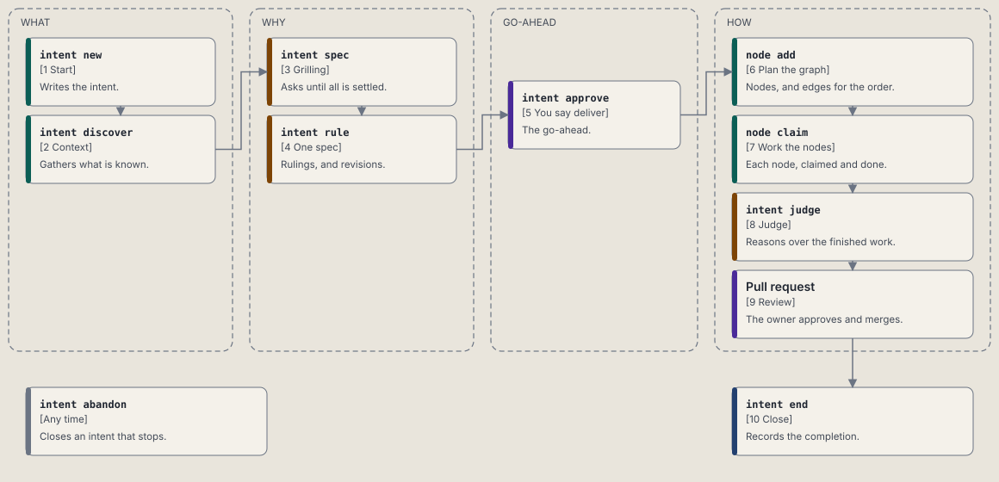
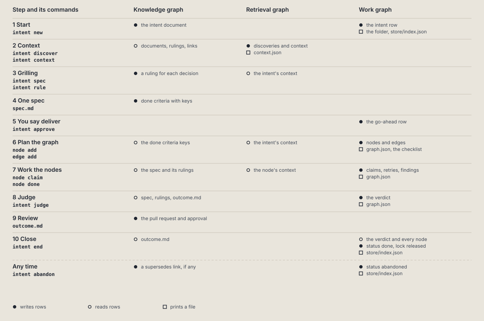

# Architecture

This page is the map of Plastic. Each section opens with a drawing, and the tables under it
name the parts. The drawings are generated: rebuild them with `ruby bin/architecture-figures`
after a change to the system, and commit the files in `docs/contributing/figures/`.

## The system and what it talks to


| Actor | What it is | What passes between it and Plastic |
| ----- | ---------- | ---------------------------------- |
| Owner | The person who decides what to build. | Goals, answers to questions and the go-ahead to deliver. The owner reviews and merges the pull request. |
| Agent harness | Claude Code or Codex. | The harness runs `plastic` commands and fires the hook events. |
| Project repositories | The code of each project. | Plastic reads where each project lives from `projects.yml`. The agent edits the code in a worktree made for each intent. |
| GitHub | The host of the pull request and of CI. | The agent pushes a branch and opens the pull request. Plastic runs no `git` command. |

## What runs and where it keeps data


One program, `active/bin/plastic` of the install, serves every command and the three hooks.
Everything it keeps lives under the Plastic home.

| Place | Holds |
| ----- | ----- |
| `~/.local/share/plastic/` | The install: `active/bin/plastic`, the program; `releases/VERSION/`, one folder for each release; and `rubies/`, the Ruby each release runs on. `~/.local/bin/plastic` links to the program. |
| `bin/plastic` | In the home, a launcher that points to the active program. |
| `PLASTIC.md` | The always-on instructions that the harness imports. |
| `local.db` | What belongs to one machine: `routine_runs`, `sessions`, `locks` and `backups`. |
| `config.yml`, `projects.yml` | The settings, and the list of projects from slug to repository. |
| `installations/` | One install record for each harness Plastic is installed into: every file, folder, setting and section the install wrote, which `plastic uninstall` takes out. |
| `stores/SLUG/` | One store for each project, plus the global store. |
| `stores/SLUG/backups/` | Copies of the three databases, one folder for each backup. |
| `store/index.json` | Every intent and cluster of the store in Luhmann order. It carries no print time. |
| `roadmaps/` | One markdown file for each roadmap, printed from the rows. |
| `store/ID--slug/` | An intent folder: `intent.md`, `spec.md`, `graph.json`, `savepoint.md`, `outcome.md` and `context.json`, printed from the rows. |

A store keeps its rows in three SQLite databases. The store folder's `.gitignore` lists them,
so they are never versioned. The files printed from them are.

| Database | Tables |
| -------- | ------ |
| `work_graph.db` | `intents`, `clusters`, `nodes`, `edges`, `savepoints`, `completions`, `approvals`, `verdicts`, `roadmaps`, `batches`, `roadmap_items`, `roadmap_edges`, `roadmap_log`, `archives`, `archive_entries` |
| `knowledge_graph.db` | `documents`, `document_revisions`, `document_heads`, `rulings`, `links`, and the search tables of the retrieval graph |
| `references.db` | `sqlar` |

Every store database also has two bookkeeping tables:

- `changes` logs every write: the table, the row key, put or remove, the whole row, the time and
  the origin. The log row is written in the same transaction as the write.
- `printed` keeps the hash of every file printed from the rows, as of the last print.

Every row carries `origin_id`, the id of the installation that wrote it. The id sits in a file
at the home and is made on first use. Every stored time is UTC.

An intent row has its number in `id`, its Luhmann id in `intent_id`, the Luhmann id of its
parent in `parent_id`, and an optional `ref` to an intent it follows. Its status is one of six:
open, active, parked, future, done or abandoned.

## The components of the kernel

![The components of the plastic kernel. CLI finds the row in CLI::TABLE and builds the command, a Routine or a Hook. The Routine walks a chain of workflows with Routine::Traversal, which looks each workflow up in Workflows::REGISTRY, where a CodeWorkflow or an AgentWorkflow is held. The Routine opens the Graph: Graph::WorkGraph writes, Graph::RetrievalGraph reads, Graph::Printer prints. Graph::WorkGraph writes the four databases through Graph::Work::Writers and Graph::Database, and Graph::RetrievalGraph reads them.](figures/components.svg)

The kernel lives under `scripts/lib/plastic/`, and `scripts/lib/plastic.rb` loads it. A class
loads on first use, so `plastic help` reads the table and loads no command.

| Component | File | What it owns |
| --------- | ---- | ------------ |
| `CLI` | `scripts/lib/plastic/cli.rb` | Finds the longest entry in the table that starts the arguments, answers `--help`, and names an unknown command and points at `plastic help`. |
| `CLI::TABLE` | `scripts/lib/plastic/cli/table.rb` | The whole command line in one frozen hash: the words, the class and the help line. |
| `CLI::Command` | `scripts/lib/plastic/cli/command.rb` | The base class. It parses the arguments, runs the call, prints and maps errors to exit codes. |
| `CLI::Scope` | `scripts/lib/plastic/cli/scope.rb` | Which project and store a command works on. |
| `CLI::Output` | `scripts/lib/plastic/cli/output.rb` | Prints rows, the `next:` and `because:` lines, and the `--json` form. |
| `Routine` | `scripts/lib/plastic/routine.rb` | A command whose work is a chain of workflows, written as data in the class body. |
| `Routine::Chain` | `scripts/lib/plastic/routine/chain.rb` | The workflow keys in order and the edges between them. It lists every wiring fault at once. |
| `Routine::Traversal` | `scripts/lib/plastic/routine/traversal.rb` | One pass along a chain. It runs each workflow and follows the edge its outcome takes. |
| `CodeWorkflow` | `scripts/lib/plastic/code_workflow.rb` | Ruby steps that run in order: gates, reads and steps. It returns an outcome name. |
| `AgentWorkflow` | `scripts/lib/plastic/agent_workflow.rb` | Steps in plain words for the agent. It hands off while any step is left undone. |
| `Workflows::REGISTRY` | `scripts/lib/plastic/workflows/registry.rb` | Every workflow by name. |
| `Context`, `Facts` | `scripts/lib/plastic/context.rb`, `scripts/lib/plastic/facts.rb` | The named values of one call. A name that no one declared raises at once. |
| `RoutineRun` | `scripts/lib/plastic/routine_run.rb` | One call of one tool on one subject, kept as a row of `local.db`. |
| `Hook` | `scripts/lib/plastic/hook.rb` | The base class of a hook command. It prints a plain text reply and always exits 0. |
| `Hooks::Recap`, `Hooks::StopGate`, `Hooks::Entries` | `scripts/lib/plastic/hooks/` | The text `hook start` prints, the decision whether `hook stop` blocks a stop, and the hook entries the installer writes for Claude Code and Codex. |
| `Harnesses`, `Harnesses::Detection`, `Harnesses::Innermost` | `scripts/lib/plastic/harnesses.rb`, `scripts/lib/plastic/harnesses/` | The harness registry: for each harness its settings folder, session variable, transcript path, process name, hook events and doctor checks. `plastic init` lists the harnesses whose folder or program it finds. Detection names the harness of a start hook, and `Innermost` picks the session of the inner harness when one runs inside another. |
| `Installations` | `scripts/lib/plastic/installations.rb`, `scripts/lib/plastic/installations/` | The install records: `Recording` writes one when an install finishes, and `Removal` takes out exactly what one lists. |
| `Config`, `Config::Document` | `scripts/lib/plastic/config.rb`, `scripts/lib/plastic/config/` | `config.yml` read in layers: the shipped defaults, the `global` section, then the section of the harness. `Document` writes one key and keeps the anchors the file holds. |
| `Graph::Database` | `scripts/lib/plastic/graph/database.rb` | One SQLite file, read and written through the `sqlite3` gem. A write is one transaction and logs its `changes` row. |
| `Graph::WorkGraph` | `scripts/lib/plastic/graph/work_graph.rb` | The writes of a command: routine runs, sessions, locks, intents, nodes and edges. |
| `Graph::RetrievalGraph` | `scripts/lib/plastic/graph/retrieval_graph.rb` | The reads of a command, one table at a time. |
| `Graph::Printer` | `scripts/lib/plastic/graph/printer.rb` | Prints files from their rows and records each hash in `printed`. |
| `Graph::Knowledge::Sync` | `scripts/lib/plastic/graph/knowledge/sync.rb` | Compares each file, its rows and its last print, and plans and applies a sync. |

`Plastic.now` is the one source of the time. A command receives its streams, environment, home
directory and working directory as arguments. No command reads `ENV`, `Dir.home` or `$stdout`
directly, so a test never touches the real store.

Every table is declared once, in `scripts/lib/plastic/graph/db/schema.rb`. The class in
`scripts/lib/plastic/graph/db/schema_file.rb` builds the table definitions from it, and `Graph::Schema` serves their DDL, so nothing else
declares a table. `test/plastic/graph/db/schema_test.rb` pins the DDL of each table by hash.
Two marks sit on a table:

| Mark | Meaning |
| ---- | ------- |
| `legacy: true` | The table holds old data that nothing new reads. |
| `since: VERSION` | Databases older than VERSION lack the table. The next open creates it, so the backup check and `plastic doctor` do not fail on its absence, and the doctor notes it. |

To retire a kind of data:

1. Mark its table `legacy: true` in the schema file.
2. Stop writing it from new code and stop reading it, except in the plumbing that writes,
   prints, counts and declares it.
3. Add its name to the allowed list of `test/legacy_tables_guard_test.rb` only for that plumbing.
4. Leave its DDL unchanged. A legacy table is never dropped.

## The three graphs


`Graph::WorkGraph` is the write side of every database. `Graph::RetrievalGraph` is the read side:
it reads every database and writes nothing. The commands below reach them through these two.

| Graph | Database | What it holds | Written by | Read by |
| ----- | -------- | ------------- | ---------- | ------- |
| Work graph | `work_graph.db` | What is being built: intents, with their nodes and the edges between them, savepoints, roadmaps and archives. | `Graph::WorkGraph` | `plastic next`, `plastic intent show` |
| Knowledge graph | `knowledge_graph.db` | What is known: documents with their revisions, rulings and links. | `plastic intent new`, `plastic intent rule`, `plastic sync up` | `plastic search`, `plastic intent spec` |
| Retrieval graph | `knowledge_graph.db` | What is found: the passages and the search index over the documents. | `plastic sync up` | `plastic search` |

A node is one unit of work. It moves through `open`, `claimed`, `done`, `failed`,
`needs_info` and `impeded`, or leaves the graph as `removed`. `Graph::Work::Node::Writer` owns
the moves, and each move is a guarded `UPDATE`, so two attempts on one node cannot both win.
The fourth claim of a node that keeps failing moves it to `needs_info` with a standing question.
An edge says one node needs another. `Graph::Work::Edge::Writer` refuses a self edge, an edge to
a missing or removed node, and an edge that would close a loop.

| Move | Command |
| ---- | ------- |
| Add or remove a node | `plastic node add`, `plastic node remove` |
| Take or give back a node | `plastic node claim`, `plastic node release` |
| Finish or fail a node | `plastic node done`, `plastic node fail` |
| Ask the owner, stop, or reopen | `plastic node ask`, `plastic node impede`, `plastic node resolve` |
| Wire the order | `plastic edge add`, `plastic edge remove` |

Every plan follows the Principle of Least Surprise. An ambiguity gets research and then
`plastic node ask`. A blocker stops its node with `plastic node impede`. A newly found issue
becomes `plastic node add` plus `plastic edge add`. `Graph::Work::PlanningDirective` holds the
text that Plastic prints in the planning hand-off.

## How an intent is delivered



| Step | Command | What it writes |
| ---- | ------- | -------------- |
| Start | `plastic intent new` | The intent row and its folder. |
| Context | `plastic intent discover` | The context the intent starts from. |
| Grilling | `plastic intent spec` | Nothing. It prints the method and the open decisions. |
| One spec | `plastic intent rule`, `plastic intent revise` | A ruling, or a new revision of the What and the Why. |
| Go-ahead | `plastic intent approve` | The approval row. `plastic auto` refuses without it. |
| Plan the graph | `plastic node add`, `plastic edge add` | Nodes and edges, and `graph.json`. |
| Work the nodes | `plastic auto`, `plastic node claim`, `plastic node done` | The delivery lock, then each node's findings. |
| Judge | `plastic intent judge`, `plastic intent verdict` | The verdict row. |
| Review | The pull request | The `Pull request:` and `Approved:` lines of `outcome.md`, which `plastic sync up` reads into the rows. The owner approves and merges. |
| Close | `plastic intent end` | The completion row. |



`plastic auto ID` takes the delivery lock and sets the intent active. It refuses with exit 3 for
an open decision, a missing go-ahead, and a live lock held by another session. The lock is one
row of `local.db`, keyed by the store and the intent, and it names the session. A lock is live
until its session ends, while it was renewed within 1800 seconds, or while its session holds a
node of the intent claimed within 7200 seconds. `hook stop` renews it. Plastic computes the path
and branch of the code worktree, `<repo>/.claude/worktrees/ID--slug` on `plastic/ID--slug`, and
prints them. The agent makes the worktree.

`plastic intent end ID` takes no options. It closes the intent when every live node is done,
every criterion key of `spec.md` is covered by a done node, the latest verdict is `accept` and
is newer than the last node change, and `outcome.md` has a `## Verification` section with a
`Merged:` line and an `Architecture map:` line. When review by pull request is on, the section
also has a `Pull request:` line, and an `Approved:` line once the owner approves. Closing
releases the lock and hands the agent the wind-down steps in `Workflows::WindDownIntent`.
`plastic intent abandon ID` hands the agent the revert steps in `Workflows::RevertIntent`, then
closes the intent as abandoned, with the disposition `superseded` when another intent supersedes it, or `cancelled`.

## One command from call to report


`bin/plastic` runs the dispatcher. It finds the command in the table, prints the usage line on
`--help` without running it, or builds the command and sends it `call` and then `flush`.
The `call` method does the work, and `flush` prints the report or its `--json` form.

A routine names its chain in its class body. Each `workflow` line gives a key and the edge that
each outcome takes. The key `:noop` ends the chain.

```ruby
workflow :code_check_write_lock, next: :code_check_ending
workflow :code_check_ending do
  on :written, next: :code_close_intent
  on :missing, next: :agent_write_outcome
end
```

`Routine.verify` checks the chain once per process, before the first workflow runs. It raises
one error that lists every fault: an edge that points backward or to an unknown key, a
workflow no edge reaches, an outcome with no edge, an agent workflow that is not last, an
ending with no `because:` line, and a printed line that names an undeclared fact.

A call ends in one of four values. Each value prints its own last lines and gives the exit code,
so no workflow picks a number.

| End value | Meaning | Exit code |
| --------- | ------- | --------- |
| `Finished` | The chain ended. | 0 |
| `HandedOff` | The agent has steps to do. The next call picks up where this one stopped. | 0, or 1 when the handoff stops as a failure |
| `Failed` | A step broke. | 1 |
| `Refused` | A step belongs to the owner. | 3 |

A usage error exits 2. A command raises, and the `run` method maps the error: `Failure`
gives 1, `Usage` and an unknown project give 2, and `Refusal` gives 3.

### The routine run row

A routine run is one call of one tool on one subject. A tool that writes keeps it as a row of
`routine_runs` in `local.db`, keyed by the store, the tool and the subject. A tool that writes
nothing keeps it in memory. The traversal saves the row after each workflow and again when the
call ends.

| Status | What it means | What the next call does |
| ------ | ------------- | ----------------------- |
| `running` | The process is inside the chain, or it died there. | Starts again at the first workflow. |
| `handed_off` | The agent has steps to do. | Reads the saved facts and checks the steps again. |
| `failed` | A step broke. | Retries the workflow that broke. |
| `refused` | The owner holds a step. | Asks again. |
| `finished` | The chain ended. | Starts a new routine run. |

A step that changes state has a done check, so a change that already happened is skipped and
never runs twice.

### The hook reply

A hook is a command that the harness calls on an event. It is not a routine: it prints no
`next:` line and keeps no routine run. It reads the event as JSON on stdin, prints a plain text
reply, and always exits 0. On an error it prints one line on stderr and still exits 0, so a
broken hook never breaks the session. A hook takes no harness option: the start hook names the
harness from the event, the session variables, the transcript path and the process tree, in that
order, and later hooks read it from the session row.

| Event | Command | What it does |
| ----- | ------- | ------------ |
| Session start: a new session, a clear or a compaction | `plastic hook start` | Names the harness, records it on the session row, and prints the open intents, the previous session, the intent in progress with its last savepoint lines, and the note. |
| End of a turn | `plastic hook stop` | Stamps the session's last turn, renews its live locks, and runs the stop gate with the settings of the harness the session row names. |
| Session end | `plastic hook end` | Sets the end time and the reason. |
| Every other event | Nothing | No hook runs. |
| Message display (Claude Code) | The screens launcher | Paints the screens when `config.yml` turns them on. |
| Status line (Claude Code) | The statusline launcher | Prints the status line when `config.yml` turns it on. |

### Sync

`plastic intent new` writes an intent's rows and prints its folder in the same call. The two
sync commands keep the files and the rows level after a hand edit. Three hashes decide what
happens to each file: the file on disk, the text printed from the rows now, and the last print
that `printed` records.

| The file and its rows | `sync up` | `sync down` |
| --------------------- | --------- | ----------- |
| The file equals its rows. | Records the hash when it is new. | Records the hash when it is new. |
| Only the file changed. | Reads the file into its rows. | Leaves the file. |
| Only the rows changed, or the file is missing. | Leaves the rows. | Prints the file. |
| Both changed. | A conflict. | A conflict. |

A plain sync with a conflict writes nothing, exits 3 and lists every conflict. With
`--overwrite PATH`, the file at that path takes the side of the command: `sync up` keeps the
file, and `sync down` keeps the rows. `--overwrite` alone does the same for every conflict.
`--merge` applies the one-sided changes, then exits 3 and lists the conflicts left.

`plastic sync up` reads every intent folder of a store. A folder with no row gives a row built
from its intent file. A folder that cannot give a row is named with its reason, and the call
exits 1. A command that declares `previews` takes `--dry-run`: `Graph::DisposableCopy` runs the
whole chain against a temporary copy of the store and prints what the call would change.

## Roadmaps, links, archive and backup

A roadmap is a plan of several intents, kept as rows in `work_graph.db`. It holds batches. Each
batch has a goal and done criteria, and each item can need other items. `plastic roadmap new`,
`plastic roadmap batch` and `plastic roadmap add` write the plan. `plastic roadmap open` opens a
ready item's intent and copies the item's goal and done criteria into its spec. An item's state
is never stored: it is derived on each read as done, dropped, in flight, blocked or ready.
`plastic roadmap next` prints the first ready item, and `plastic roadmap check` names a cycle.

| Command | What it does |
| ------- | ------------ |
| `plastic intent link` | Writes a typed link from one intent to another. A link to a live intent stops that intent from being archived. |
| `plastic intent archive ID` | Saves the whole intent folder in `work_graph.db`, then removes it. Open and linked intents are refused. |
| `plastic intent unarchive ID` | Restores the snapshot. Conflicting files are preserved. |
| `plastic backup --store SLUG` | Copies the three databases with `VACUUM INTO` into `stores/SLUG/backups/YYYYMMDDHHMMSS/`, with a `status.yml` and a `backup.log`. |
| `plastic backup list --store SLUG` | Lists the backups of a store. |
| `plastic backup purge --store SLUG` | Deletes backups older than a date, all of them, or the failed ones. |
| `plastic backup restore --store SLUG` | Puts back a finished backup after a safety backup of the current databases. It refuses while a delivery lock is fresh. |

A restore never syncs by itself, because a sync can undo it. It ends with
`next: plastic sync down --project STORE`, which writes the files from the restored rows.
Backups recover one store on the same installation. They are not a way to hand work to a
colleague.
