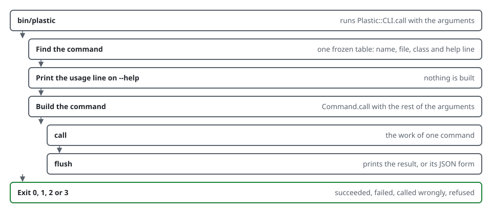
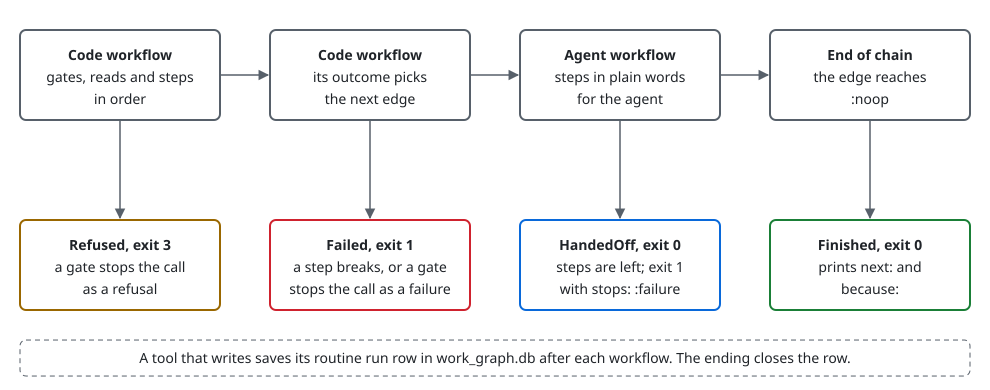
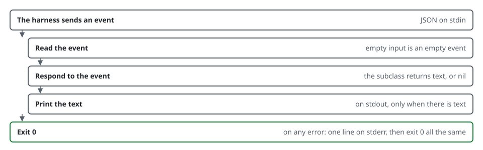

# Architecture

This page covers the `plastic` command. The system architecture, with the two processes and
the store layout, is in [docs/architecture.md](../architecture.md).

## The life of a command



The dispatcher's table is one frozen hash: the command's name, its file, its class and its
help line. The `call` method does the work of one command, and `flush` prints the result or
its JSON form.

## The shared classes

`CLI` lives in `scripts/lib/cli.rb`; the rest live under `scripts/lib/cli/`.

| Class | Job |
| ----- | --- |
| `CLI` | Finds the command in `TABLE`, answers `--help`, suggests the closest name. |
| `TABLE` | The whole command line in one hash. `plastic help` reads it and loads nothing. |
| `Command` | The base class. Its class method `call` maps errors to exit codes. |
| `Output` | Prints rows, the `next:` and `because:` lines, and the `--json` form. |
| `Scope` | Decides which store a command works on. |
| `Frontier` | Reads what comes next in a scope, for `next` and `continue`. |
| `Legacy` | Runs a script that has no library behind it, and hands back its exit status. |
| `IntentProgress` | Picks the next command for one intent, for `intent show` and `intent step`. |

## Errors and exit codes

A command raises, and the class method `call` maps the error.

| Raised | Exit code |
| ------ | --------- |
| Nothing | 0 |
| `Failure` | 1 |
| `Usage`, `OptionParser::ParseError`, `Scope::UnknownProject` | 2 |
| `Refusal` | 3 |

## Injection

A command receives its streams, environment, home directory and working directory as
arguments. No command reads `ENV`, `Dir.home` or `$stdout` directly, so a test never touches
the real store.

## The three databases

Three SQLite databases sit at the top of the Plastic home: `knowledge_graph.db`,
`work_graph.db` and `references.db`. `plastic sync` builds them from the store files and keeps
them level, `plastic index` rebuilds the search index in `knowledge_graph.db`, `plastic search`
and `plastic query` read that index, `plastic checkout` restores missing store files from the
databases, and `plastic backup` archives them.

## The tri-graph kernel

A second command line sits beside the live one. It is the kernel of the tri-graph design, the
design that moves Plastic's work into three graph databases. The kernel is stage 1 of eight in
that build. It lives under `scripts/lib/plastic/`, and `scripts/lib/plastic.rb` loads it.

The kernel has no command yet. Its command table and its workflow registry are both empty, and
`bin/plastic` does not call it. The live command line described above still serves every
command. Stage 2 adds the first commands and the other two graphs.

The kernel ships in the install manifest, so an installed copy carries it. It defines some of
the same constant names as the live command line, such as the command base class and the
output class. So its tests run in a separate process, as the tests section of the
[technical reference](TECHNICAL.md) describes.

### The kernel's classes

The following table lists the kernel's main classes. Each one sits in the `Plastic` module.

| Class | Job |
| ----- | --- |
| `CLI` | Finds the longest entry in its command table that starts the arguments, and loads that command's class on first use. |
| `CLI::Command` | The base class of every command. It parses the arguments, runs the call, prints, and maps errors to exit codes. |
| `Routine` | A command whose work is a chain of workflows. The chain is written as data in the class body. |
| `Routine::Chain` | The workflow keys in order and the edges between them. It lists every wiring fault at once. |
| `Routine::Traversal` | One pass along a chain. It runs each workflow and follows the edge its outcome takes. |
| `CodeWorkflow` | Ruby steps that run in order: gates, reads and steps. It returns an outcome name. |
| `AgentWorkflow` | Steps in plain words for the agent. It hands off while any step is left undone. |
| `Context` and `Facts` | The named values of one call. A name that no one declared raises at once. |
| `RoutineRun` | One call of one tool on one subject, kept as a row of the work graph. |
| `Graph::Database` | One SQLite file, reached through the `sqlite3` program. |
| `Hook` | The base class of a hook command. It prints a plain text reply and always exits 0. |

`Plastic.now` is the one source of the time. It gives the local time with its offset.

### The life of a routine call


A usage error still exits 2, as it does in the live command line.

### The chain and its four endings

A routine names its chain in its class body. Each `workflow` line gives a key and the edge
that each outcome takes. The special key `:noop` ends the chain.

```ruby
workflow :code_check_write_lock, next: :code_check_ending
workflow :code_check_ending do
  on :written, next: :code_close_intent
  on :missing, next: :agent_write_outcome
end
```

`Routine.verify` checks the chain once per process, before the first workflow runs. It raises
one error that lists every fault, so a reordered chain never skips a workflow in silence. It
finds these faults:

- An edge points backward, or to a key that is not in the chain.
- No edge reaches a workflow.
- An outcome has no edge, or an edge names an outcome the workflow never returns.
- An agent workflow is not the last workflow of the chain.
- An outcome ends the chain, and no outcome line gives its `because:` line.
- A printed line names a fact that no one declares.

A call ends in one of four values. Each value prints its own last lines and gives the exit
code, so no workflow picks a number.



`docs/resources/routine_endings.rb` draws this figure, and `docs/resources/call_flows.rb` draws
the call figures of these pages. Run either one from the repository root after you change it.

### The routine run row

A routine run is one call of one tool on one subject. A tool that writes keeps it as a row of
the `routine_runs` table in `work_graph.db`, which sits at the top of the Plastic home. The key
is the store, the tool and the subject. A tool that writes nothing keeps its routine run in
memory only.

The traversal saves the row after each workflow, and again when the call ends. The row holds
the facts the call found, the workflows that finished, the workflow it stopped at, and the
lines it printed last.

The following table lists the status values of a routine run.

| Status | What it means | What the next call does |
| ------ | ------------- | ----------------------- |
| `running` | The process is inside the chain, or it died there. | Starts again at the first workflow. |
| `handed_off` | The agent has steps to do. | Reads the saved facts and checks the steps again. |
| `failed` | A step broke. | Retries the workflow that broke. |
| `refused` | The owner holds a step. | Asks again. |
| `finished` | The chain ended. | Starts a new routine run. |

An open routine run restarts at the first workflow with its saved facts. A step that changes
state has a done check, so a change that already happened is skipped and never runs twice.

`Graph::Database` runs one `sqlite3` process for each read or write. A write is one
transaction that takes the write lock first. The first script of a process carries the schema,
so a new home needs no setup step. The report counts the rows a call wrote and prints them on
its `wrote:` line.

### The hook reply

A hook is a command that the harness calls on an event, such as the start of a session. A
hook is not a routine. It prints no `next:` line and keeps no routine run.



Claude Code adds the text to the agent's context on the session start event. A broken hook
never breaks the session, because the hook always exits 0.
