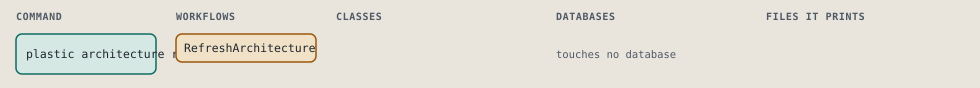
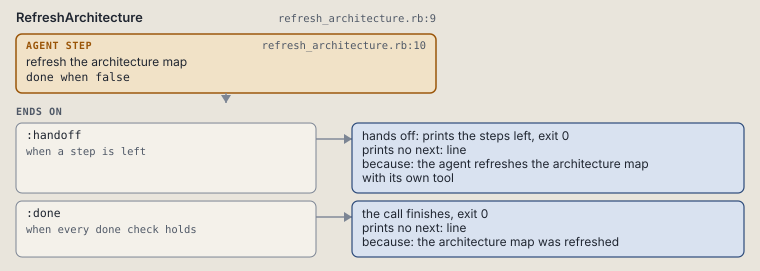

# plastic architecture refresh

Tell the agent to regenerate the architecture map with its own tool.

Tells the agent to regenerate the project's architecture map with its own tool.

```sh
plastic architecture refresh
```

The command is `ArchitectureRefresh`, in [`architecture_refresh.rb:8`](../../../../scripts/lib/plastic/commands/architecture_refresh.rb#L8). The words on this page, such as gate, step and outcome, are explained in [the command DSL](../../dsl/README.md).

## What it touches



## How the call flows


| Workflow | Kind | Code |
| --- | --- | --- |
| [RefreshArchitecture](#refresharchitecture) | agent | [`refresh_architecture.rb:9`](../../../../scripts/lib/plastic/workflows/refresh_architecture.rb#L9) |

### RefreshArchitecture

The agent workflow `:agent_refresh_architecture`, in [`refresh_architecture.rb:9`](../../../../scripts/lib/plastic/workflows/refresh_architecture.rb#L9).

The agent regenerates the architecture map with the tool it chose. Plastic runs no tool and reads no result, so the step is never done on its own.



| Step | Kind | Check | Code |
| --- | --- | --- | --- |
| refresh the architecture map | agent step | `false` | [`refresh_architecture.rb:10`](../../../../scripts/lib/plastic/workflows/refresh_architecture.rb#L10) |

| Outcome | When | Then | Code |
| --- | --- | --- | --- |
| `:handoff` | when a step is left | hands off, exit 0; prints no next: line | [`refresh_architecture.rb:15`](../../../../scripts/lib/plastic/workflows/refresh_architecture.rb#L15) |
| `:done` | when every done check holds | finishes, exit 0; prints no next: line | [`refresh_architecture.rb:16`](../../../../scripts/lib/plastic/workflows/refresh_architecture.rb#L16) |

The agent step "refresh the architecture map" prints:

> Regenerate the project's architecture map with an architecture mapping tool such as Enola; the choice of tool is yours. Read the new map for context. When you deliver an intent, note the tool, the source revision the map describes, what it covers and what it leaves out as the Architecture map: line under Verification in outcome.md.

## Outcomes

Every call can also end in [the ways any call can end](../../dsl/README.md#how-any-call-can-end).

| Ending | Exit | next: | Code |
| --- | --- | --- | --- |
| the agent refreshes the architecture map with its own tool | 0 | prints no next: line | [`refresh_architecture.rb:15`](../../../../scripts/lib/plastic/workflows/refresh_architecture.rb#L15) |
| the architecture map was refreshed | 0 | prints no next: line | [`refresh_architecture.rb:16`](../../../../scripts/lib/plastic/workflows/refresh_architecture.rb#L16) |
