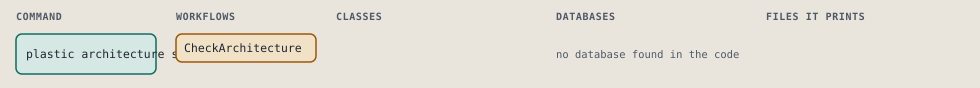
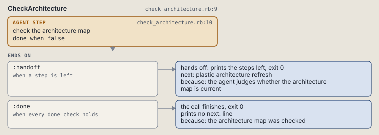

# plastic architecture status

Tell the agent to check the architecture map with its own tool.

Tells the agent to check the project's architecture map with its own tool.

```sh
plastic architecture status
```

The command is `ArchitectureStatus`, in [`architecture_status.rb:8`](../../../../scripts/lib/plastic/commands/architecture_status.rb#L8). The words on this page, such as gate, step and outcome, are explained in [the command DSL](../../dsl/README.md).

## What it touches



## How the call flows


| Workflow | Kind | Code |
| --- | --- | --- |
| [CheckArchitecture](#checkarchitecture) | agent | [`check_architecture.rb:9`](../../../../scripts/lib/plastic/workflows/check_architecture.rb#L9) |

### CheckArchitecture

The agent workflow `:agent_check_architecture`, in [`check_architecture.rb:9`](../../../../scripts/lib/plastic/workflows/check_architecture.rb#L9).

The agent checks the architecture map with the tool it chose. Plastic runs no tool and reads no result, so the step is never done on its own.



| Step | Kind | Check | Code |
| --- | --- | --- | --- |
| check the architecture map | agent step | `false` | [`check_architecture.rb:10`](../../../../scripts/lib/plastic/workflows/check_architecture.rb#L10) |

| Outcome | When | Then | Code |
| --- | --- | --- | --- |
| `:handoff` | when a step is left | hands off, exit 0; next: plastic architecture refresh | [`check_architecture.rb:15`](../../../../scripts/lib/plastic/workflows/check_architecture.rb#L15) |
| `:done` | when every done check holds | finishes, exit 0; prints no next: line | [`check_architecture.rb:16`](../../../../scripts/lib/plastic/workflows/check_architecture.rb#L16) |

The agent step "check the architecture map" prints:

> Check whether the project has an architecture map and whether it describes the source as it is now. Use an architecture mapping tool such as Enola; the choice of tool is yours. When the map is current, read it for context. When it is missing or older than the source, refresh it.

## Outcomes

Every call can also end in [the ways any call can end](../../dsl/README.md#how-any-call-can-end).

| Ending | Exit | next: | Code |
| --- | --- | --- | --- |
| the agent judges whether the architecture map is current | 0 | plastic architecture refresh | [`check_architecture.rb:15`](../../../../scripts/lib/plastic/workflows/check_architecture.rb#L15) |
| the architecture map was checked | 0 | prints no next: line | [`check_architecture.rb:16`](../../../../scripts/lib/plastic/workflows/check_architecture.rb#L16) |
