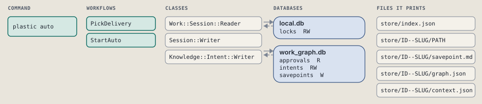
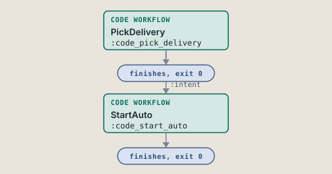
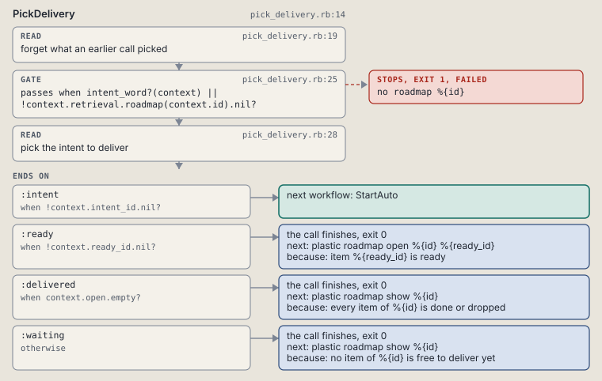
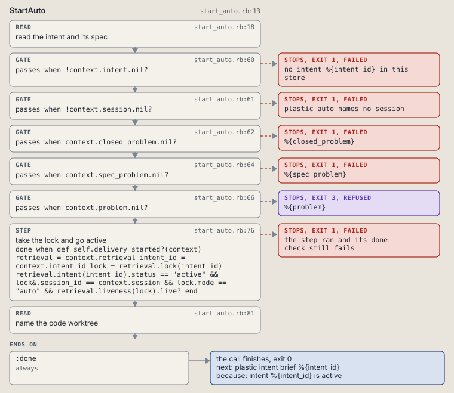

# plastic auto

Deliver one intent or one roadmap in auto mode: take the lock and print the worktree.

```sh
plastic auto ID
```

The command is `Auto`, in [`auto.rb:9`](../../../../scripts/lib/plastic/commands/auto.rb#L9). The words on this page, such as gate, step and outcome, are explained in [the command DSL](../../dsl/README.md).

| Argument or option | What it gives | Default |
| --- | --- | --- |
| `ID` | the intent id or the roadmap slug | |

## What it touches



## How the call flows



| Workflow | Kind | Code |
| --- | --- | --- |
| [PickDelivery](#pickdelivery) | code | [`pick_delivery.rb:14`](../../../../scripts/lib/plastic/workflows/pick_delivery.rb#L14) |
| [StartAuto](#startauto) | code | [`start_auto.rb:13`](../../../../scripts/lib/plastic/workflows/start_auto.rb#L13) |

### PickDelivery

The code workflow `:code_pick_delivery`, in [`pick_delivery.rb:14`](../../../../scripts/lib/plastic/workflows/pick_delivery.rb#L14).

Turns the word `plastic auto` was given into the intent to deliver. A word shaped like an intent id is that intent. Any other word is a roadmap slug: its first item in flight that is not parked and not held by another session's live lock, in batch then item order. With none, it offers a ready item to start, or says the roadmap is delivered or waits.



| Step | Kind | Check | Code |
| --- | --- | --- | --- |
| forget what an earlier call picked | read |  | [`pick_delivery.rb:19`](../../../../scripts/lib/plastic/workflows/pick_delivery.rb#L19) |
| no roadmap %{id} | gate, stops with exit 1 | `intent_word?(context) \|\| !context.retrieval.roadmap(context.id).nil?` | [`pick_delivery.rb:25`](../../../../scripts/lib/plastic/workflows/pick_delivery.rb#L25) |
| pick the intent to deliver | read |  | [`pick_delivery.rb:28`](../../../../scripts/lib/plastic/workflows/pick_delivery.rb#L28) |

| Outcome | When | Then | Code |
| --- | --- | --- | --- |
| `:intent` | when `!context.intent_id.nil?` | runs [StartAuto](#startauto) | [`pick_delivery.rb:55`](../../../../scripts/lib/plastic/workflows/pick_delivery.rb#L55) |
| `:ready` | when `!context.ready_id.nil?` | finishes, exit 0; next: plastic roadmap open %{id} %{ready_id} | [`pick_delivery.rb:56`](../../../../scripts/lib/plastic/workflows/pick_delivery.rb#L56) |
| `:delivered` | when `context.open.empty?` | finishes, exit 0; next: plastic roadmap show %{id} | [`pick_delivery.rb:58`](../../../../scripts/lib/plastic/workflows/pick_delivery.rb#L58) |
| `:waiting` | otherwise | finishes, exit 0; next: plastic roadmap show %{id} | [`pick_delivery.rb:60`](../../../../scripts/lib/plastic/workflows/pick_delivery.rb#L60) |

It sets `intent_id`, `ready_id`, `open`.

### StartAuto

The code workflow `:code_start_auto`, in [`start_auto.rb:13`](../../../../scripts/lib/plastic/workflows/start_auto.rb#L13).

Arms delivery on an intent: refuses an open decision, no done criteria, no go-ahead row, a done or abandoned intent, or another session's live lock; fails with no session named; otherwise takes the lock and goes active, then prints the code worktree when the store's project names a repository.



| Step | Kind | Check | Code |
| --- | --- | --- | --- |
| read the intent and its spec | read |  | [`start_auto.rb:18`](../../../../scripts/lib/plastic/workflows/start_auto.rb#L18) |
| no intent %{intent_id} in this store | gate, stops with exit 1 | `!context.intent.nil?` | [`start_auto.rb:60`](../../../../scripts/lib/plastic/workflows/start_auto.rb#L60) |
| plastic auto names no session | gate, stops with exit 1 | `!context.session.nil?` | [`start_auto.rb:61`](../../../../scripts/lib/plastic/workflows/start_auto.rb#L61) |
| %{closed_problem} | gate, stops with exit 1 | `context.closed_problem.nil?` | [`start_auto.rb:62`](../../../../scripts/lib/plastic/workflows/start_auto.rb#L62) |
| %{spec_problem} | gate, stops with exit 1 | `context.spec_problem.nil?` | [`start_auto.rb:64`](../../../../scripts/lib/plastic/workflows/start_auto.rb#L64) |
| %{problem} | gate, stops with exit 3 | `context.problem.nil?` | [`start_auto.rb:66`](../../../../scripts/lib/plastic/workflows/start_auto.rb#L66) |
| take the lock and go active | step | `def self.delivery_started?(context) retrieval = context.retrieval intent_id = context.intent_id lock = retrieval.lock(intent_id) retrieval.intent(intent_id).status == "active" && lock&.session_id == context.session && lock.mode == "auto" && retrieval.liveness(lock).live? end` | [`start_auto.rb:76`](../../../../scripts/lib/plastic/workflows/start_auto.rb#L76) |
| name the code worktree | read |  | [`start_auto.rb:81`](../../../../scripts/lib/plastic/workflows/start_auto.rb#L81) |

| Outcome | When | Then | Code |
| --- | --- | --- | --- |
| `:done` | always | finishes, exit 0; next: plastic intent brief %{intent_id} | [`start_auto.rb:92`](../../../../scripts/lib/plastic/workflows/start_auto.rb#L92) |

It sets `problem`, `closed_problem`, `spec_problem`, `intent`.

## Outcomes

Every call can also end in [the ways any call can end](../../dsl/README.md#how-any-call-can-end).

| Ending | Exit | next: | Code |
| --- | --- | --- | --- |
| no roadmap %{id} | 1 | prints no next: line | [`pick_delivery.rb:25`](../../../../scripts/lib/plastic/workflows/pick_delivery.rb#L25) |
| item %{ready_id} is ready | 0 | plastic roadmap open %{id} %{ready_id} | [`pick_delivery.rb:56`](../../../../scripts/lib/plastic/workflows/pick_delivery.rb#L56) |
| every item of %{id} is done or dropped | 0 | plastic roadmap show %{id} | [`pick_delivery.rb:58`](../../../../scripts/lib/plastic/workflows/pick_delivery.rb#L58) |
| no item of %{id} is free to deliver yet | 0 | plastic roadmap show %{id} | [`pick_delivery.rb:60`](../../../../scripts/lib/plastic/workflows/pick_delivery.rb#L60) |
| no intent %{intent_id} in this store | 1 | prints no next: line | [`start_auto.rb:60`](../../../../scripts/lib/plastic/workflows/start_auto.rb#L60) |
| plastic auto names no session | 1 | prints no next: line | [`start_auto.rb:61`](../../../../scripts/lib/plastic/workflows/start_auto.rb#L61) |
| %{closed_problem} | 1 | plastic next | [`start_auto.rb:62`](../../../../scripts/lib/plastic/workflows/start_auto.rb#L62) |
| %{spec_problem} | 1 | plastic intent spec %{intent_id} | [`start_auto.rb:64`](../../../../scripts/lib/plastic/workflows/start_auto.rb#L64) |
| %{problem} | 3 | prints no next: line | [`start_auto.rb:66`](../../../../scripts/lib/plastic/workflows/start_auto.rb#L66) |
| intent %{intent_id} is active | 0 | plastic intent brief %{intent_id} | [`start_auto.rb:92`](../../../../scripts/lib/plastic/workflows/start_auto.rb#L92) |
| a step raises | 1 | prints no next: line | [`code_workflow.rb:97`](../../../../scripts/lib/plastic/code_workflow.rb#L97) |
