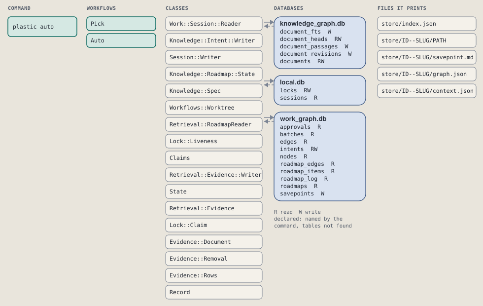
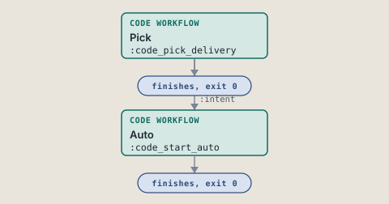
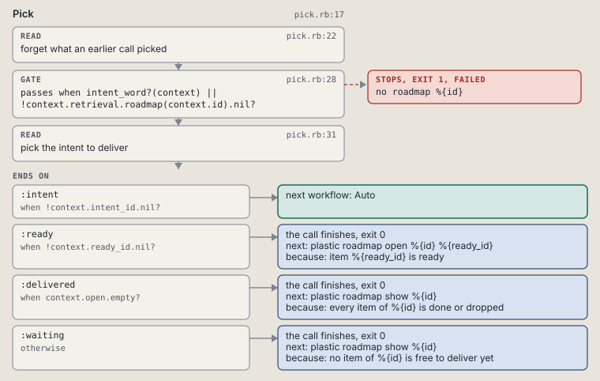
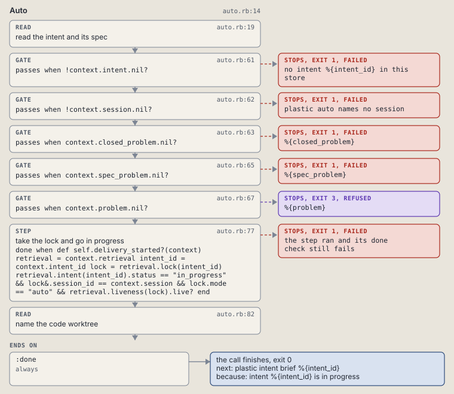
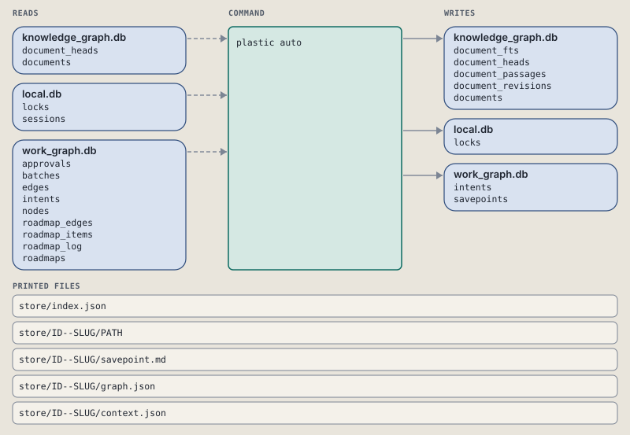

# plastic auto

Deliver one intent or one roadmap in auto mode: take the lock and print the worktree.

```sh
plastic auto ID
```

The command is `Auto`, in [`auto.rb:9`](../../../../lib/plastic/commands/auto.rb#L9). The words on this page, such as gate, step and outcome, are explained in [the command DSL](../../dsl/README.md).

| Argument or option | What it gives | Default |
| --- | --- | --- |
| `ID` | the intent id or the roadmap slug | |

## Components



The figure shows the command, the workflows it runs, the classes behind them, and the databases and files they reach.

## The events of one call



| Workflow | Kind | Code |
| --- | --- | --- |
| [Code::Auto::Pick](#codeautopick) | code | [`pick.rb:17`](../../../../lib/plastic/workflows/code/auto/pick.rb#L17) |
| [Code::Auto](#codeauto) | code | [`auto.rb:15`](../../../../lib/plastic/workflows/code/auto.rb#L15) |

### Code::Auto::Pick

The code workflow `:code_pick_delivery`, in [`pick.rb:17`](../../../../lib/plastic/workflows/code/auto/pick.rb#L17).

Turns the word `plastic auto` was given into the intent to deliver. A word shaped like an intent id is that intent. Any other word is a roadmap slug: its first item in flight that is not parked and not held by another session's live lock, in batch then item order. With none, it offers a ready item to start, or says the roadmap is delivered or waits.



Its rows run in this order:

1. Read: forget what an earlier call picked. [`pick.rb:22`](../../../../lib/plastic/workflows/code/auto/pick.rb#L22)
2. Gate: passes when `intent_word?(context) || !context.retrieval.roadmap(context.id).nil?`; otherwise the call stops with exit 1 and prints no roadmap ID. [`pick.rb:28`](../../../../lib/plastic/workflows/code/auto/pick.rb#L28)
3. Read: pick the intent to deliver. [`pick.rb:31`](../../../../lib/plastic/workflows/code/auto/pick.rb#L31)
4. Outcome `:intent`, when `!context.intent_id.nil?`: starts the workflow [Code::Auto](#codeauto). [`pick.rb:58`](../../../../lib/plastic/workflows/code/auto/pick.rb#L58)
5. Outcome `:ready`, when `!context.ready_id.nil?`: finishes with exit 0; next: plastic roadmap open ID READY_ID. [`pick.rb:59`](../../../../lib/plastic/workflows/code/auto/pick.rb#L59)
6. Outcome `:delivered`, when `context.open.empty?`: finishes with exit 0; next: plastic roadmap show ID. [`pick.rb:61`](../../../../lib/plastic/workflows/code/auto/pick.rb#L61)
7. Outcome `:waiting`, otherwise: finishes with exit 0; next: plastic roadmap show ID. [`pick.rb:63`](../../../../lib/plastic/workflows/code/auto/pick.rb#L63)

It sets `intent_id`, `ready_id`, `open`.

### Code::Auto

The code workflow `:code_start_auto`, in [`auto.rb:15`](../../../../lib/plastic/workflows/code/auto.rb#L15).

Arms delivery on an intent: refuses an open decision, no done criteria, no go-ahead row, a done or abandoned intent, or another session's live lock; fails with no session named or a session that ended; otherwise goes in progress and takes the lock, then prints the code worktree when the store's project names a repository, and names the worktree to create when its folder is missing.



Its rows run in this order:

1. Read: read the intent and its spec. [`auto.rb:20`](../../../../lib/plastic/workflows/code/auto.rb#L20)
2. Gate: passes when `!context.intent.nil?`; otherwise the call stops with exit 1 and prints no intent INTENT_ID in this store. [`auto.rb:69`](../../../../lib/plastic/workflows/code/auto.rb#L69)
3. Gate: passes when `!context.session.nil?`; otherwise the call stops with exit 1 and prints plastic auto names no session. [`auto.rb:70`](../../../../lib/plastic/workflows/code/auto.rb#L70)
4. Gate: passes when `context.session_problem.nil?`; otherwise the call stops with exit 1 and prints SESSION_PROBLEM. [`auto.rb:71`](../../../../lib/plastic/workflows/code/auto.rb#L71)
5. Gate: passes when `context.closed_problem.nil?`; otherwise the call stops with exit 1 and prints CLOSED_PROBLEM. [`auto.rb:72`](../../../../lib/plastic/workflows/code/auto.rb#L72)
6. Gate: passes when `context.spec_problem.nil?`; otherwise the call stops with exit 1 and prints SPEC_PROBLEM. [`auto.rb:74`](../../../../lib/plastic/workflows/code/auto.rb#L74)
7. Gate: passes when `context.problem.nil?`; otherwise the call stops with exit 3 and prints PROBLEM. [`auto.rb:76`](../../../../lib/plastic/workflows/code/auto.rb#L76)
8. Step: go in progress and take the lock. Done when `def self.delivery_started?(context) retrieval = context.retrieval intent_id = context.intent_id lock = retrieval.lock(intent_id) retrieval.intent(intent_id).status == "in_progress" && lock&.session_id == context.session && lock.mode == "auto" && retrieval.liveness(lock).live? end`, so a second call skips it. [`auto.rb:86`](../../../../lib/plastic/workflows/code/auto.rb#L86)
9. Read: name the code worktree. [`auto.rb:91`](../../../../lib/plastic/workflows/code/auto.rb#L91)
10. Outcome `:worktree_missing`, when `context.worktree_missing`: finishes with exit 0; next: plastic auto INTENT_ID. [`auto.rb:110`](../../../../lib/plastic/workflows/code/auto.rb#L110)
11. Outcome `:done`, otherwise: finishes with exit 0; next: plastic intent brief INTENT_ID. [`auto.rb:112`](../../../../lib/plastic/workflows/code/auto.rb#L112)

It sets `problem`, `closed_problem`, `spec_problem`, `intent`, `session_problem`, `worktree_missing`.

In the words of workflow engines, the rows are these four parts:

- **Trigger**: the call starts the workflow `Code::Auto::Pick`; each later workflow starts from an outcome of the one before it.
- **Activities**: 4 reads and 1 step.
- **Transitions**: 7 gates stop the call when their checks fail; a step runs only while its done check fails; Pick goes to Auto on `:intent`.
- **Outcomes**: `:ready` of Pick, `:delivered` of Pick, `:waiting` of Pick, `:worktree_missing` of Auto, `:done` of Auto end the call.

## What one call reads, writes and prints



| Place | Database or file | Tables | Reads or writes | Code |
| --- | --- | --- | --- | --- |
| the store folder | knowledge_graph.db | `document_fts`, `document_heads`, `document_passages`, `document_revisions`, `documents` | reads and writes | [`auto.rb:12`](../../../../lib/plastic/commands/auto.rb#L12) |
| the home folder | local.db | `locks`, `sessions` | reads and writes | found in the code, not declared |
| the store folder | work_graph.db | `approvals`, `batches`, `edges`, `intents`, `nodes`, `roadmap_edges`, `roadmap_items`, `roadmap_log`, `roadmaps`, `savepoints` | reads and writes | [`auto.rb:12`](../../../../lib/plastic/commands/auto.rb#L12) |
| the store folder | store/index.json | | writes | [`prints.rb:17`](../../../../lib/plastic/graph/prints.rb#L17) |
| the store folder | store/ID--SLUG/PATH | | writes | [`prints.rb:18`](../../../../lib/plastic/graph/prints.rb#L18) |
| the store folder | store/ID--SLUG/savepoint.md | | writes | [`prints.rb:19`](../../../../lib/plastic/graph/prints.rb#L19) |
| the store folder | store/ID--SLUG/graph.json | | writes | [`prints.rb:20`](../../../../lib/plastic/graph/prints.rb#L20) |
| the store folder | store/ID--SLUG/context.json | | writes | [`prints.rb:21`](../../../../lib/plastic/graph/prints.rb#L21) |

A second call runs the same rows again. A step runs again only when its done check fails.

| Step | Done when | The second call | Code |
| --- | --- | --- | --- |
| go in progress and take the lock | `def self.delivery_started?(context) retrieval = context.retrieval intent_id = context.intent_id lock = retrieval.lock(intent_id) retrieval.intent(intent_id).status == "in_progress" && lock&.session_id == context.session && lock.mode == "auto" && retrieval.liveness(lock).live? end` | skips it | [`auto.rb:86`](../../../../lib/plastic/workflows/code/auto.rb#L86) |

## How a call ends

Every call can also end in [the ways any call can end](../../dsl/README.md#how-any-call-can-end).

| Ending | Exit | next: | Code |
| --- | --- | --- | --- |
| no roadmap ID | 1 | prints no next: line | [`pick.rb:28`](../../../../lib/plastic/workflows/code/auto/pick.rb#L28) |
| item READY_ID is ready | 0 | plastic roadmap open ID READY_ID | [`pick.rb:59`](../../../../lib/plastic/workflows/code/auto/pick.rb#L59) |
| every item of ID is done or dropped | 0 | plastic roadmap show ID | [`pick.rb:61`](../../../../lib/plastic/workflows/code/auto/pick.rb#L61) |
| no item of ID is free to deliver yet | 0 | plastic roadmap show ID | [`pick.rb:63`](../../../../lib/plastic/workflows/code/auto/pick.rb#L63) |
| no intent INTENT_ID in this store | 1 | prints no next: line | [`auto.rb:69`](../../../../lib/plastic/workflows/code/auto.rb#L69) |
| plastic auto names no session | 1 | prints no next: line | [`auto.rb:70`](../../../../lib/plastic/workflows/code/auto.rb#L70) |
| SESSION_PROBLEM | 1 | prints no next: line | [`auto.rb:71`](../../../../lib/plastic/workflows/code/auto.rb#L71) |
| CLOSED_PROBLEM | 1 | plastic next | [`auto.rb:72`](../../../../lib/plastic/workflows/code/auto.rb#L72) |
| SPEC_PROBLEM | 1 | plastic intent spec INTENT_ID | [`auto.rb:74`](../../../../lib/plastic/workflows/code/auto.rb#L74) |
| PROBLEM | 3 | prints no next: line | [`auto.rb:76`](../../../../lib/plastic/workflows/code/auto.rb#L76) |
| the worktree of intent INTENT_ID is not made yet | 0 | plastic auto INTENT_ID | [`auto.rb:110`](../../../../lib/plastic/workflows/code/auto.rb#L110) |
| intent INTENT_ID is in progress | 0 | plastic intent brief INTENT_ID | [`auto.rb:112`](../../../../lib/plastic/workflows/code/auto.rb#L112) |
| a step raises | 1 | prints no next: line | [`code_workflow.rb:102`](../../../../lib/plastic/code_workflow.rb#L102) |

## What the page leaves out

Every call shares a few things that this page does not repeat; [the command DSL](../../dsl/README.md#what-every-call-shares) names them.

- A call that writes saves a routine run row in local.db. A stop by a gate or a step saves the run, and the next call resumes from it. A dry run saves no row.
