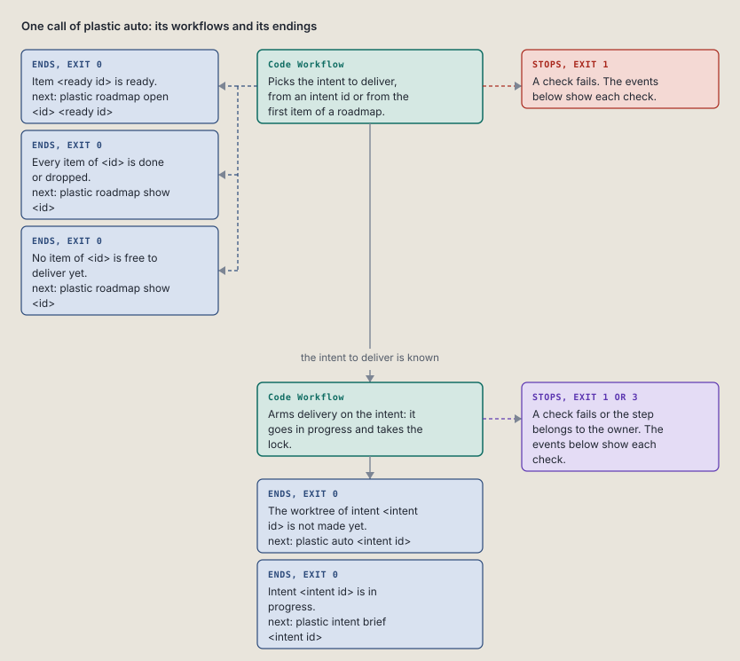
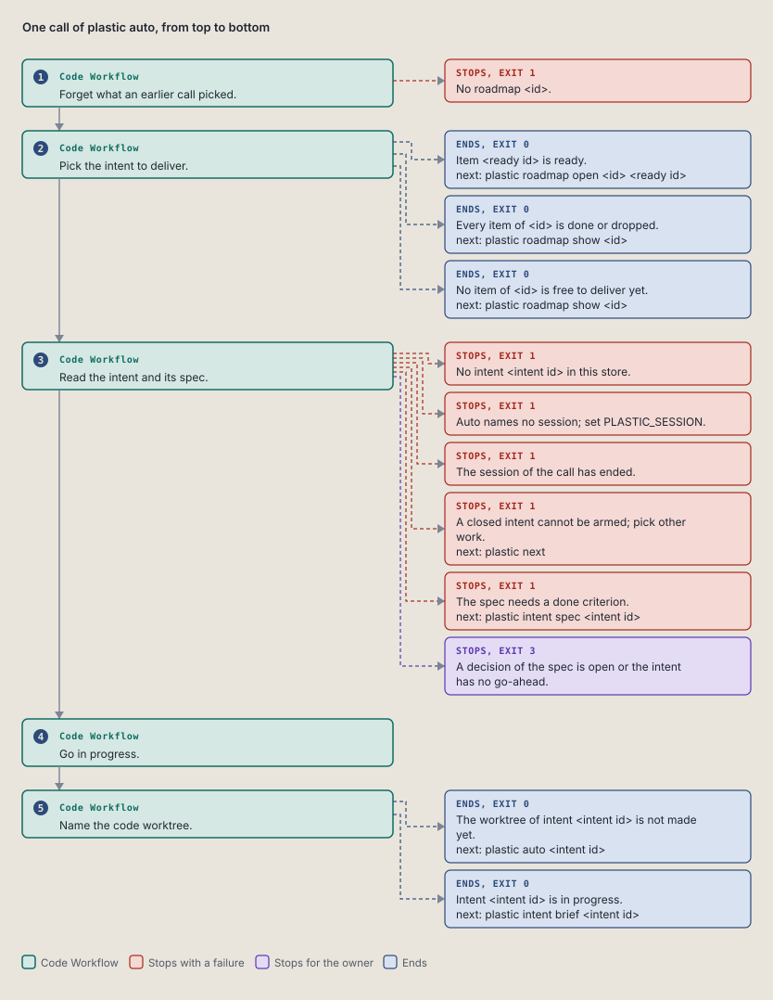

# plastic auto

Deliver one intent or one roadmap in auto mode: lock the intent and print the worktree.

```sh
plastic auto ID
```

| Argument or option | What it gives | Default |
| --- | --- | --- |
| `ID` | the intent id or the roadmap slug | |

## The workflows of one call



Each box is a workflow. The words between the boxes say when the call moves on, and the last boxes say how the call ends.

## The events of one call, step by step



The boxes on the left run in order. The boxes on the right are the ways the call stops or ends at that step.

## What one call changes

| What changes | Where | Reach |
| --- | --- | --- |
| The intent goes in progress | the work graph database, in the store folder | goes with the store |
| The intent is locked to this session | the local database, in the home folder | stays on this machine |
| The files of the intent and the index of the store are rewritten | the store folder | goes with the store |

Goes with the store: the files of the store carry the change, and `plastic sync up` rebuilds it on another machine. The database files themselves stay on this machine.

The command is `Plastic::Commands::Auto`, in [`commands/auto.rb`](../../../../lib/plastic/commands/auto.rb).
