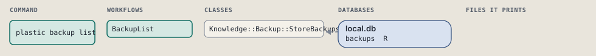
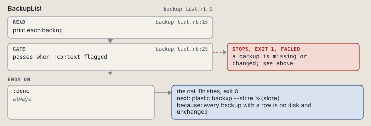

# plastic backup list

List one store's backups with status and goal, flagging a missing or changed file.

```sh
plastic backup list --store SLUG
```

The command is `BackupList`, in [`backup_list.rb:9`](../../../../scripts/lib/plastic/commands/backup_list.rb#L9). The words on this page, such as gate, step and outcome, are explained in [the command DSL](../../dsl/README.md).

| Argument or option | What it gives | Default |
| --- | --- | --- |
| `--store SLUG` | the registered project whose backups the call works on |  |

## What it touches



## Before the chain

The command's own `call`, at [`backup_store.rb:15`](../../../../scripts/lib/plastic/commands/backup_store.rb#L15), runs first:

```ruby
def call
  refuse_project
  refuse_unregistered
  check_call
  super
end
```

## How the call flows


| Workflow | Kind | Code |
| --- | --- | --- |
| [BackupList](#backuplist) | code | [`backup_list.rb:9`](../../../../scripts/lib/plastic/workflows/backup_list.rb#L9) |

### BackupList

The code workflow `:code_backup_list`, in [`backup_list.rb:9`](../../../../scripts/lib/plastic/workflows/backup_list.rb#L9).

Prints each backup folder of the store with its start time, status and goal, flagging a missing or changed file. A flag fails the call.



| Step | Kind | Check | Code |
| --- | --- | --- | --- |
| print each backup | read |  | [`backup_list.rb:16`](../../../../scripts/lib/plastic/workflows/backup_list.rb#L16) |
| a backup is missing or changed; see above | gate, stops with exit 1 | `!context.flagged` | [`backup_list.rb:29`](../../../../scripts/lib/plastic/workflows/backup_list.rb#L29) |

| Outcome | When | Then | Code |
| --- | --- | --- | --- |
| `:done` | always | finishes, exit 0; next: plastic backup --store %{store} | [`backup_list.rb:31`](../../../../scripts/lib/plastic/workflows/backup_list.rb#L31) |

It sets `flagged`.

## Outcomes

Every call can also end in [the ways any call can end](../../dsl/README.md#how-any-call-can-end).

| Ending | Exit | next: | Code |
| --- | --- | --- | --- |
| a backup is missing or changed; see above | 1 | prints no next: line | [`backup_list.rb:29`](../../../../scripts/lib/plastic/workflows/backup_list.rb#L29) |
| every backup with a row is on disk and unchanged | 0 | plastic backup --store %{store} | [`backup_list.rb:31`](../../../../scripts/lib/plastic/workflows/backup_list.rb#L31) |
| a step raises | 1 | prints no next: line | [`code_workflow.rb:97`](../../../../scripts/lib/plastic/code_workflow.rb#L97) |
| Usage error: name the store with --store; --project does not apply | 2 | prints no next: line | [`backup_store.rb:27`](../../../../scripts/lib/plastic/commands/backup_store.rb#L27) |
| Usage error: no registered project named %{slug}; the projects are %{projects} | 2 | prints no next: line | [`backup_store.rb:35`](../../../../scripts/lib/plastic/commands/backup_store.rb#L35) |
