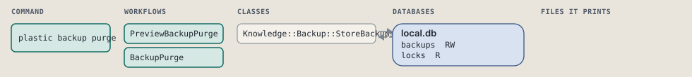
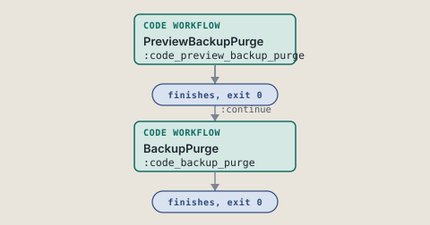
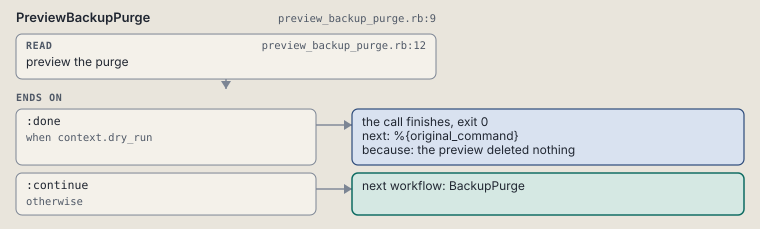
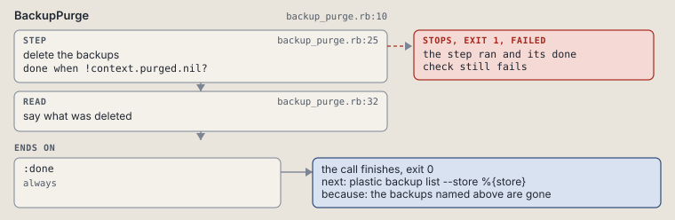

# plastic backup purge

Delete one store's backups; give one of --all, --failed or --older-than.

Deletes backups of one registered store: all of them, those before a date, or those that failed.

```sh
plastic backup purge --store SLUG (--older-than DATE | --all | --failed) [--dry-run]
```

The command is `BackupPurge`, in [`backup_purge.rb:10`](../../../../scripts/lib/plastic/commands/backup_purge.rb#L10). The words on this page, such as gate, step and outcome, are explained in [the command DSL](../../dsl/README.md).

| Argument or option | What it gives | Default |
| --- | --- | --- |
| `--store SLUG` | the registered project whose backups the call works on |  |
| `--older-than DATE` | delete the backups before this date or time |  |
| `--all` | delete every backup of the store | `false` |
| `--failed` | delete every backup whose status is failed | `false` |
| `--dry-run` | list what would be deleted and delete nothing | `false` |

## What it touches



## Before the chain

The command's own `call`, at [`backup_store.rb:15`](../../../../scripts/lib/plastic/commands/backup_store.rb#L15), runs first:

```ruby
def call
  refuse_project
  refuse_unregistered
  check_call
  super
end
```

The command's own `check_call`, at [`backup_purge.rb:30`](../../../../scripts/lib/plastic/commands/backup_purge.rb#L30), runs inside it:

```ruby
def check_call
  one_of(%i[older_than all failed], give: "give --older-than DATE, --all or --failed", both: "--older-than, --all and --failed exclude each other")
  read_date
end
```

## How the call flows



| Workflow | Kind | Code |
| --- | --- | --- |
| [PreviewBackupPurge](#previewbackuppurge) | code | [`preview_backup_purge.rb:9`](../../../../scripts/lib/plastic/workflows/preview_backup_purge.rb#L9) |
| [BackupPurge](#backuppurge) | code | [`backup_purge.rb:10`](../../../../scripts/lib/plastic/workflows/backup_purge.rb#L10) |

### PreviewBackupPurge

The code workflow `:code_preview_backup_purge`, in [`preview_backup_purge.rb:9`](../../../../scripts/lib/plastic/workflows/preview_backup_purge.rb#L9).

Lists the backups a purge would delete, and deletes nothing.



| Step | Kind | Check | Code |
| --- | --- | --- | --- |
| preview the purge | read |  | [`preview_backup_purge.rb:12`](../../../../scripts/lib/plastic/workflows/preview_backup_purge.rb#L12) |

| Outcome | When | Then | Code |
| --- | --- | --- | --- |
| `:done` | when `context.dry_run` | finishes, exit 0; next: %{original_command} | [`preview_backup_purge.rb:19`](../../../../scripts/lib/plastic/workflows/preview_backup_purge.rb#L19) |
| `:continue` | otherwise | runs [BackupPurge](#backuppurge) | [`preview_backup_purge.rb:21`](../../../../scripts/lib/plastic/workflows/preview_backup_purge.rb#L21) |

### BackupPurge

The code workflow `:code_backup_purge`, in [`backup_purge.rb:10`](../../../../scripts/lib/plastic/workflows/backup_purge.rb#L10).

Deletes the backup folders of one store with their rows: all of them, or those strictly before a time, or those that failed. A row with no folder goes with them.



| Step | Kind | Check | Code |
| --- | --- | --- | --- |
| delete the backups | step | `!context.purged.nil?` | [`backup_purge.rb:25`](../../../../scripts/lib/plastic/workflows/backup_purge.rb#L25) |
| say what was deleted | read |  | [`backup_purge.rb:32`](../../../../scripts/lib/plastic/workflows/backup_purge.rb#L32) |

| Outcome | When | Then | Code |
| --- | --- | --- | --- |
| `:done` | always | finishes, exit 0; next: plastic backup list --store %{store} | [`backup_purge.rb:37`](../../../../scripts/lib/plastic/workflows/backup_purge.rb#L37) |

It sets `purged`.

## Outcomes

Every call can also end in [the ways any call can end](../../dsl/README.md#how-any-call-can-end).

| Ending | Exit | next: | Code |
| --- | --- | --- | --- |
| the preview deleted nothing | 0 | %{original_command} | [`preview_backup_purge.rb:19`](../../../../scripts/lib/plastic/workflows/preview_backup_purge.rb#L19) |
| the backups named above are gone | 0 | plastic backup list --store %{store} | [`backup_purge.rb:37`](../../../../scripts/lib/plastic/workflows/backup_purge.rb#L37) |
| a step raises | 1 | prints no next: line | [`code_workflow.rb:102`](../../../../scripts/lib/plastic/code_workflow.rb#L102) |
| Usage error: name the store with --store; --project does not apply | 2 | prints no next: line | [`backup_store.rb:27`](../../../../scripts/lib/plastic/commands/backup_store.rb#L27) |
| Usage error: no registered project named %{slug}; the projects are %{projects} | 2 | prints no next: line | [`backup_store.rb:35`](../../../../scripts/lib/plastic/commands/backup_store.rb#L35) |
| Usage error | 2 | prints no next: line | [`backup_store.rb:40`](../../../../scripts/lib/plastic/commands/backup_store.rb#L40) |
| Usage error | 2 | prints no next: line | [`backup_store.rb:41`](../../../../scripts/lib/plastic/commands/backup_store.rb#L41) |
| Usage error | 2 | prints no next: line | [`backup_store.rb:47`](../../../../scripts/lib/plastic/commands/backup_store.rb#L47) |
