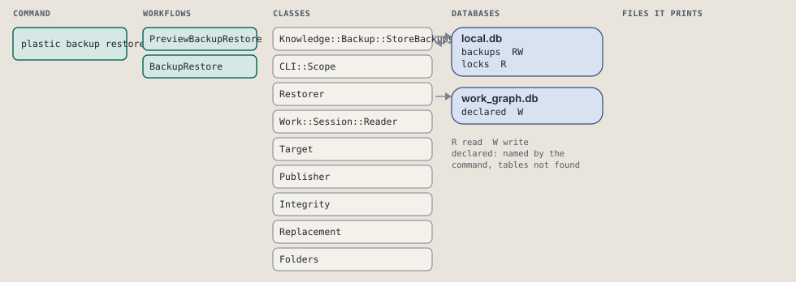
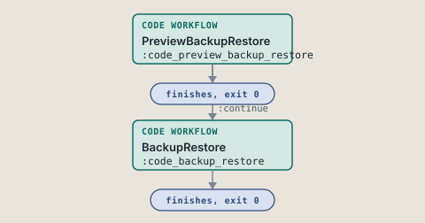
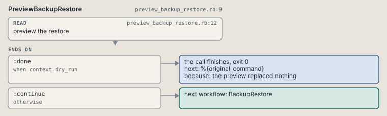
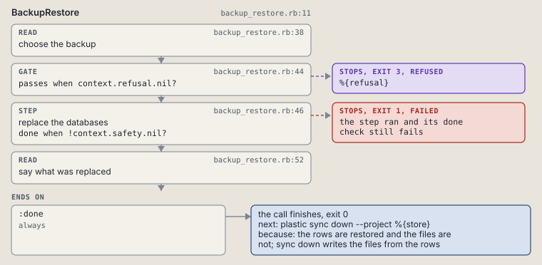

# plastic backup restore

Replace one store's databases with those of a done backup.

```sh
plastic backup restore --store SLUG [--timestamp TS] [--latest] [--databases LIST] [--dry-run]
```

The command is `BackupRestore`, in [`backup_restore.rb:10`](../../../../scripts/lib/plastic/commands/backup_restore.rb#L10). The words on this page, such as gate, step and outcome, are explained in [the command DSL](../../dsl/README.md).

| Argument or option | What it gives | Default |
| --- | --- | --- |
| `--store SLUG` | the registered project whose backups the call works on |  |
| `--timestamp TS` | the backup to restore, by its folder name |  |
| `--latest` | restore the newest backup that is done | `false` |
| `--databases LIST` | the databases to restore, comma separated; all the backup holds when left out |  |
| `--dry-run` | list what would be replaced and change nothing | `false` |

## What it touches



## Before the chain

The command's own `call`, at [`backup_store.rb:15`](../../../../scripts/lib/plastic/commands/backup_store.rb#L15), runs first:

```ruby
def call
  refuse_project
  refuse_unregistered
  check_call
  super
end
```

The command's own `check_call`, at [`backup_restore.rb:28`](../../../../scripts/lib/plastic/commands/backup_restore.rb#L28), runs inside it:

```ruby
def check_call
  one_of(%i[timestamp latest], give: "give --timestamp TS or --latest", both: "--latest and --timestamp exclude each other")
  database_list
end
```

## How the call flows



| Workflow | Kind | Code |
| --- | --- | --- |
| [PreviewBackupRestore](#previewbackuprestore) | code | [`preview_backup_restore.rb:9`](../../../../scripts/lib/plastic/workflows/preview_backup_restore.rb#L9) |
| [BackupRestore](#backuprestore) | code | [`backup_restore.rb:11`](../../../../scripts/lib/plastic/workflows/backup_restore.rb#L11) |

### PreviewBackupRestore

The code workflow `:code_preview_backup_restore`, in [`preview_backup_restore.rb:9`](../../../../scripts/lib/plastic/workflows/preview_backup_restore.rb#L9).

Lists the databases a restore would replace, and changes nothing.



| Step | Kind | Check | Code |
| --- | --- | --- | --- |
| preview the restore | read |  | [`preview_backup_restore.rb:12`](../../../../scripts/lib/plastic/workflows/preview_backup_restore.rb#L12) |

| Outcome | When | Then | Code |
| --- | --- | --- | --- |
| `:done` | when `context.dry_run` | finishes, exit 0; next: %{original_command} | [`preview_backup_restore.rb:20`](../../../../scripts/lib/plastic/workflows/preview_backup_restore.rb#L20) |
| `:continue` | otherwise | runs [BackupRestore](#backuprestore) | [`preview_backup_restore.rb:22`](../../../../scripts/lib/plastic/workflows/preview_backup_restore.rb#L22) |

### BackupRestore

The code workflow `:code_backup_restore`, in [`backup_restore.rb:11`](../../../../scripts/lib/plastic/workflows/backup_restore.rb#L11).

Replaces the databases of one store with those of a done backup, after a safety backup of the current ones.



| Step | Kind | Check | Code |
| --- | --- | --- | --- |
| choose the backup | read |  | [`backup_restore.rb:38`](../../../../scripts/lib/plastic/workflows/backup_restore.rb#L38) |
| %{refusal} | gate, stops with exit 3 | `context.refusal.nil?` | [`backup_restore.rb:44`](../../../../scripts/lib/plastic/workflows/backup_restore.rb#L44) |
| replace the databases | step | `!context.safety.nil?` | [`backup_restore.rb:46`](../../../../scripts/lib/plastic/workflows/backup_restore.rb#L46) |
| say what was replaced | read |  | [`backup_restore.rb:52`](../../../../scripts/lib/plastic/workflows/backup_restore.rb#L52) |

| Outcome | When | Then | Code |
| --- | --- | --- | --- |
| `:done` | always | finishes, exit 0; next: plastic sync down --project %{store} | [`backup_restore.rb:57`](../../../../scripts/lib/plastic/workflows/backup_restore.rb#L57) |

It sets `folder`, `refusal`, `safety`, `restored`.

## Outcomes

Every call can also end in [the ways any call can end](../../dsl/README.md#how-any-call-can-end).

| Ending | Exit | next: | Code |
| --- | --- | --- | --- |
| the preview replaced nothing | 0 | %{original_command} | [`preview_backup_restore.rb:20`](../../../../scripts/lib/plastic/workflows/preview_backup_restore.rb#L20) |
| %{refusal} | 3 | prints no next: line | [`backup_restore.rb:44`](../../../../scripts/lib/plastic/workflows/backup_restore.rb#L44) |
| the rows are restored and the files are not; sync down writes the files from the rows | 0 | plastic sync down --project %{store} | [`backup_restore.rb:57`](../../../../scripts/lib/plastic/workflows/backup_restore.rb#L57) |
| a step raises | 1 | prints no next: line | [`code_workflow.rb:102`](../../../../scripts/lib/plastic/code_workflow.rb#L102) |
| Usage error: name the store with --store; --project does not apply | 2 | prints no next: line | [`backup_store.rb:27`](../../../../scripts/lib/plastic/commands/backup_store.rb#L27) |
| Usage error: no registered project named %{slug}; the projects are %{projects} | 2 | prints no next: line | [`backup_store.rb:35`](../../../../scripts/lib/plastic/commands/backup_store.rb#L35) |
| Usage error | 2 | prints no next: line | [`backup_store.rb:40`](../../../../scripts/lib/plastic/commands/backup_store.rb#L40) |
| Usage error | 2 | prints no next: line | [`backup_store.rb:41`](../../../../scripts/lib/plastic/commands/backup_store.rb#L41) |
| Usage error | 2 | prints no next: line | [`backup_store.rb:47`](../../../../scripts/lib/plastic/commands/backup_store.rb#L47) |
