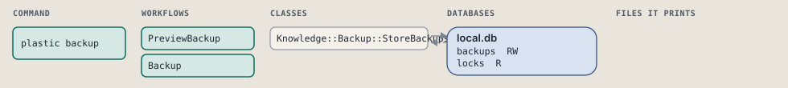
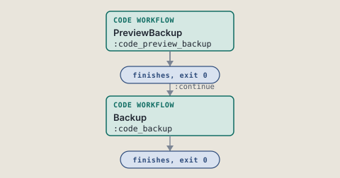
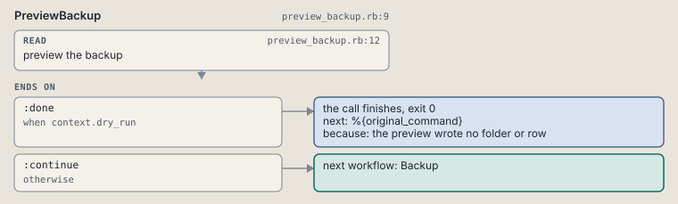
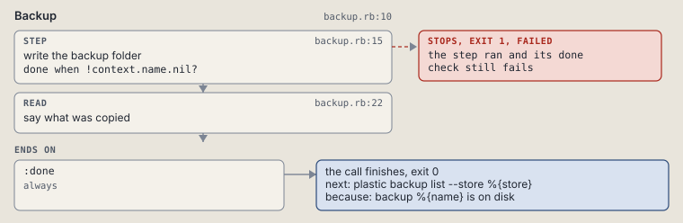

# plastic backup

Copy one store's databases into a new backup folder.

Copies one registered store's databases into a new backup folder.

```sh
plastic backup --store SLUG [--databases LIST] [--live] [--dry-run]
```

The command is `Backup`, in [`backup.rb:10`](../../../../scripts/lib/plastic/commands/backup.rb#L10). The words on this page, such as gate, step and outcome, are explained in [the command DSL](../../dsl/README.md).

| Argument or option | What it gives | Default |
| --- | --- | --- |
| `--store SLUG` | the registered project whose backups the call works on |  |
| `--databases LIST` | the databases to copy, comma separated; all of them when left out |  |
| `--live` | print each line of the backup log as it is written | `false` |
| `--dry-run` | preview the backup without writing a folder | `false` |

## What it touches



## Before the chain

The command's own `call`, at [`backup_store.rb:15`](../../../../scripts/lib/plastic/commands/backup_store.rb#L15), runs first:

```ruby
def call
  refuse_project
  refuse_unregistered
  check_call
  super
end
```

## How the call flows



| Workflow | Kind | Code |
| --- | --- | --- |
| [PreviewBackup](#previewbackup) | code | [`preview_backup.rb:9`](../../../../scripts/lib/plastic/workflows/preview_backup.rb#L9) |
| [Backup](#backup) | code | [`backup.rb:10`](../../../../scripts/lib/plastic/workflows/backup.rb#L10) |

### PreviewBackup

The code workflow `:code_preview_backup`, in [`preview_backup.rb:9`](../../../../scripts/lib/plastic/workflows/preview_backup.rb#L9).

Says which folder and databases a backup would write, and writes nothing.



| Step | Kind | Check | Code |
| --- | --- | --- | --- |
| preview the backup | read |  | [`preview_backup.rb:12`](../../../../scripts/lib/plastic/workflows/preview_backup.rb#L12) |

| Outcome | When | Then | Code |
| --- | --- | --- | --- |
| `:done` | when `context.dry_run` | finishes, exit 0; next: %{original_command} | [`preview_backup.rb:19`](../../../../scripts/lib/plastic/workflows/preview_backup.rb#L19) |
| `:continue` | otherwise | runs [Backup](#backup) | [`preview_backup.rb:21`](../../../../scripts/lib/plastic/workflows/preview_backup.rb#L21) |

### Backup

The code workflow `:code_backup`, in [`backup.rb:10`](../../../../scripts/lib/plastic/workflows/backup.rb#L10).

Copies the databases of one store into a new backup folder, and writes the row that names it.



| Step | Kind | Check | Code |
| --- | --- | --- | --- |
| write the backup folder | step | `!context.name.nil?` | [`backup.rb:15`](../../../../scripts/lib/plastic/workflows/backup.rb#L15) |
| say what was copied | read |  | [`backup.rb:22`](../../../../scripts/lib/plastic/workflows/backup.rb#L22) |

| Outcome | When | Then | Code |
| --- | --- | --- | --- |
| `:done` | always | finishes, exit 0; next: plastic backup list --store %{store} | [`backup.rb:27`](../../../../scripts/lib/plastic/workflows/backup.rb#L27) |

It sets `name`, `files`, `bytes`.

## Outcomes

Every call can also end in [the ways any call can end](../../dsl/README.md#how-any-call-can-end).

| Ending | Exit | next: | Code |
| --- | --- | --- | --- |
| the preview wrote no folder or row | 0 | %{original_command} | [`preview_backup.rb:19`](../../../../scripts/lib/plastic/workflows/preview_backup.rb#L19) |
| backup %{name} is on disk | 0 | plastic backup list --store %{store} | [`backup.rb:27`](../../../../scripts/lib/plastic/workflows/backup.rb#L27) |
| a step raises | 1 | prints no next: line | [`code_workflow.rb:97`](../../../../scripts/lib/plastic/code_workflow.rb#L97) |
| raise CLI::Command::Usage, "name the store with --store; --project does not apply" if parsed[:project] | 2 | prints no next: line | [`backup_store.rb:27`](../../../../scripts/lib/plastic/commands/backup_store.rb#L27) |
| raise CLI::Command::Usage, "no registered project named #{slug.inspect}; the projects are #{projects.keys.sort.join(", ")}" | 2 | prints no next: line | [`backup_store.rb:35`](../../../../scripts/lib/plastic/commands/backup_store.rb#L35) |
| raise CLI::Command::Usage, give if given.zero? | 2 | prints no next: line | [`backup_store.rb:40`](../../../../scripts/lib/plastic/commands/backup_store.rb#L40) |
| raise CLI::Command::Usage, both if given > 1 | 2 | prints no next: line | [`backup_store.rb:41`](../../../../scripts/lib/plastic/commands/backup_store.rb#L41) |
| raise CLI::Command::Usage, error.message | 2 | prints no next: line | [`backup_store.rb:47`](../../../../scripts/lib/plastic/commands/backup_store.rb#L47) |
