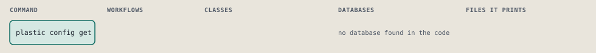
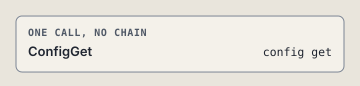

# plastic config get

Print the value of one setting.

```sh
plastic config get KEY [--harness NAME]
```

The command is `ConfigGet`, in [`config_get.rb:9`](../../../../scripts/lib/plastic/commands/config_get.rb#L9). The words on this page, such as gate, step and outcome, are explained in [the command DSL](../../dsl/README.md).

| Argument or option | What it gives | Default |
| --- | --- | --- |
| `KEY` | the setting, as its dotted name | |
| `--harness NAME` | the harness whose settings to use; the global settings when left out |  |

## What it touches



## The command

The command's `call`, at [`config_get.rb:14`](../../../../scripts/lib/plastic/commands/config_get.rb#L14):

```ruby
def call
  key = parsed[:key]
  output.row(key, current(key).to_s)
  output.next_step("plastic config set #{key} VALUE#{harness_words}", because: "the setting is printed")
end
```

## How the call flows



## Outcomes

Every call can also end in [the ways any call can end](../../dsl/README.md#how-any-call-can-end).

| Ending | Exit | next: | Code |
| --- | --- | --- | --- |
| Offers the next command | 0 | plastic config set KEY VALUE [HARNESS_WORDS] | [`config_get.rb:17`](../../../../scripts/lib/plastic/commands/config_get.rb#L17) |
