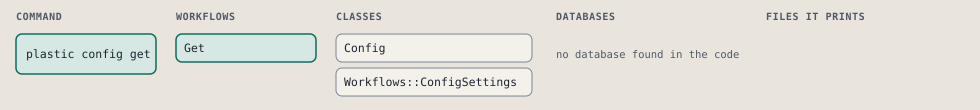
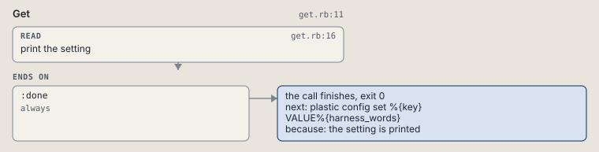
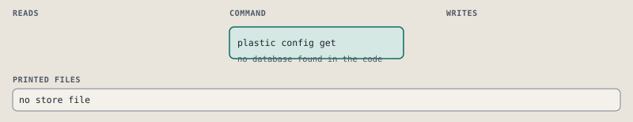

# plastic config get

Print the value of one setting.

```sh
plastic config get KEY [--harness NAME]
```

The command is `Config::Get`, in [`get.rb:11`](../../../../lib/plastic/commands/config/get.rb#L11). The words on this page, such as gate, step and outcome, are explained in [the command DSL](../../dsl/README.md).

| Argument or option | What it gives | Default |
| --- | --- | --- |
| `KEY` | the setting, as its dotted name | |
| `--harness NAME` | the harness whose settings to use; the global settings when left out |  |

## Components



The figure shows the command, the workflows it runs, the classes behind them, and the databases and files they reach.

## The events of one call

The call starts the workflow `Code::Config::Get`, in [`get.rb:11`](../../../../lib/plastic/workflows/code/config/get.rb#L11).

Prints the value of one setting. It writes nothing.



Its rows run in this order:

1. Read: print the setting. [`get.rb:16`](../../../../lib/plastic/workflows/code/config/get.rb#L16)
2. Outcome `:done`, always: finishes with exit 0; next: plastic config set KEY VALUEHARNESS_WORDS. [`get.rb:22`](../../../../lib/plastic/workflows/code/config/get.rb#L22)

It sets `harness_words`.

In the words of workflow engines, the rows are these four parts:

- **Trigger**: the call starts the workflow `Code::Config::Get`.
- **Activities**: 1 read.
- **Transitions**: .
- **Outcomes**: `:done` ends the call.

## What one call reads, writes and prints



It reads and writes no store database and prints no store file.

## How a call ends

Every call can also end in [the ways any call can end](../../dsl/README.md#how-any-call-can-end).

| Ending | Exit | next: | Code |
| --- | --- | --- | --- |
| the setting is printed | 0 | plastic config set KEY VALUEHARNESS_WORDS | [`get.rb:22`](../../../../lib/plastic/workflows/code/config/get.rb#L22) |
| a step raises | 1 | prints no next: line | [`code_workflow.rb:107`](../../../../lib/plastic/code_workflow.rb#L107) |

## What the page leaves out

Every call shares a few things that this page does not repeat; [the command DSL](../../dsl/README.md#what-every-call-shares) names them.

- No gate of this command refuses, so exit 3 never happens.
