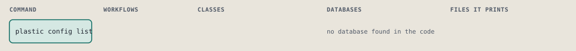
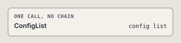

# plastic config list

List every setting with its value, globally or for one harness.

```sh
plastic config list [--harness NAME]
```

The command is `ConfigList`, in [`config_list.rb:10`](../../../../scripts/lib/plastic/commands/config_list.rb#L10). The words on this page, such as gate, step and outcome, are explained in [the command DSL](../../dsl/README.md).

| Argument or option | What it gives | Default |
| --- | --- | --- |
| `--harness NAME` | the harness whose settings to use; the global settings when left out |  |

## What it touches



## The command

The command's `call`, at [`config_list.rb:13`](../../../../scripts/lib/plastic/commands/config_list.rb#L13):

```ruby
def call
  config.entries.each { |key, value| output.row(key, value.to_s) }
  output.next_step("plastic config set KEY VALUE#{harness_words}", because: "the settings are listed")
end
```

## How the call flows



## Outcomes

Every call can also end in [the ways any call can end](../../dsl/README.md#how-any-call-can-end).

| Ending | Exit | next: | Code |
| --- | --- | --- | --- |
| Offers the next command | 0 | plastic config set KEY VALUE#{harness_words} | [`config_list.rb:15`](../../../../scripts/lib/plastic/commands/config_list.rb#L15) |
