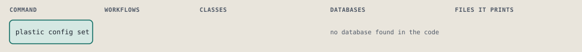
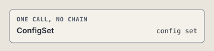

# plastic config set

Write one setting to config.yml, globally or for one harness.

```sh
plastic config set KEY VALUE [--harness NAME]
```

The command is `ConfigSet`, in [`config_set.rb:11`](../../../../scripts/lib/plastic/commands/config_set.rb#L11). The words on this page, such as gate, step and outcome, are explained in [the command DSL](../../dsl/README.md).

| Argument or option | What it gives | Default |
| --- | --- | --- |
| `KEY` | the setting, as its dotted name | |
| `VALUE` | the new value | |
| `--harness NAME` | the harness whose settings to use; the global settings when left out |  |

## What it touches



## The command

The command's `call`, at [`config_set.rb:26`](../../../../scripts/lib/plastic/commands/config_set.rb#L26):

```ruby
def call
  key = parsed[:key]
  value = checked(key, ConfigSet.scalar(parsed[:value]))
  config.set(key, value)
  output.row(key, value.to_s)
  output.next_step("plastic config get #{key}#{harness_words}", because: "the setting is written")
end
```

## How the call flows



## Outcomes

Every call can also end in [the ways any call can end](../../dsl/README.md#how-any-call-can-end).

| Ending | Exit | next: | Code |
| --- | --- | --- | --- |
| Usage error: a setting takes one value, not %{text} | 2 | prints no next: line | [`config_set.rb:19`](../../../../scripts/lib/plastic/commands/config_set.rb#L19) |
| Usage error: %{key} takes true or false | 2 | prints no next: line | [`config_set.rb:38`](../../../../scripts/lib/plastic/commands/config_set.rb#L38) |
| Offers the next command | 0 | plastic config get KEY [HARNESS_WORDS] | [`config_set.rb:31`](../../../../scripts/lib/plastic/commands/config_set.rb#L31) |
