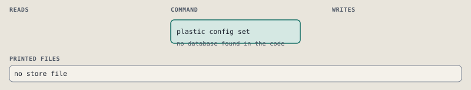

# plastic config set

Write one setting to config.yml, globally or for one harness.

```sh
plastic config set KEY VALUE [--harness NAME]
```

The command is `Config::Set`, in [`set.rb:13`](../../../../lib/plastic/commands/config/set.rb#L13). The words on this page, such as gate, step and outcome, are explained in [the command DSL](../../dsl/README.md).

| Argument or option | What it gives | Default |
| --- | --- | --- |
| `KEY` | the setting, as its dotted name | |
| `VALUE` | the new value | |
| `--harness NAME` | the harness whose settings to use; the global settings when left out |  |

## Components


The figure shows the command, the workflows it runs, the classes behind them, and the databases and files they reach.

## The events of one call


The command's `call`, at [`set.rb:28`](../../../../lib/plastic/commands/config/set.rb#L28):

```ruby
def call
  key = parsed[:key]
  value = checked(key, self.class.scalar(parsed[:value]))
  config.set(key, value)
  output.row(key, value.to_s)
  output.next_step("plastic config get #{key}#{harness_words}", because: "the setting is written")
end
```

Its steps run in this order:

1. `key = parsed[:key]` [`set.rb:29`](../../../../lib/plastic/commands/config/set.rb#L29)
2. `value = checked(key, self.class.scalar(parsed[:value]))` [`set.rb:30`](../../../../lib/plastic/commands/config/set.rb#L30)
3. `config.set(key, value)` [`set.rb:31`](../../../../lib/plastic/commands/config/set.rb#L31)
4. `output.row(key, value.to_s)` [`set.rb:32`](../../../../lib/plastic/commands/config/set.rb#L32)
5. `output.next_step("plastic config get #{key}#{harness_words}", because: "the setting is written")` [`set.rb:33`](../../../../lib/plastic/commands/config/set.rb#L33)

## What one call reads, writes and prints



It reads and writes no store database and prints no store file.

## How a call ends

Every call can also end in [the ways any call can end](../../dsl/README.md#how-any-call-can-end).

| Ending | Exit | next: | Code |
| --- | --- | --- | --- |
| Usage error: a setting takes one value, not TEXT | 2 | prints no next: line | [`set.rb:21`](../../../../lib/plastic/commands/config/set.rb#L21) |
| Usage error: KEY takes true or false | 2 | prints no next: line | [`set.rb:40`](../../../../lib/plastic/commands/config/set.rb#L40) |
| Offers the next command | 0 | plastic config get KEY [HARNESS_WORDS] | [`set.rb:33`](../../../../lib/plastic/commands/config/set.rb#L33) |

## What the page leaves out

Every call shares a few things that this page does not repeat; [the command DSL](../../dsl/README.md#what-every-call-shares) names them.

- No gate of this command refuses, so exit 3 never happens.
