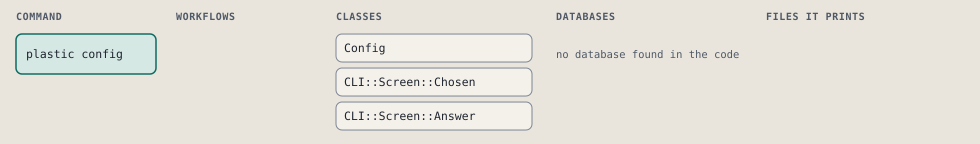
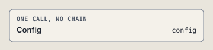

# plastic config

Pick which on/off settings are on, on the choice screen.

Shows the on/off settings on the choice screen, the ones that are on already picked, and writes each one the person changed. See docs/help/choice-screen.md.

```sh
plastic config [ANSWER] [--harness NAME]
```

The command is `Config`, in [`config.rb:12`](../../../../scripts/lib/plastic/commands/config.rb#L12). The words on this page, such as gate, step and outcome, are explained in [the command DSL](../../dsl/README.md).

| Argument or option | What it gives | Default |
| --- | --- | --- |
| `ANSWER` | the person's answer to the numbered list | |
| `--harness NAME` | the harness whose settings to use; the global settings when left out |  |

## What it touches



## The command

The command's `call`, at [`config.rb:23`](../../../../scripts/lib/plastic/commands/config.rb#L23):

```ruby
def call
  result = pick(choices)
  save(result.labels) if result.is_a?(CLI::Screen::Chosen)
  output.next_step("plastic config list#{harness_words}", because: "the person left with no change") if result.is_a?(CLI::Screen::Left)
end
```

## How the call flows



## Outcomes

Every call can also end in [the ways any call can end](../../dsl/README.md#how-any-call-can-end).

| Ending | Exit | next: | Code |
| --- | --- | --- | --- |
| Offers the next command | 0 | plastic config list [HARNESS_WORDS] | [`config.rb:26`](../../../../scripts/lib/plastic/commands/config.rb#L26) |
| Offers the next command | 0 | plastic config list [HARNESS_WORDS] | [`config.rb:45`](../../../../scripts/lib/plastic/commands/config.rb#L45) |
