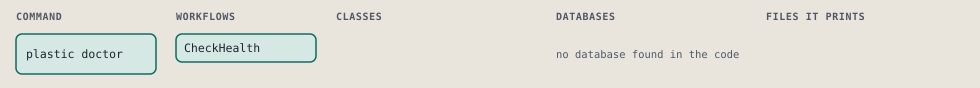
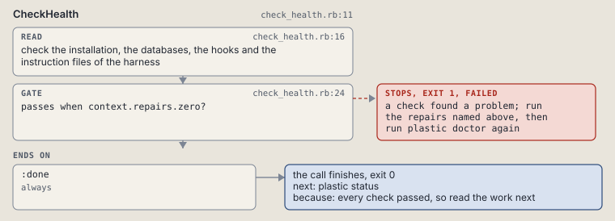

# plastic doctor

Check the installation, the databases and the hooks of this harness, and name each repair.

```sh
plastic doctor [--harness NAME]
```

The command is `Doctor`, in [`doctor.rb:7`](../../../../scripts/lib/plastic/commands/doctor.rb#L7). The words on this page, such as gate, step and outcome, are explained in [the command DSL](../../dsl/README.md).

| Argument or option | What it gives | Default |
| --- | --- | --- |
| `--harness NAME` | the harness to check, such as claude-code; the one the call runs in when left out |  |

## What it touches



## How the call flows


| Workflow | Kind | Code |
| --- | --- | --- |
| [CheckHealth](#checkhealth) | code | [`check_health.rb:11`](../../../../scripts/lib/plastic/workflows/check_health.rb#L11) |

### CheckHealth

The code workflow `:code_check_health`, in [`check_health.rb:11`](../../../../scripts/lib/plastic/workflows/check_health.rb#L11).

Runs the checks of the shared parts and of one harness, prints a row for each, and names each repair once. It reads files and changes none.



| Step | Kind | Check | Code |
| --- | --- | --- | --- |
| check the installation, the databases, the hooks and the instruction files of the harness | read |  | [`check_health.rb:16`](../../../../scripts/lib/plastic/workflows/check_health.rb#L16) |
| a check found a problem; run the repairs named above, then run plastic doctor again | gate, stops with exit 1 | `context.repairs.zero?` | [`check_health.rb:24`](../../../../scripts/lib/plastic/workflows/check_health.rb#L24) |

| Outcome | When | Then | Code |
| --- | --- | --- | --- |
| `:done` | always | finishes, exit 0; next: plastic status | [`check_health.rb:27`](../../../../scripts/lib/plastic/workflows/check_health.rb#L27) |

It sets `repairs`.

## Outcomes

Every call can also end in [the ways any call can end](../../dsl/README.md#how-any-call-can-end).

| Ending | Exit | next: | Code |
| --- | --- | --- | --- |
| a check found a problem; run the repairs named above, then run plastic doctor again | 1 | prints no next: line | [`check_health.rb:24`](../../../../scripts/lib/plastic/workflows/check_health.rb#L24) |
| every check passed, so read the work next | 0 | plastic status | [`check_health.rb:27`](../../../../scripts/lib/plastic/workflows/check_health.rb#L27) |
| a step raises | 1 | prints no next: line | [`code_workflow.rb:102`](../../../../scripts/lib/plastic/code_workflow.rb#L102) |
