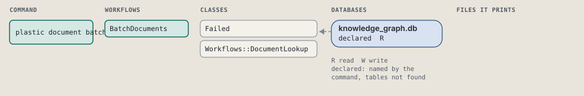
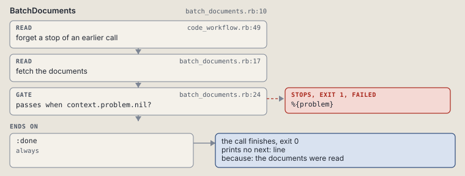

# plastic document batch

Fetch qualified documents in request order.

```sh
plastic document batch REF...
```

The command is `DocumentBatch`, in [`document_batch.rb:8`](../../../../scripts/lib/plastic/commands/document_batch.rb#L8). The words on this page, such as gate, step and outcome, are explained in [the command DSL](../../dsl/README.md).

| Argument or option | What it gives | Default |
| --- | --- | --- |
| `REF` | one or more plastic://STORE/INTENT/PATH?revision=SHA256 references | |

## What it touches



## How the call flows


| Workflow | Kind | Code |
| --- | --- | --- |
| [BatchDocuments](#batchdocuments) | code | [`batch_documents.rb:10`](../../../../scripts/lib/plastic/workflows/batch_documents.rb#L10) |

### BatchDocuments

The code workflow `:code_batch_documents`, in [`batch_documents.rb:10`](../../../../scripts/lib/plastic/workflows/batch_documents.rb#L10).

Fetches qualified documents in the exact request order.



| Step | Kind | Check | Code |
| --- | --- | --- | --- |
| forget a stop of an earlier call | read |  | [`code_workflow.rb:49`](../../../../scripts/lib/plastic/code_workflow.rb#L49) |
| fetch the documents | read |  | [`batch_documents.rb:17`](../../../../scripts/lib/plastic/workflows/batch_documents.rb#L17) |
| %{problem} | gate, stops with exit 1 | `context.problem.nil?` | [`batch_documents.rb:24`](../../../../scripts/lib/plastic/workflows/batch_documents.rb#L24) |

| Outcome | When | Then | Code |
| --- | --- | --- | --- |
| `:done` | always | finishes, exit 0; prints no next: line | [`batch_documents.rb:26`](../../../../scripts/lib/plastic/workflows/batch_documents.rb#L26) |

It sets `problem`.

## Outcomes

Every call can also end in [the ways any call can end](../../dsl/README.md#how-any-call-can-end).

| Ending | Exit | next: | Code |
| --- | --- | --- | --- |
| %{problem} | 1 | prints no next: line | [`batch_documents.rb:24`](../../../../scripts/lib/plastic/workflows/batch_documents.rb#L24) |
| the documents were read | 0 | prints no next: line | [`batch_documents.rb:26`](../../../../scripts/lib/plastic/workflows/batch_documents.rb#L26) |
| a step raises | 1 | prints no next: line | [`code_workflow.rb:97`](../../../../scripts/lib/plastic/code_workflow.rb#L97) |
