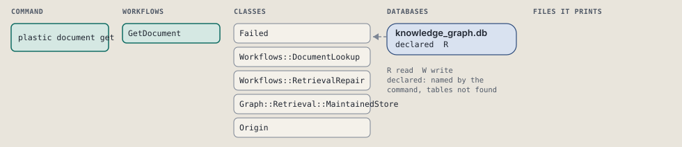
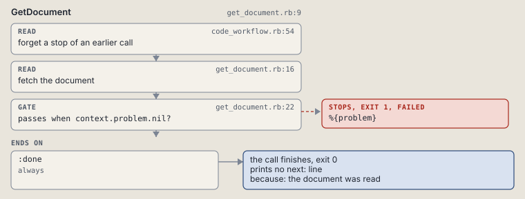

# plastic document get

Fetch one current or revision-qualified document.

Fetches one current or immutable document by its qualified reference.

```sh
plastic document get REF [--passage N]
```

The command is `DocumentGet`, in [`document_get.rb:8`](../../../../scripts/lib/plastic/commands/document_get.rb#L8). The words on this page, such as gate, step and outcome, are explained in [the command DSL](../../dsl/README.md).

| Argument or option | What it gives | Default |
| --- | --- | --- |
| `REF` | plastic://STORE/INTENT/PATH?revision=SHA256 | |
| `--passage N` | one-based bounded passage position |  |

## What it touches



## How the call flows


| Workflow | Kind | Code |
| --- | --- | --- |
| [GetDocument](#getdocument) | code | [`get_document.rb:10`](../../../../scripts/lib/plastic/workflows/get_document.rb#L10) |

### GetDocument

The code workflow `:code_get_document`, in [`get_document.rb:10`](../../../../scripts/lib/plastic/workflows/get_document.rb#L10).

Fetches one current or immutable document, or one bounded passage of it.



| Step | Kind | Check | Code |
| --- | --- | --- | --- |
| forget a stop of an earlier call | read |  | [`code_workflow.rb:54`](../../../../scripts/lib/plastic/code_workflow.rb#L54) |
| fetch the document | read |  | [`get_document.rb:17`](../../../../scripts/lib/plastic/workflows/get_document.rb#L17) |
| %{problem} | gate, stops with exit 1 | `context.problem.nil?` | [`get_document.rb:23`](../../../../scripts/lib/plastic/workflows/get_document.rb#L23) |

| Outcome | When | Then | Code |
| --- | --- | --- | --- |
| `:done` | always | finishes, exit 0; prints no next: line | [`get_document.rb:25`](../../../../scripts/lib/plastic/workflows/get_document.rb#L25) |

It sets `problem`.

## Outcomes

Every call can also end in [the ways any call can end](../../dsl/README.md#how-any-call-can-end).

| Ending | Exit | next: | Code |
| --- | --- | --- | --- |
| %{problem} | 1 | prints no next: line | [`get_document.rb:23`](../../../../scripts/lib/plastic/workflows/get_document.rb#L23) |
| the document was read | 0 | prints no next: line | [`get_document.rb:25`](../../../../scripts/lib/plastic/workflows/get_document.rb#L25) |
| a step raises | 1 | prints no next: line | [`code_workflow.rb:102`](../../../../scripts/lib/plastic/code_workflow.rb#L102) |
