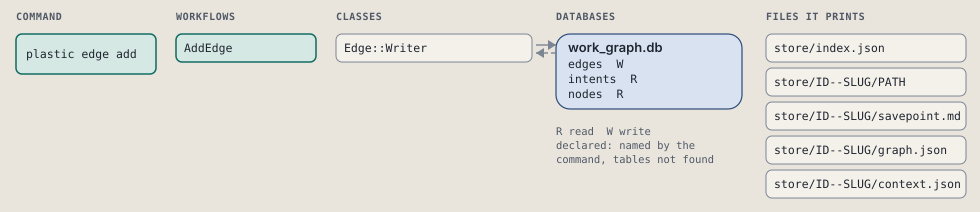
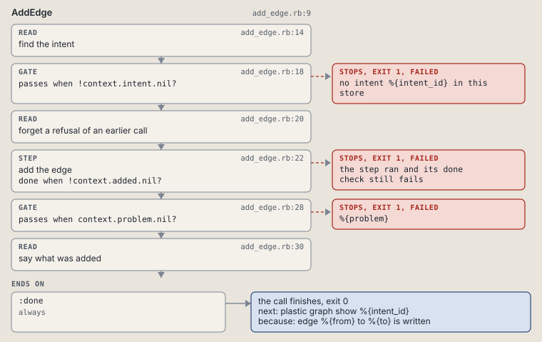

# plastic edge add

Add a needs edge between two nodes.

Adds a needs edge between two nodes of the same intent, guarded against a self edge, a missing or removed node, and a loop.

```sh
plastic edge add ID FROM TO
```

The command is `EdgeAdd`, in [`edge_add.rb:9`](../../../../scripts/lib/plastic/commands/edge_add.rb#L9). The words on this page, such as gate, step and outcome, are explained in [the command DSL](../../dsl/README.md).

| Argument or option | What it gives | Default |
| --- | --- | --- |
| `ID` | the intent | |
| `FROM` | the node that must be done first | |
| `TO` | the node that waits on it | |

## What it touches



## How the call flows


| Workflow | Kind | Code |
| --- | --- | --- |
| [AddEdge](#addedge) | code | [`add_edge.rb:9`](../../../../scripts/lib/plastic/workflows/add_edge.rb#L9) |

### AddEdge

The code workflow `:code_add_edge`, in [`add_edge.rb:9`](../../../../scripts/lib/plastic/workflows/add_edge.rb#L9).

Writes one guarded edge: fails on a self edge, a missing or removed node, or a loop back to its own start.



| Step | Kind | Check | Code |
| --- | --- | --- | --- |
| find the intent | read |  | [`add_edge.rb:14`](../../../../scripts/lib/plastic/workflows/add_edge.rb#L14) |
| no intent %{intent_id} in this store | gate, stops with exit 1 | `!context.intent.nil?` | [`add_edge.rb:18`](../../../../scripts/lib/plastic/workflows/add_edge.rb#L18) |
| forget a refusal of an earlier call | read |  | [`add_edge.rb:20`](../../../../scripts/lib/plastic/workflows/add_edge.rb#L20) |
| add the edge | step | `!context.added.nil?` | [`add_edge.rb:22`](../../../../scripts/lib/plastic/workflows/add_edge.rb#L22) |
| %{problem} | gate, stops with exit 1 | `context.problem.nil?` | [`add_edge.rb:28`](../../../../scripts/lib/plastic/workflows/add_edge.rb#L28) |
| say what was added | read |  | [`add_edge.rb:30`](../../../../scripts/lib/plastic/workflows/add_edge.rb#L30) |

| Outcome | When | Then | Code |
| --- | --- | --- | --- |
| `:done` | always | finishes, exit 0; next: plastic graph show %{intent_id} | [`add_edge.rb:34`](../../../../scripts/lib/plastic/workflows/add_edge.rb#L34) |

It sets `intent`, `problem`, `added`.

## Outcomes

Every call can also end in [the ways any call can end](../../dsl/README.md#how-any-call-can-end).

| Ending | Exit | next: | Code |
| --- | --- | --- | --- |
| no intent %{intent_id} in this store | 1 | prints no next: line | [`add_edge.rb:18`](../../../../scripts/lib/plastic/workflows/add_edge.rb#L18) |
| %{problem} | 1 | prints no next: line | [`add_edge.rb:28`](../../../../scripts/lib/plastic/workflows/add_edge.rb#L28) |
| edge %{from} to %{to} is written | 0 | plastic graph show %{intent_id} | [`add_edge.rb:34`](../../../../scripts/lib/plastic/workflows/add_edge.rb#L34) |
| a step raises | 1 | prints no next: line | [`code_workflow.rb:97`](../../../../scripts/lib/plastic/code_workflow.rb#L97) |
