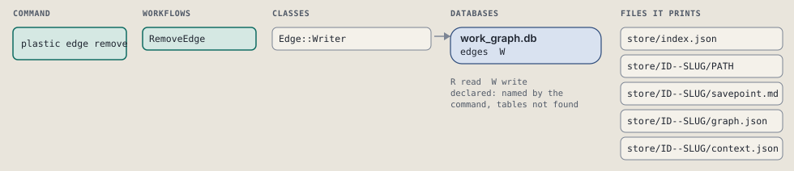
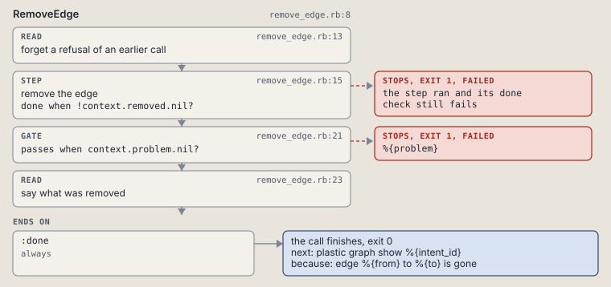

# plastic edge remove

Remove an edge.

Removes one edge. Fails when no such edge exists.

```sh
plastic edge remove ID FROM TO [--dry-run]
```

The command is `EdgeRemove`, in [`edge_remove.rb:8`](../../../../scripts/lib/plastic/commands/edge_remove.rb#L8). The words on this page, such as gate, step and outcome, are explained in [the command DSL](../../dsl/README.md).

| Argument or option | What it gives | Default |
| --- | --- | --- |
| `ID` | the intent | |
| `FROM` | the edge's start | |
| `TO` | the edge's end | |
| `--dry-run` | preview the call in a disposable copy | `false` |

## What it touches



## How the call flows


| Workflow | Kind | Code |
| --- | --- | --- |
| [RemoveEdge](#removeedge) | code | [`remove_edge.rb:8`](../../../../scripts/lib/plastic/workflows/remove_edge.rb#L8) |

### RemoveEdge

The code workflow `:code_remove_edge`, in [`remove_edge.rb:8`](../../../../scripts/lib/plastic/workflows/remove_edge.rb#L8).

Removes one edge; fails when no such edge exists.



| Step | Kind | Check | Code |
| --- | --- | --- | --- |
| forget a refusal of an earlier call | read |  | [`remove_edge.rb:13`](../../../../scripts/lib/plastic/workflows/remove_edge.rb#L13) |
| remove the edge | step | `!context.removed.nil?` | [`remove_edge.rb:15`](../../../../scripts/lib/plastic/workflows/remove_edge.rb#L15) |
| %{problem} | gate, stops with exit 1 | `context.problem.nil?` | [`remove_edge.rb:21`](../../../../scripts/lib/plastic/workflows/remove_edge.rb#L21) |
| say what was removed | read |  | [`remove_edge.rb:23`](../../../../scripts/lib/plastic/workflows/remove_edge.rb#L23) |

| Outcome | When | Then | Code |
| --- | --- | --- | --- |
| `:done` | always | finishes, exit 0; next: plastic graph show %{intent_id} | [`remove_edge.rb:27`](../../../../scripts/lib/plastic/workflows/remove_edge.rb#L27) |

It sets `problem`, `removed`.

## Outcomes

Every call can also end in [the ways any call can end](../../dsl/README.md#how-any-call-can-end).

| Ending | Exit | next: | Code |
| --- | --- | --- | --- |
| %{problem} | 1 | prints no next: line | [`remove_edge.rb:21`](../../../../scripts/lib/plastic/workflows/remove_edge.rb#L21) |
| edge %{from} to %{to} is gone | 0 | plastic graph show %{intent_id} | [`remove_edge.rb:27`](../../../../scripts/lib/plastic/workflows/remove_edge.rb#L27) |
| a step raises | 1 | prints no next: line | [`code_workflow.rb:97`](../../../../scripts/lib/plastic/code_workflow.rb#L97) |
