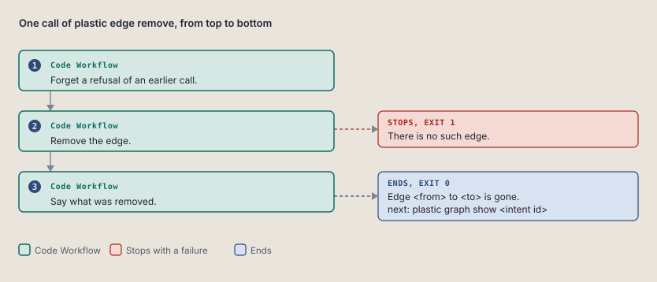

# plastic edge remove

Remove an edge.

Removes one edge. Fails when no such edge exists.

```sh
plastic edge remove ID FROM TO [--dry-run]
```

| Argument or option | What it gives | Default |
| --- | --- | --- |
| `ID` | the intent | |
| `FROM` | the edge's start | |
| `TO` | the edge's end | |
| `--dry-run` | preview the call in a disposable copy | `false` |

## The events of one call, step by step



The boxes on the left run in order. The boxes on the right are the ways the call stops or ends at that step.

## What one call changes

| What changes | Where | Reach |
| --- | --- | --- |
| The edge between two nodes of the intent is removed | the work graph database, in the store folder | goes with the store |
| The files of the intent and the index of the store are rewritten | the store folder | goes with the store |

Goes with the store: the files of the store carry the change, and `plastic sync up` rebuilds it on another machine. The database files themselves stay on this machine.

The command is `Plastic::Commands::Edge::Remove`, in [`remove.rb:9`](../../../../lib/plastic/commands/edge/remove.rb#L9).
