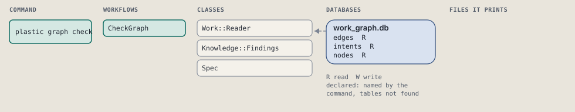
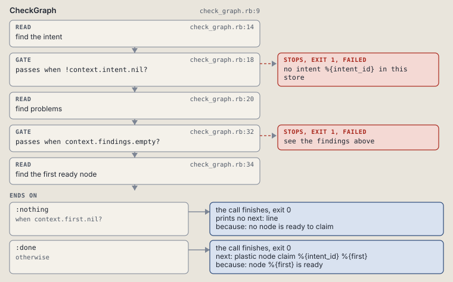

# plastic graph check

Find a done node with no findings, an isolated node, a retry cap or no done criterion.

Runs the five findings of one intent's work graph and its spec.

```sh
plastic graph check ID
```

The command is `GraphCheck`, in [`graph_check.rb:8`](../../../../scripts/lib/plastic/commands/graph_check.rb#L8). The words on this page, such as gate, step and outcome, are explained in [the command DSL](../../dsl/README.md).

| Argument or option | What it gives | Default |
| --- | --- | --- |
| `ID` | the intent | |

## What it touches



## How the call flows


| Workflow | Kind | Code |
| --- | --- | --- |
| [CheckGraph](#checkgraph) | code | [`check_graph.rb:9`](../../../../scripts/lib/plastic/workflows/check_graph.rb#L9) |

### CheckGraph

The code workflow `:code_check_graph`, in [`check_graph.rb:9`](../../../../scripts/lib/plastic/workflows/check_graph.rb#L9).

Prints each finding, or "no findings"; a finding fails the call.



| Step | Kind | Check | Code |
| --- | --- | --- | --- |
| find the intent | read |  | [`check_graph.rb:14`](../../../../scripts/lib/plastic/workflows/check_graph.rb#L14) |
| no intent %{intent_id} in this store | gate, stops with exit 1 | `!context.intent.nil?` | [`check_graph.rb:18`](../../../../scripts/lib/plastic/workflows/check_graph.rb#L18) |
| find problems | read |  | [`check_graph.rb:20`](../../../../scripts/lib/plastic/workflows/check_graph.rb#L20) |
| see the findings above | gate, stops with exit 1 | `context.findings.empty?` | [`check_graph.rb:32`](../../../../scripts/lib/plastic/workflows/check_graph.rb#L32) |
| find the first ready node | read |  | [`check_graph.rb:34`](../../../../scripts/lib/plastic/workflows/check_graph.rb#L34) |

| Outcome | When | Then | Code |
| --- | --- | --- | --- |
| `:nothing` | when `context.first.nil?` | finishes, exit 0; prints no next: line | [`check_graph.rb:38`](../../../../scripts/lib/plastic/workflows/check_graph.rb#L38) |
| `:done` | otherwise | finishes, exit 0; next: plastic node claim %{intent_id} %{first} | [`check_graph.rb:39`](../../../../scripts/lib/plastic/workflows/check_graph.rb#L39) |

It sets `intent`, `findings`, `first`.

## Outcomes

Every call can also end in [the ways any call can end](../../dsl/README.md#how-any-call-can-end).

| Ending | Exit | next: | Code |
| --- | --- | --- | --- |
| no intent %{intent_id} in this store | 1 | prints no next: line | [`check_graph.rb:18`](../../../../scripts/lib/plastic/workflows/check_graph.rb#L18) |
| see the findings above | 1 | prints no next: line | [`check_graph.rb:32`](../../../../scripts/lib/plastic/workflows/check_graph.rb#L32) |
| no node is ready to claim | 0 | prints no next: line | [`check_graph.rb:38`](../../../../scripts/lib/plastic/workflows/check_graph.rb#L38) |
| node %{first} is ready | 0 | plastic node claim %{intent_id} %{first} | [`check_graph.rb:39`](../../../../scripts/lib/plastic/workflows/check_graph.rb#L39) |
| a step raises | 1 | prints no next: line | [`code_workflow.rb:97`](../../../../scripts/lib/plastic/code_workflow.rb#L97) |
