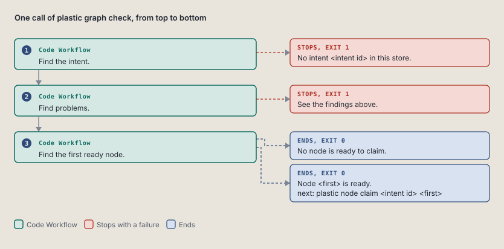

# plastic graph check

Find a done node with no findings, an isolated node, a retry cap, no done criterion, a need on a removed node, a loop, output that is not JSON or a schema file with no live node.

```sh
plastic graph check ID
```

| Argument or option | What it gives | Default |
| --- | --- | --- |
| `ID` | the intent | |

## The events of one call, step by step



The boxes on the left run in order. The boxes on the right are the ways the call stops or ends at that step.

## What one call changes

This command changes nothing.

The command is `Plastic::Commands::Graph::Check`, in [`commands/graph/check.rb`](../../../../lib/plastic/commands/graph/check.rb).
