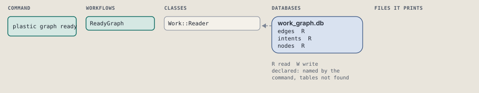
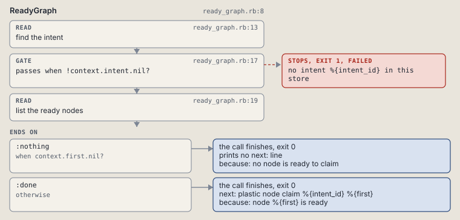

# plastic graph ready

List the nodes ready to claim.

Lists the nodes ready to claim: open, with every need done.

```sh
plastic graph ready ID
```

The command is `GraphReady`, in [`graph_ready.rb:8`](../../../../scripts/lib/plastic/commands/graph_ready.rb#L8). The words on this page, such as gate, step and outcome, are explained in [the command DSL](../../dsl/README.md).

| Argument or option | What it gives | Default |
| --- | --- | --- |
| `ID` | the intent | |

## What it touches



## How the call flows


| Workflow | Kind | Code |
| --- | --- | --- |
| [ReadyGraph](#readygraph) | code | [`ready_graph.rb:8`](../../../../scripts/lib/plastic/workflows/ready_graph.rb#L8) |

### ReadyGraph

The code workflow `:code_ready_graph`, in [`ready_graph.rb:8`](../../../../scripts/lib/plastic/workflows/ready_graph.rb#L8).

Lists the ready nodes of one intent's work graph.



| Step | Kind | Check | Code |
| --- | --- | --- | --- |
| find the intent | read |  | [`ready_graph.rb:13`](../../../../scripts/lib/plastic/workflows/ready_graph.rb#L13) |
| no intent %{intent_id} in this store | gate, stops with exit 1 | `!context.intent.nil?` | [`ready_graph.rb:17`](../../../../scripts/lib/plastic/workflows/ready_graph.rb#L17) |
| list the ready nodes | read |  | [`ready_graph.rb:19`](../../../../scripts/lib/plastic/workflows/ready_graph.rb#L19) |

| Outcome | When | Then | Code |
| --- | --- | --- | --- |
| `:nothing` | when `context.first.nil?` | finishes, exit 0; prints no next: line | [`ready_graph.rb:25`](../../../../scripts/lib/plastic/workflows/ready_graph.rb#L25) |
| `:done` | otherwise | finishes, exit 0; next: plastic node claim %{intent_id} %{first} | [`ready_graph.rb:26`](../../../../scripts/lib/plastic/workflows/ready_graph.rb#L26) |

It sets `intent`, `nodes`, `first`.

## Outcomes

Every call can also end in [the ways any call can end](../../dsl/README.md#how-any-call-can-end).

| Ending | Exit | next: | Code |
| --- | --- | --- | --- |
| no intent %{intent_id} in this store | 1 | prints no next: line | [`ready_graph.rb:17`](../../../../scripts/lib/plastic/workflows/ready_graph.rb#L17) |
| no node is ready to claim | 0 | prints no next: line | [`ready_graph.rb:25`](../../../../scripts/lib/plastic/workflows/ready_graph.rb#L25) |
| node %{first} is ready | 0 | plastic node claim %{intent_id} %{first} | [`ready_graph.rb:26`](../../../../scripts/lib/plastic/workflows/ready_graph.rb#L26) |
| a step raises | 1 | prints no next: line | [`code_workflow.rb:97`](../../../../scripts/lib/plastic/code_workflow.rb#L97) |
