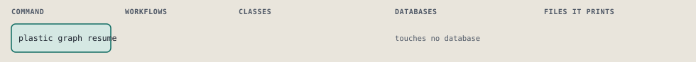

# plastic graph resume

Say where each named store's work stopped and what runs next.

```sh
plastic graph resume [--stores LIST]
```

The command is `GraphResume`, in [`graph_resume.rb:13`](../../../../scripts/lib/plastic/commands/graph_resume.rb#L13). The words on this page, such as gate, step and outcome, are explained in [the command DSL](../../dsl/README.md).

| Argument or option | What it gives | Default |
| --- | --- | --- |
| `--stores LIST` | the stores to read, comma separated: registered projects or global; the call's own store when left out |  |

## What it touches



## The command

The command's `call`, at [`graph_resume.rb:19`](../../../../scripts/lib/plastic/commands/graph_resume.rb#L19):

```ruby
def call
  refuse_project
  offer_next(store_slugs.map { |slug| report(slug) }.each { |found| print_rows(found) })
end
```

## How the call flows


## Outcomes

Every call can also end in [the ways any call can end](../../dsl/README.md#how-any-call-can-end).

| Ending | Exit | next: | Code |
| --- | --- | --- | --- |
| Usage error: --stores names the stores; --project does not apply | 2 | prints no next: line | [`graph_resume.rb:31`](../../../../scripts/lib/plastic/commands/graph_resume.rb#L31) |
| Usage error: name at least one store after --stores | 2 | prints no next: line | [`graph_resume.rb:41`](../../../../scripts/lib/plastic/commands/graph_resume.rb#L41) |
| Usage error: no registered project named %{name}; the projects are %{projects} | 2 | prints no next: line | [`graph_resume.rb:50`](../../../../scripts/lib/plastic/commands/graph_resume.rb#L50) |
| Offers the next command | 0 | plastic status | [`graph_resume.rb:62`](../../../../scripts/lib/plastic/commands/graph_resume.rb#L62) |
| Offers the next command | 0 | decided at run time | [`graph_resume.rb:70`](../../../../scripts/lib/plastic/commands/graph_resume.rb#L70) |
