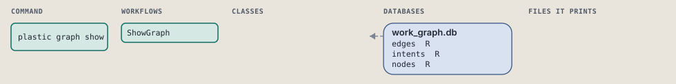
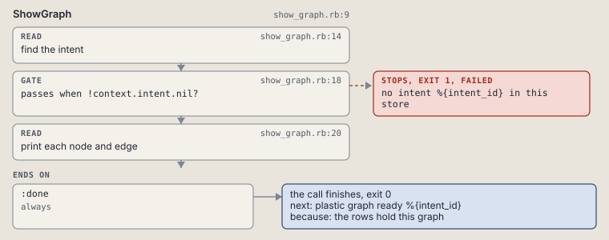

# plastic graph show

Print every node and edge of an intent.

Prints one intent's nodes and edges from the rows. It reads and writes nothing.

```sh
plastic graph show ID
```

The command is `GraphShow`, in [`graph_show.rb:8`](../../../../scripts/lib/plastic/commands/graph_show.rb#L8). The words on this page, such as gate, step and outcome, are explained in [the command DSL](../../dsl/README.md).

| Argument or option | What it gives | Default |
| --- | --- | --- |
| `ID` | the intent | |

## What it touches



## How the call flows


| Workflow | Kind | Code |
| --- | --- | --- |
| [ShowGraph](#showgraph) | code | [`show_graph.rb:9`](../../../../scripts/lib/plastic/workflows/show_graph.rb#L9) |

### ShowGraph

The code workflow `:code_show_graph`, in [`show_graph.rb:9`](../../../../scripts/lib/plastic/workflows/show_graph.rb#L9).

Prints each node and edge from the rows. It never reads or writes graph.json.



| Step | Kind | Check | Code |
| --- | --- | --- | --- |
| find the intent | read |  | [`show_graph.rb:14`](../../../../scripts/lib/plastic/workflows/show_graph.rb#L14) |
| no intent %{intent_id} in this store | gate, stops with exit 1 | `!context.intent.nil?` | [`show_graph.rb:18`](../../../../scripts/lib/plastic/workflows/show_graph.rb#L18) |
| print each node and edge | read |  | [`show_graph.rb:20`](../../../../scripts/lib/plastic/workflows/show_graph.rb#L20) |

| Outcome | When | Then | Code |
| --- | --- | --- | --- |
| `:done` | always | finishes, exit 0; next: plastic graph ready %{intent_id} | [`show_graph.rb:25`](../../../../scripts/lib/plastic/workflows/show_graph.rb#L25) |

It sets `intent`.

## Outcomes

Every call can also end in [the ways any call can end](../../dsl/README.md#how-any-call-can-end).

| Ending | Exit | next: | Code |
| --- | --- | --- | --- |
| no intent %{intent_id} in this store | 1 | prints no next: line | [`show_graph.rb:18`](../../../../scripts/lib/plastic/workflows/show_graph.rb#L18) |
| the rows hold this graph | 0 | plastic graph ready %{intent_id} | [`show_graph.rb:25`](../../../../scripts/lib/plastic/workflows/show_graph.rb#L25) |
| a step raises | 1 | prints no next: line | [`code_workflow.rb:102`](../../../../scripts/lib/plastic/code_workflow.rb#L102) |
