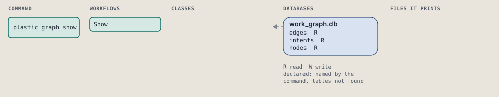
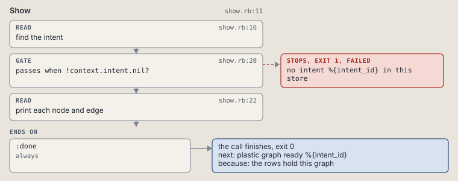
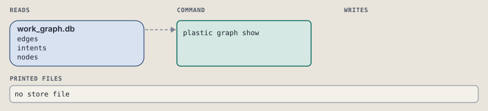

# plastic graph show

Print every node and edge of an intent.

Prints one intent's nodes and edges from the rows. It reads and writes nothing.

```sh
plastic graph show ID
```

The command is `Graph::Show`, in [`show.rb:9`](../../../../lib/plastic/commands/graph/show.rb#L9). The words on this page, such as gate, step and outcome, are explained in [the command DSL](../../dsl/README.md).

| Argument or option | What it gives | Default |
| --- | --- | --- |
| `ID` | the intent | |

## Components



The figure shows the command, the workflows it runs, the classes behind them, and the databases and files they reach.

## The events of one call

The call starts the workflow `Code::Graph::Show`, in [`show.rb:11`](../../../../lib/plastic/workflows/code/graph/show.rb#L11).

Prints each node and edge from the rows. It never reads or writes graph.json.



Its rows run in this order:

1. Read: find the intent. [`show.rb:16`](../../../../lib/plastic/workflows/code/graph/show.rb#L16)
2. Gate: passes when `!context.intent.nil?`; otherwise the call stops with exit 1 and prints no intent INTENT_ID in this store. [`show.rb:20`](../../../../lib/plastic/workflows/code/graph/show.rb#L20)
3. Read: print each node and edge. [`show.rb:22`](../../../../lib/plastic/workflows/code/graph/show.rb#L22)
4. Outcome `:done`, always: finishes with exit 0; next: plastic graph ready INTENT_ID. [`show.rb:27`](../../../../lib/plastic/workflows/code/graph/show.rb#L27)

It sets `intent`.

In the words of workflow engines, the rows are these four parts:

- **Trigger**: the call starts the workflow `Code::Graph::Show`.
- **Activities**: 2 reads.
- **Transitions**: 1 gate stops the call when its check fails.
- **Outcomes**: `:done` end the call.

## What one call reads, writes and prints



| Place | Database or file | Tables | Reads or writes | Code |
| --- | --- | --- | --- | --- |
| the store folder | work_graph.db | `edges`, `intents`, `nodes` | reads | [`show.rb:11`](../../../../lib/plastic/commands/graph/show.rb#L11) |

## How a call ends

Every call can also end in [the ways any call can end](../../dsl/README.md#how-any-call-can-end).

| Ending | Exit | next: | Code |
| --- | --- | --- | --- |
| no intent INTENT_ID in this store | 1 | prints no next: line | [`show.rb:20`](../../../../lib/plastic/workflows/code/graph/show.rb#L20) |
| the rows hold this graph | 0 | plastic graph ready INTENT_ID | [`show.rb:27`](../../../../lib/plastic/workflows/code/graph/show.rb#L27) |
| a step raises | 1 | prints no next: line | [`code_workflow.rb:102`](../../../../lib/plastic/code_workflow.rb#L102) |

## What the page leaves out

Every call shares a few things that this page does not repeat; [the command DSL](../../dsl/README.md#what-every-call-shares) names them.

- No gate of this command refuses, so exit 3 never happens.
