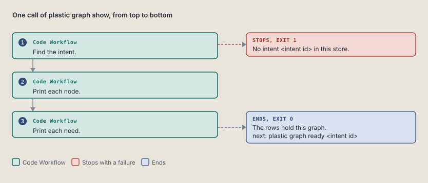

# plastic graph show

Print every node, with the node it was found in, and every need of an intent.

```sh
plastic graph show ID
```

| Argument or option | What it gives | Default |
| --- | --- | --- |
| `ID` | the intent | |

## The events of one call, step by step



The boxes on the left run in order. The boxes on the right are the ways the call stops or ends at that step.

## What one call changes

This command changes nothing.

The command is `Plastic::Commands::Graph::Show`, in [`commands/graph/show.rb`](../../../../lib/plastic/commands/graph/show.rb).
