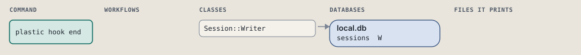
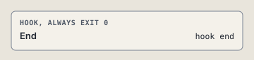

# plastic hook end

SessionEnd: set the session's end time and reason.

```sh
plastic hook end
```

The command is `End`, in [`end.rb:9`](../../../../scripts/lib/plastic/hooks/end.rb#L9). The words on this page, such as gate, step and outcome, are explained in [the command DSL](../../dsl/README.md).

## What it touches



## The command

The hook's `respond`, at [`end.rb:10`](../../../../scripts/lib/plastic/hooks/end.rb#L10):

```ruby
def respond(event)
  return no_session unless session_id

  Graph.open(home: scope.plastic_home, store: scope.slug, session: session_id).work.end_session(session_id, reason: event[:reason])
  nil
end
```

## How the call flows



## Outcomes

Every call can also end in [the ways any call can end](../../dsl/README.md#how-any-call-can-end).

| Ending | Exit | next: | Code |
| --- | --- | --- | --- |
| answers the event | 0 | prints no next: line | [`end.rb:10`](../../../../scripts/lib/plastic/hooks/end.rb#L10) |
