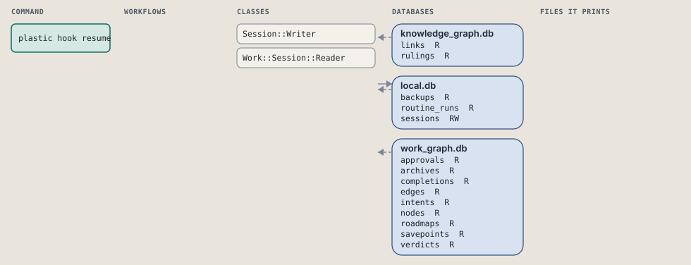
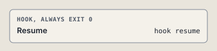

# plastic hook resume

SessionStart: print the state the rows carry.

SessionStart: opens the session row, then prints the Recap the rows alone carry, and one line naming plastic doctor when a doctor check fails on a session that starts fresh. Nothing here is call memory: a hook keeps no routine run.

```sh
plastic hook resume [--harness NAME]
```

The command is `Resume`, in [`resume.rb:13`](../../../../scripts/lib/plastic/hooks/resume.rb#L13). The words on this page, such as gate, step and outcome, are explained in [the command DSL](../../dsl/README.md).

| Argument or option | What it gives | Default |
| --- | --- | --- |
| `--harness NAME` | the harness calling this hook | `"claude-code"` |

## What it touches



## The command

The hook's `respond`, at [`resume.rb:29`](../../../../scripts/lib/plastic/hooks/resume.rb#L29):

```ruby
def respond(event)
  [*recap(event), doctor_line(event)].compact.join("\n")
end
```

## How the call flows



## Outcomes

Every call can also end in [the ways any call can end](../../dsl/README.md#how-any-call-can-end).

| Ending | Exit | next: | Code |
| --- | --- | --- | --- |
| answers the event | 0 | prints no next: line | [`resume.rb:29`](../../../../scripts/lib/plastic/hooks/resume.rb#L29) |
