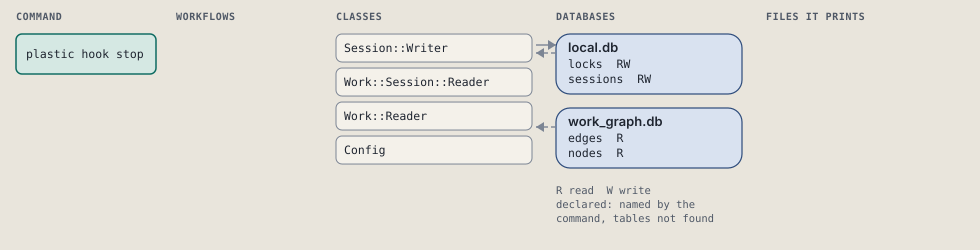
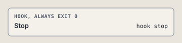

# plastic hook stop

Stop: stamp the turn, renew locks, run the stop gate.

```sh
plastic hook stop
```

The command is `Stop`, in [`stop.rb:14`](../../../../scripts/lib/plastic/hooks/stop.rb#L14). The words on this page, such as gate, step and outcome, are explained in [the command DSL](../../dsl/README.md).

## What it touches



## The command

The hook's `respond`, at [`stop.rb:15`](../../../../scripts/lib/plastic/hooks/stop.rb#L15):

```ruby
def respond(event)
  return no_session unless session_id

  stop(event)
end
```

## How the call flows



## Outcomes

Every call can also end in [the ways any call can end](../../dsl/README.md#how-any-call-can-end).

| Ending | Exit | next: | Code |
| --- | --- | --- | --- |
| answers the event | 0 | prints no next: line | [`stop.rb:15`](../../../../scripts/lib/plastic/hooks/stop.rb#L15) |
| blocks the stop | 0 | prints no next: line | [`stop_gate.rb:24`](../../../../scripts/lib/plastic/hooks/stop_gate.rb#L24) |
