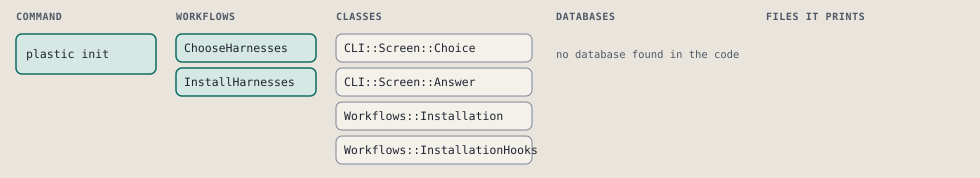
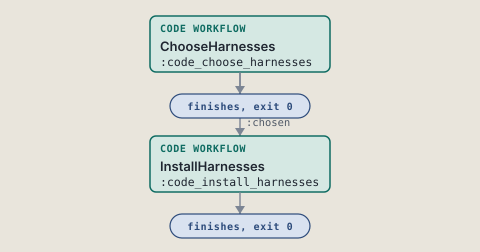
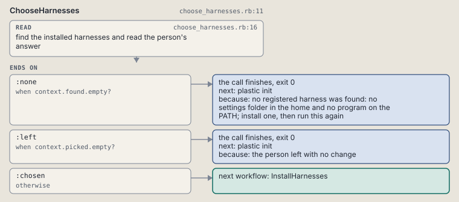
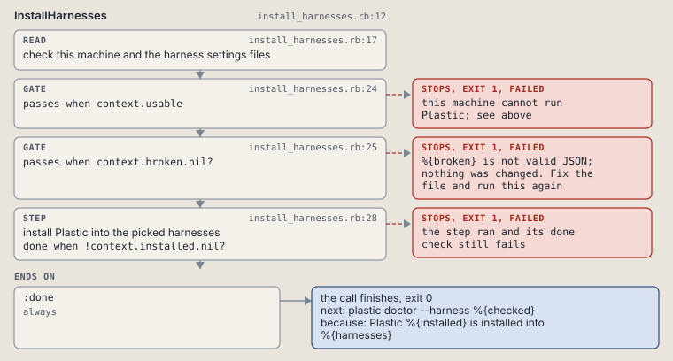

# plastic init

Find the installed harnesses and install Plastic into the ones the person picks.

Finds the installed harnesses, shows them on the choice screen with every found one picked, and installs Plastic into each one the person picks. See docs/help/choice-screen.md.

```sh
plastic init [ANSWER]
```

The command is `Init`, in [`init.rb:12`](../../../../scripts/lib/plastic/commands/init.rb#L12). The words on this page, such as gate, step and outcome, are explained in [the command DSL](../../dsl/README.md).

| Argument or option | What it gives | Default |
| --- | --- | --- |
| `ANSWER` | the person's answer to the numbered list | |

## What it touches



## Before the chain

The command's own `call`, at [`harness_pick.rb:12`](../../../../scripts/lib/plastic/commands/harness_pick.rb#L12), runs first:

```ruby
def call
  answer = parsed[:answer] ||= answered_on_screen
  super if answer
end
```

## How the call flows



| Workflow | Kind | Code |
| --- | --- | --- |
| [ChooseHarnesses](#chooseharnesses) | code | [`choose_harnesses.rb:11`](../../../../scripts/lib/plastic/workflows/choose_harnesses.rb#L11) |
| [InstallHarnesses](#installharnesses) | code | [`install_harnesses.rb:12`](../../../../scripts/lib/plastic/workflows/install_harnesses.rb#L12) |

### ChooseHarnesses

The code workflow `:code_choose_harnesses`, in [`choose_harnesses.rb:11`](../../../../scripts/lib/plastic/workflows/choose_harnesses.rb#L11).

Reads the person's answer against the installed harnesses, every one of them picked at the start.



| Step | Kind | Check | Code |
| --- | --- | --- | --- |
| find the installed harnesses and read the person's answer | read |  | [`choose_harnesses.rb:16`](../../../../scripts/lib/plastic/workflows/choose_harnesses.rb#L16) |

| Outcome | When | Then | Code |
| --- | --- | --- | --- |
| `:none` | when `context.found.empty?` | finishes, exit 0; next: plastic init | [`choose_harnesses.rb:25`](../../../../scripts/lib/plastic/workflows/choose_harnesses.rb#L25) |
| `:left` | when `context.picked.empty?` | finishes, exit 0; next: plastic init | [`choose_harnesses.rb:27`](../../../../scripts/lib/plastic/workflows/choose_harnesses.rb#L27) |
| `:chosen` | otherwise | runs [InstallHarnesses](#installharnesses) | [`choose_harnesses.rb:29`](../../../../scripts/lib/plastic/workflows/choose_harnesses.rb#L29) |

It sets `found`, `picked`, `harnesses`.

### InstallHarnesses

The code workflow `:code_install_harnesses`, in [`install_harnesses.rb:12`](../../../../scripts/lib/plastic/workflows/install_harnesses.rb#L12).

Checks the machine, copies the core files on a home that has none, and installs Plastic into each picked harness.



| Step | Kind | Check | Code |
| --- | --- | --- | --- |
| check this machine and the harness settings files | read |  | [`install_harnesses.rb:17`](../../../../scripts/lib/plastic/workflows/install_harnesses.rb#L17) |
| this machine cannot run Plastic; see above | gate, stops with exit 1 | `context.usable` | [`install_harnesses.rb:24`](../../../../scripts/lib/plastic/workflows/install_harnesses.rb#L24) |
| %{broken} is not valid JSON; nothing was changed. Fix the file and run this again | gate, stops with exit 1 | `context.broken.nil?` | [`install_harnesses.rb:25`](../../../../scripts/lib/plastic/workflows/install_harnesses.rb#L25) |
| install Plastic into the picked harnesses | step | `!context.installed.nil?` | [`install_harnesses.rb:28`](../../../../scripts/lib/plastic/workflows/install_harnesses.rb#L28) |

| Outcome | When | Then | Code |
| --- | --- | --- | --- |
| `:done` | always | finishes, exit 0; next: plastic doctor --harness %{checked} | [`install_harnesses.rb:36`](../../../../scripts/lib/plastic/workflows/install_harnesses.rb#L36) |

It sets `usable`, `broken`, `installed`, `checked`.

## Outcomes

Every call can also end in [the ways any call can end](../../dsl/README.md#how-any-call-can-end).

| Ending | Exit | next: | Code |
| --- | --- | --- | --- |
| no registered harness was found: no settings folder in the home and no program on the PATH; install one, then run this again | 0 | plastic init | [`choose_harnesses.rb:25`](../../../../scripts/lib/plastic/workflows/choose_harnesses.rb#L25) |
| the person left with no change | 0 | plastic init | [`choose_harnesses.rb:27`](../../../../scripts/lib/plastic/workflows/choose_harnesses.rb#L27) |
| this machine cannot run Plastic; see above | 1 | prints no next: line | [`install_harnesses.rb:24`](../../../../scripts/lib/plastic/workflows/install_harnesses.rb#L24) |
| %{broken} is not valid JSON; nothing was changed. Fix the file and run this again | 1 | prints no next: line | [`install_harnesses.rb:25`](../../../../scripts/lib/plastic/workflows/install_harnesses.rb#L25) |
| Plastic %{installed} is installed into %{harnesses} | 0 | plastic doctor --harness %{checked} | [`install_harnesses.rb:36`](../../../../scripts/lib/plastic/workflows/install_harnesses.rb#L36) |
| a step raises | 1 | prints no next: line | [`code_workflow.rb:102`](../../../../scripts/lib/plastic/code_workflow.rb#L102) |
