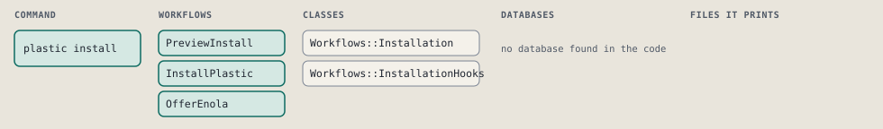
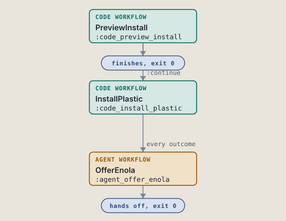
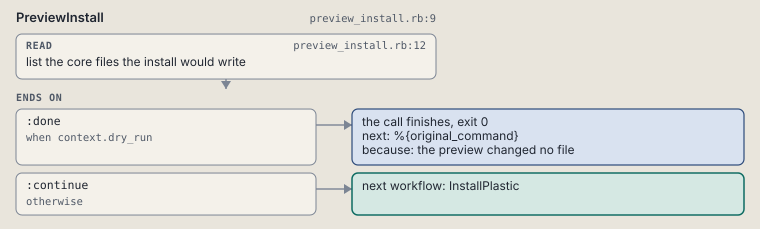
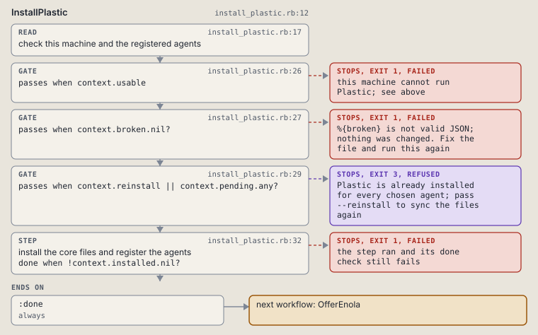
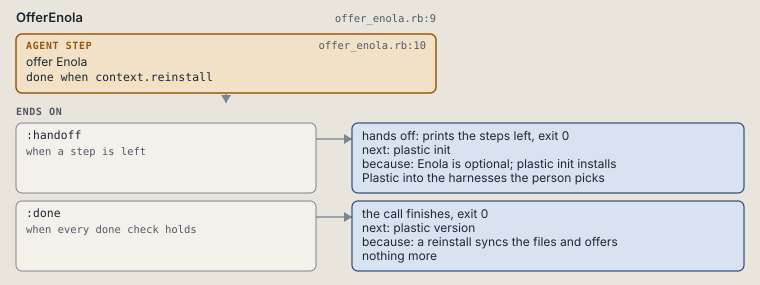

# plastic install

Install the core files and register Plastic with agents.

Copies the core files of the running package into the home and registers Plastic with the chosen agents.

```sh
plastic install [--claude] [--codex] [--hermes] [--all] [--dry-run] [--reinstall] [--force]
```

The command is `Install`, in [`install.rb:10`](../../../../scripts/lib/plastic/commands/install.rb#L10). The words on this page, such as gate, step and outcome, are explained in [the command DSL](../../dsl/README.md).

| Argument or option | What it gives | Default |
| --- | --- | --- |
| `--claude` | Claude Code, the default | `false` |
| `--codex` | Codex CLI | `false` |
| `--hermes` | Hermes | `false` |
| `--all` | every agent | `false` |
| `--dry-run` | list what would change and change nothing | `false` |
| `--reinstall` | sync the files again and make the global store and local.db when they are missing or behind | `false` |
| `--force` | replace agent files Plastic did not write | `false` |

## What it touches



## How the call flows



| Workflow | Kind | Code |
| --- | --- | --- |
| [PreviewInstall](#previewinstall) | code | [`preview_install.rb:9`](../../../../scripts/lib/plastic/workflows/preview_install.rb#L9) |
| [InstallPlastic](#installplastic) | code | [`install_plastic.rb:12`](../../../../scripts/lib/plastic/workflows/install_plastic.rb#L12) |
| [OfferEnola](#offerenola) | agent | [`offer_enola.rb:9`](../../../../scripts/lib/plastic/workflows/offer_enola.rb#L9) |

### PreviewInstall

The code workflow `:code_preview_install`, in [`preview_install.rb:9`](../../../../scripts/lib/plastic/workflows/preview_install.rb#L9).

On a dry run, lists each core file the install would add or replace.



| Step | Kind | Check | Code |
| --- | --- | --- | --- |
| list the core files the install would write | read |  | [`preview_install.rb:12`](../../../../scripts/lib/plastic/workflows/preview_install.rb#L12) |

| Outcome | When | Then | Code |
| --- | --- | --- | --- |
| `:done` | when `context.dry_run` | finishes, exit 0; next: %{original_command} | [`preview_install.rb:20`](../../../../scripts/lib/plastic/workflows/preview_install.rb#L20) |
| `:continue` | otherwise | runs [InstallPlastic](#installplastic) | [`preview_install.rb:22`](../../../../scripts/lib/plastic/workflows/preview_install.rb#L22) |

### InstallPlastic

The code workflow `:code_install_plastic`, in [`install_plastic.rb:12`](../../../../scripts/lib/plastic/workflows/install_plastic.rb#L12).

Checks the machine, then copies the core files into the home and registers the chosen agents. Agents already registered are skipped unless the call asks for a reinstall.



| Step | Kind | Check | Code |
| --- | --- | --- | --- |
| check this machine and the registered agents | read |  | [`install_plastic.rb:17`](../../../../scripts/lib/plastic/workflows/install_plastic.rb#L17) |
| this machine cannot run Plastic; see above | gate, stops with exit 1 | `context.usable` | [`install_plastic.rb:26`](../../../../scripts/lib/plastic/workflows/install_plastic.rb#L26) |
| %{broken} is not valid JSON; nothing was changed. Fix the file and run this again | gate, stops with exit 1 | `context.broken.nil?` | [`install_plastic.rb:27`](../../../../scripts/lib/plastic/workflows/install_plastic.rb#L27) |
| Plastic is already installed for every chosen agent; pass --reinstall to sync the files again | gate, stops with exit 3 | `context.reinstall \|\| context.pending.any?` | [`install_plastic.rb:29`](../../../../scripts/lib/plastic/workflows/install_plastic.rb#L29) |
| install the core files and register the agents | step | `!context.installed.nil?` | [`install_plastic.rb:32`](../../../../scripts/lib/plastic/workflows/install_plastic.rb#L32) |

| Outcome | When | Then | Code |
| --- | --- | --- | --- |
| `:done` | always | runs [OfferEnola](#offerenola) | [`install_plastic.rb:40`](../../../../scripts/lib/plastic/workflows/install_plastic.rb#L40) |

It sets `usable`, `broken`, `pending`, `installed`.

### OfferEnola

The agent workflow `:agent_offer_enola`, in [`offer_enola.rb:9`](../../../../scripts/lib/plastic/workflows/offer_enola.rb#L9).

After a first install, the agent may offer Enola to the person. Plastic runs no Enola installer and keeps no answer, so a reinstall offers nothing.



| Step | Kind | Check | Code |
| --- | --- | --- | --- |
| offer Enola | agent step | `context.reinstall` | [`offer_enola.rb:10`](../../../../scripts/lib/plastic/workflows/offer_enola.rb#L10) |

| Outcome | When | Then | Code |
| --- | --- | --- | --- |
| `:handoff` | when a step is left | hands off, exit 0; next: plastic version | [`offer_enola.rb:14`](../../../../scripts/lib/plastic/workflows/offer_enola.rb#L14) |
| `:done` | when every done check holds | finishes, exit 0; next: plastic version | [`offer_enola.rb:15`](../../../../scripts/lib/plastic/workflows/offer_enola.rb#L15) |

The agent step "offer Enola" prints:

> Enola maps the code architecture of a project. It is optional: Plastic works without it. To install it, run its official installer: curl -fsSL https://raw.githubusercontent.com/enola-labs/enola/main/install.sh | sh

## Outcomes

Every call can also end in [the ways any call can end](../../dsl/README.md#how-any-call-can-end).

| Ending | Exit | next: | Code |
| --- | --- | --- | --- |
| the preview changed no file | 0 | %{original_command} | [`preview_install.rb:20`](../../../../scripts/lib/plastic/workflows/preview_install.rb#L20) |
| this machine cannot run Plastic; see above | 1 | prints no next: line | [`install_plastic.rb:26`](../../../../scripts/lib/plastic/workflows/install_plastic.rb#L26) |
| %{broken} is not valid JSON; nothing was changed. Fix the file and run this again | 1 | prints no next: line | [`install_plastic.rb:27`](../../../../scripts/lib/plastic/workflows/install_plastic.rb#L27) |
| Plastic is already installed for every chosen agent; pass --reinstall to sync the files again | 3 | prints no next: line | [`install_plastic.rb:29`](../../../../scripts/lib/plastic/workflows/install_plastic.rb#L29) |
| Enola is optional, so the installation is complete either way | 0 | plastic version | [`offer_enola.rb:14`](../../../../scripts/lib/plastic/workflows/offer_enola.rb#L14) |
| a reinstall syncs the files and offers nothing more | 0 | plastic version | [`offer_enola.rb:15`](../../../../scripts/lib/plastic/workflows/offer_enola.rb#L15) |
| a step raises | 1 | prints no next: line | [`code_workflow.rb:97`](../../../../scripts/lib/plastic/code_workflow.rb#L97) |
