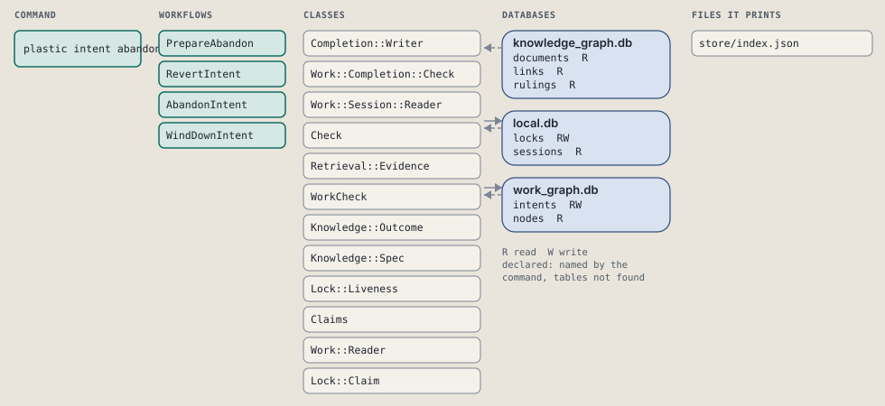
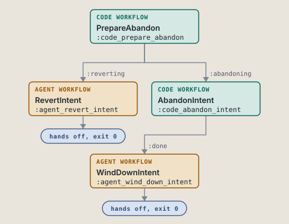
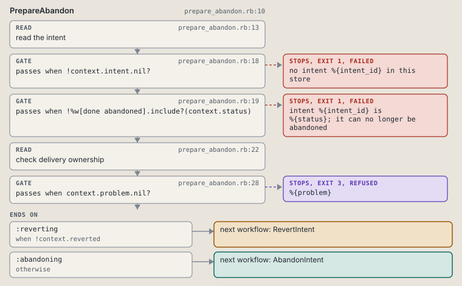
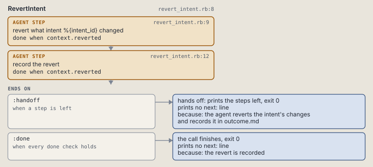
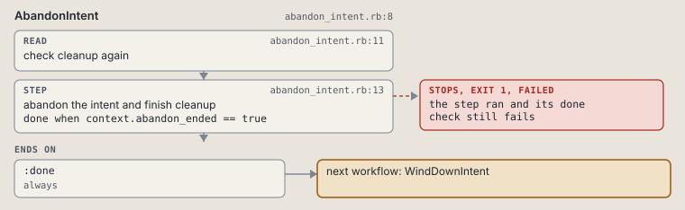
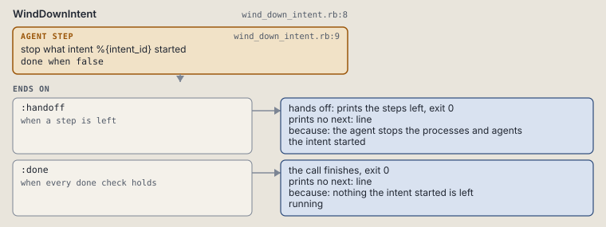

# plastic intent abandon

Close an intent that will not ship once outcome.md records the revert, or print the revert steps.

Abandons an intent that will not ship once outcome.md records the revert, and hands over the revert steps until then.

```sh
plastic intent abandon ID
```

The command is `IntentAbandon`, in [`intent_abandon.rb:8`](../../../../scripts/lib/plastic/commands/intent_abandon.rb#L8). The words on this page, such as gate, step and outcome, are explained in [the command DSL](../../dsl/README.md).

| Argument or option | What it gives | Default |
| --- | --- | --- |
| `ID` | the intent | |

## What it touches



## How the call flows



| Workflow | Kind | Code |
| --- | --- | --- |
| [PrepareAbandon](#prepareabandon) | code | [`prepare_abandon.rb:10`](../../../../scripts/lib/plastic/workflows/prepare_abandon.rb#L10) |
| [RevertIntent](#revertintent) | agent | [`revert_intent.rb:8`](../../../../scripts/lib/plastic/workflows/revert_intent.rb#L8) |
| [AbandonIntent](#abandonintent) | code | [`abandon_intent.rb:8`](../../../../scripts/lib/plastic/workflows/abandon_intent.rb#L8) |
| [WindDownIntent](#winddownintent) | agent | [`wind_down_intent.rb:8`](../../../../scripts/lib/plastic/workflows/wind_down_intent.rb#L8) |

### PrepareAbandon

The code workflow `:code_prepare_abandon`, in [`prepare_abandon.rb:10`](../../../../scripts/lib/plastic/workflows/prepare_abandon.rb#L10).

Reads the intent and its lock: a missing or closed intent fails, a foreign live lock refuses, and an outcome without a Reverted line hands over the revert steps.



| Step | Kind | Check | Code |
| --- | --- | --- | --- |
| read the intent | read |  | [`prepare_abandon.rb:13`](../../../../scripts/lib/plastic/workflows/prepare_abandon.rb#L13) |
| no intent %{intent_id} in this store | gate, stops with exit 1 | `!context.intent.nil?` | [`prepare_abandon.rb:18`](../../../../scripts/lib/plastic/workflows/prepare_abandon.rb#L18) |
| intent %{intent_id} is %{status}; it can no longer be abandoned | gate, stops with exit 1 | `!%w[done abandoned].include?(context.status)` | [`prepare_abandon.rb:19`](../../../../scripts/lib/plastic/workflows/prepare_abandon.rb#L19) |
| check delivery ownership | read |  | [`prepare_abandon.rb:22`](../../../../scripts/lib/plastic/workflows/prepare_abandon.rb#L22) |
| %{problem} | gate, stops with exit 3 | `context.problem.nil?` | [`prepare_abandon.rb:28`](../../../../scripts/lib/plastic/workflows/prepare_abandon.rb#L28) |

| Outcome | When | Then | Code |
| --- | --- | --- | --- |
| `:reverting` | when `!context.reverted` | runs [RevertIntent](#revertintent) | [`prepare_abandon.rb:30`](../../../../scripts/lib/plastic/workflows/prepare_abandon.rb#L30) |
| `:abandoning` | otherwise | runs [AbandonIntent](#abandonintent) | [`prepare_abandon.rb:31`](../../../../scripts/lib/plastic/workflows/prepare_abandon.rb#L31) |

It sets `intent`, `status`, `problem`, `intent_folder`, `reverted`.

### RevertIntent

The agent workflow `:agent_revert_intent`, in [`revert_intent.rb:8`](../../../../scripts/lib/plastic/workflows/revert_intent.rb#L8).

The agent undoes what the intent changed and records that in outcome.md. Plastic runs no version control command.



| Step | Kind | Check | Code |
| --- | --- | --- | --- |
| revert what intent %{intent_id} changed | agent step | `context.reverted` | [`revert_intent.rb:9`](../../../../scripts/lib/plastic/workflows/revert_intent.rb#L9) |
| record the revert | agent step | `context.reverted` | [`revert_intent.rb:12`](../../../../scripts/lib/plastic/workflows/revert_intent.rb#L12) |

| Outcome | When | Then | Code |
| --- | --- | --- | --- |
| `:handoff` | when a step is left | hands off, exit 0; prints no next: line | [`revert_intent.rb:16`](../../../../scripts/lib/plastic/workflows/revert_intent.rb#L16) |
| `:done` | when every done check holds | finishes, exit 0; prints no next: line | [`revert_intent.rb:17`](../../../../scripts/lib/plastic/workflows/revert_intent.rb#L17) |

The agent step "revert what intent %{intent_id} changed" prints:

> Undo what intent %{intent_id} changed with your own version control tool: close or delete its branch and worktree, and revert any commit that reached the base. Plastic runs no version control command; it records what you write.

The agent step "record the revert" prints:

> Write in %{intent_folder}/outcome.md why the intent is dropped, and add the line '- Reverted: <what was undone, or nothing delivered>' under ## Verification. Run plastic sync up and then plastic intent abandon %{intent_id} again.

### AbandonIntent

The code workflow `:code_abandon_intent`, in [`abandon_intent.rb:8`](../../../../scripts/lib/plastic/workflows/abandon_intent.rb#L8).

The abandoned close can be retried after the status write but before lock cleanup.



| Step | Kind | Check | Code |
| --- | --- | --- | --- |
| check cleanup again | read |  | [`abandon_intent.rb:11`](../../../../scripts/lib/plastic/workflows/abandon_intent.rb#L11) |
| abandon the intent and finish cleanup | step | `context.abandon_ended == true` | [`abandon_intent.rb:13`](../../../../scripts/lib/plastic/workflows/abandon_intent.rb#L13) |

| Outcome | When | Then | Code |
| --- | --- | --- | --- |
| `:done` | always | runs [WindDownIntent](#winddownintent) | [`abandon_intent.rb:19`](../../../../scripts/lib/plastic/workflows/abandon_intent.rb#L19) |

It sets `abandon_ended`.

### WindDownIntent

The agent workflow `:agent_wind_down_intent`, in [`wind_down_intent.rb:8`](../../../../scripts/lib/plastic/workflows/wind_down_intent.rb#L8).

The agent stops what the intent started. Plastic runs and stops nothing.



| Step | Kind | Check | Code |
| --- | --- | --- | --- |
| stop what intent %{intent_id} started | agent step | `false` | [`wind_down_intent.rb:9`](../../../../scripts/lib/plastic/workflows/wind_down_intent.rb#L9) |

| Outcome | When | Then | Code |
| --- | --- | --- | --- |
| `:handoff` | when a step is left | hands off, exit 0; prints no next: line | [`wind_down_intent.rb:13`](../../../../scripts/lib/plastic/workflows/wind_down_intent.rb#L13) |
| `:done` | when every done check holds | finishes, exit 0; prints no next: line | [`wind_down_intent.rb:14`](../../../../scripts/lib/plastic/workflows/wind_down_intent.rb#L14) |

The agent step "stop what intent %{intent_id} started" prints:

> Stop the processes and the agents that intent %{intent_id} started: servers, watchers, background jobs and subagents. Plastic runs none of them and stops none of them.

## Outcomes

Every call can also end in [the ways any call can end](../../dsl/README.md#how-any-call-can-end).

| Ending | Exit | next: | Code |
| --- | --- | --- | --- |
| no intent %{intent_id} in this store | 1 | prints no next: line | [`prepare_abandon.rb:18`](../../../../scripts/lib/plastic/workflows/prepare_abandon.rb#L18) |
| intent %{intent_id} is %{status}; it can no longer be abandoned | 1 | prints no next: line | [`prepare_abandon.rb:19`](../../../../scripts/lib/plastic/workflows/prepare_abandon.rb#L19) |
| %{problem} | 3 | prints no next: line | [`prepare_abandon.rb:28`](../../../../scripts/lib/plastic/workflows/prepare_abandon.rb#L28) |
| the agent reverts the intent's changes and records it in outcome.md | 0 | prints no next: line | [`revert_intent.rb:16`](../../../../scripts/lib/plastic/workflows/revert_intent.rb#L16) |
| the revert is recorded | 0 | prints no next: line | [`revert_intent.rb:17`](../../../../scripts/lib/plastic/workflows/revert_intent.rb#L17) |
| the agent stops the processes and agents the intent started | 0 | prints no next: line | [`wind_down_intent.rb:13`](../../../../scripts/lib/plastic/workflows/wind_down_intent.rb#L13) |
| nothing the intent started is left running | 0 | prints no next: line | [`wind_down_intent.rb:14`](../../../../scripts/lib/plastic/workflows/wind_down_intent.rb#L14) |
| a step raises | 1 | prints no next: line | [`code_workflow.rb:97`](../../../../scripts/lib/plastic/code_workflow.rb#L97) |
