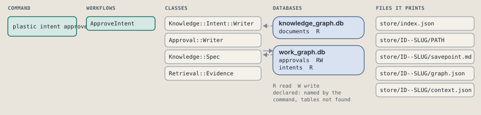
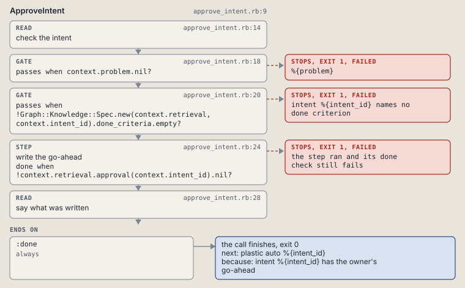

# plastic intent approve

Write the owner's go-ahead for an intent; auto refuses an intent without it.

Writes the owner's go-ahead for an intent. `plastic auto` refuses an intent without it.

```sh
plastic intent approve ID
```

The command is `IntentApprove`, in [`intent_approve.rb:8`](../../../../scripts/lib/plastic/commands/intent_approve.rb#L8). The words on this page, such as gate, step and outcome, are explained in [the command DSL](../../dsl/README.md).

| Argument or option | What it gives | Default |
| --- | --- | --- |
| `ID` | the intent | |

## What it touches



## How the call flows


| Workflow | Kind | Code |
| --- | --- | --- |
| [ApproveIntent](#approveintent) | code | [`approve_intent.rb:9`](../../../../scripts/lib/plastic/workflows/approve_intent.rb#L9) |

### ApproveIntent

The code workflow `:code_approve_intent`, in [`approve_intent.rb:9`](../../../../scripts/lib/plastic/workflows/approve_intent.rb#L9).

Writes the go-ahead row of an open or active intent. A second call changes nothing.



| Step | Kind | Check | Code |
| --- | --- | --- | --- |
| check the intent | read |  | [`approve_intent.rb:14`](../../../../scripts/lib/plastic/workflows/approve_intent.rb#L14) |
| %{problem} | gate, stops with exit 1 | `context.problem.nil?` | [`approve_intent.rb:18`](../../../../scripts/lib/plastic/workflows/approve_intent.rb#L18) |
| intent %{intent_id} names no done criterion | gate, stops with exit 1 | `!Graph::Knowledge::Spec.new(context.retrieval, context.intent_id).done_criteria.empty?` | [`approve_intent.rb:20`](../../../../scripts/lib/plastic/workflows/approve_intent.rb#L20) |
| write the go-ahead | step | `!context.retrieval.approval(context.intent_id).nil?` | [`approve_intent.rb:24`](../../../../scripts/lib/plastic/workflows/approve_intent.rb#L24) |
| say what was written | read |  | [`approve_intent.rb:28`](../../../../scripts/lib/plastic/workflows/approve_intent.rb#L28) |

| Outcome | When | Then | Code |
| --- | --- | --- | --- |
| `:done` | always | finishes, exit 0; next: plastic auto %{intent_id} | [`approve_intent.rb:32`](../../../../scripts/lib/plastic/workflows/approve_intent.rb#L32) |

It sets `problem`.

## Outcomes

Every call can also end in [the ways any call can end](../../dsl/README.md#how-any-call-can-end).

| Ending | Exit | next: | Code |
| --- | --- | --- | --- |
| %{problem} | 1 | prints no next: line | [`approve_intent.rb:18`](../../../../scripts/lib/plastic/workflows/approve_intent.rb#L18) |
| intent %{intent_id} names no done criterion | 1 | plastic intent spec %{intent_id} | [`approve_intent.rb:20`](../../../../scripts/lib/plastic/workflows/approve_intent.rb#L20) |
| intent %{intent_id} has the owner's go-ahead | 0 | plastic auto %{intent_id} | [`approve_intent.rb:32`](../../../../scripts/lib/plastic/workflows/approve_intent.rb#L32) |
| a step raises | 1 | prints no next: line | [`code_workflow.rb:97`](../../../../scripts/lib/plastic/code_workflow.rb#L97) |
