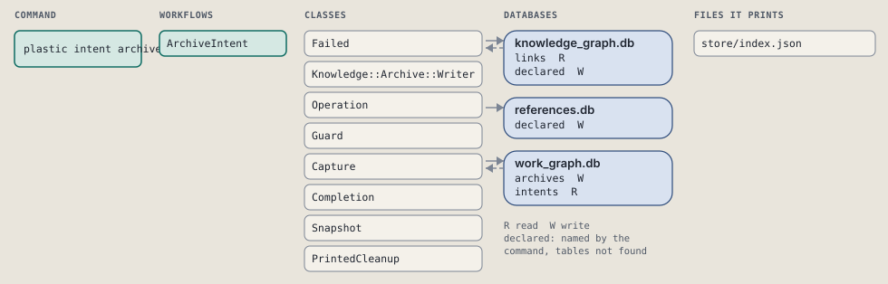
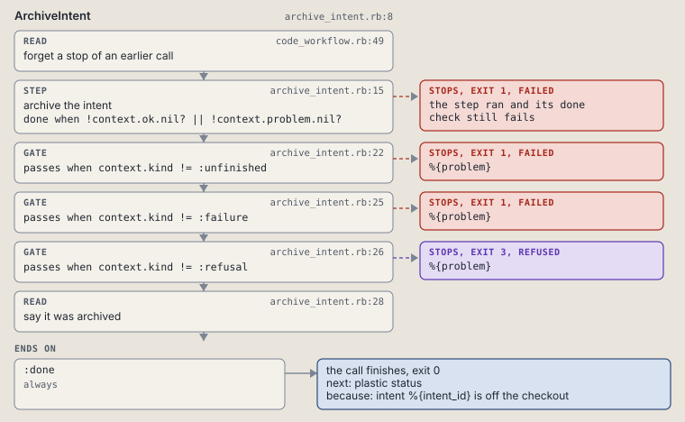

# plastic intent archive

Archive an intent directory.

Takes a done, abandoned or future intent off the checkout; its rows stay.

```sh
plastic intent archive ID [--dry-run]
```

The command is `IntentArchive`, in [`intent_archive.rb:8`](../../../../scripts/lib/plastic/commands/intent_archive.rb#L8). The words on this page, such as gate, step and outcome, are explained in [the command DSL](../../dsl/README.md).

| Argument or option | What it gives | Default |
| --- | --- | --- |
| `ID` | the intent to archive | |
| `--dry-run` | preview the call in a disposable copy | `false` |

## What it touches



## How the call flows


| Workflow | Kind | Code |
| --- | --- | --- |
| [ArchiveIntent](#archiveintent) | code | [`archive_intent.rb:8`](../../../../scripts/lib/plastic/workflows/archive_intent.rb#L8) |

### ArchiveIntent

The code workflow `:code_archive_intent`, in [`archive_intent.rb:8`](../../../../scripts/lib/plastic/workflows/archive_intent.rb#L8).

Takes a done, abandoned or future intent off the checkout. Its rows stay.



| Step | Kind | Check | Code |
| --- | --- | --- | --- |
| forget a stop of an earlier call | read |  | [`code_workflow.rb:49`](../../../../scripts/lib/plastic/code_workflow.rb#L49) |
| archive the intent | step | `!context.ok.nil? \|\| !context.problem.nil?` | [`archive_intent.rb:15`](../../../../scripts/lib/plastic/workflows/archive_intent.rb#L15) |
| %{problem} | gate, stops with exit 1 | `context.kind != :unfinished` | [`archive_intent.rb:22`](../../../../scripts/lib/plastic/workflows/archive_intent.rb#L22) |
| %{problem} | gate, stops with exit 1 | `context.kind != :failure` | [`archive_intent.rb:25`](../../../../scripts/lib/plastic/workflows/archive_intent.rb#L25) |
| %{problem} | gate, stops with exit 3 | `context.kind != :refusal` | [`archive_intent.rb:26`](../../../../scripts/lib/plastic/workflows/archive_intent.rb#L26) |
| say it was archived | read |  | [`archive_intent.rb:28`](../../../../scripts/lib/plastic/workflows/archive_intent.rb#L28) |

| Outcome | When | Then | Code |
| --- | --- | --- | --- |
| `:done` | always | finishes, exit 0; next: plastic status | [`archive_intent.rb:32`](../../../../scripts/lib/plastic/workflows/archive_intent.rb#L32) |

It sets `problem`, `kind`, `ok`.

## Outcomes

Every call can also end in [the ways any call can end](../../dsl/README.md#how-any-call-can-end).

| Ending | Exit | next: | Code |
| --- | --- | --- | --- |
| %{problem} | 1 | plastic intent end %{intent_id} | [`archive_intent.rb:22`](../../../../scripts/lib/plastic/workflows/archive_intent.rb#L22) |
| %{problem} | 1 | prints no next: line | [`archive_intent.rb:25`](../../../../scripts/lib/plastic/workflows/archive_intent.rb#L25) |
| %{problem} | 3 | prints no next: line | [`archive_intent.rb:26`](../../../../scripts/lib/plastic/workflows/archive_intent.rb#L26) |
| intent %{intent_id} is off the checkout | 0 | plastic status | [`archive_intent.rb:32`](../../../../scripts/lib/plastic/workflows/archive_intent.rb#L32) |
| a step raises | 1 | prints no next: line | [`code_workflow.rb:97`](../../../../scripts/lib/plastic/code_workflow.rb#L97) |
