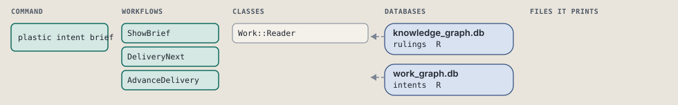
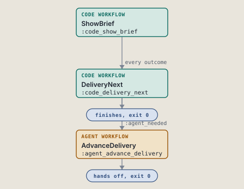
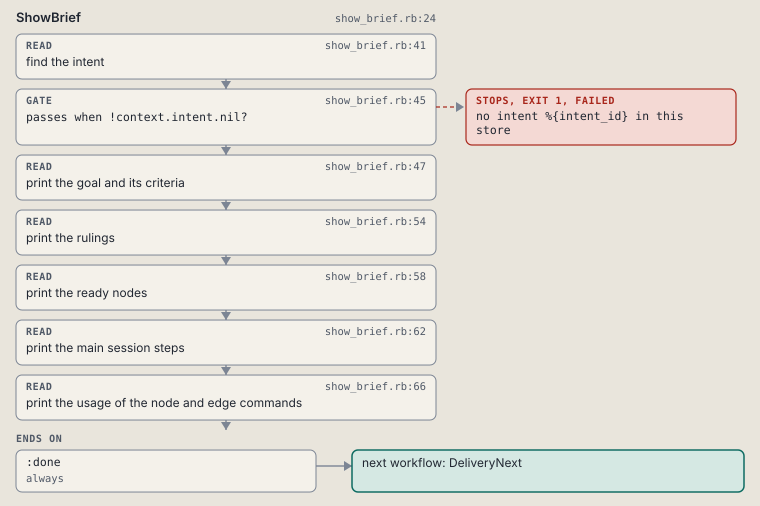
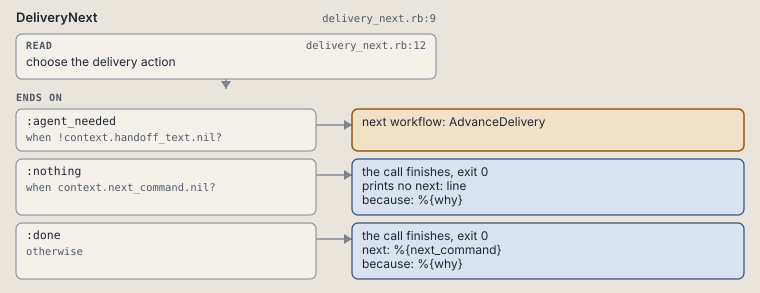
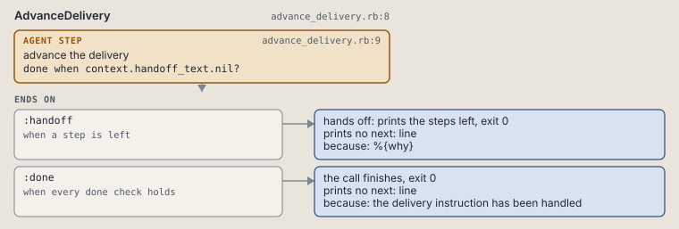

# plastic intent brief

Print an intent's goal, criteria, rulings, ready nodes and command usage.

```sh
plastic intent brief ID
```

The command is `IntentBrief`, in [`intent_brief.rb:9`](../../../../scripts/lib/plastic/commands/intent_brief.rb#L9). The words on this page, such as gate, step and outcome, are explained in [the command DSL](../../dsl/README.md).

| Argument or option | What it gives | Default |
| --- | --- | --- |
| `ID` | the intent | |

## What it touches



## How the call flows



| Workflow | Kind | Code |
| --- | --- | --- |
| [ShowBrief](#showbrief) | code | [`show_brief.rb:22`](../../../../scripts/lib/plastic/workflows/show_brief.rb#L22) |
| [DeliveryNext](#deliverynext) | code | [`delivery_next.rb:9`](../../../../scripts/lib/plastic/workflows/delivery_next.rb#L9) |
| [AdvanceDelivery](#advancedelivery) | agent | [`advance_delivery.rb:8`](../../../../scripts/lib/plastic/workflows/advance_delivery.rb#L8) |

### ShowBrief

The code workflow `:code_show_brief`, in [`show_brief.rb:22`](../../../../scripts/lib/plastic/workflows/show_brief.rb#L22).

Prints the goal, the done criteria, the rulings with superseded ones marked, the ready nodes and the usage of the node and edge commands.



| Step | Kind | Check | Code |
| --- | --- | --- | --- |
| find the intent | read |  | [`show_brief.rb:39`](../../../../scripts/lib/plastic/workflows/show_brief.rb#L39) |
| no intent %{intent_id} in this store | gate, stops with exit 1 | `!context.intent.nil?` | [`show_brief.rb:43`](../../../../scripts/lib/plastic/workflows/show_brief.rb#L43) |
| print the goal and its criteria | read |  | [`show_brief.rb:45`](../../../../scripts/lib/plastic/workflows/show_brief.rb#L45) |
| print the rulings | read |  | [`show_brief.rb:52`](../../../../scripts/lib/plastic/workflows/show_brief.rb#L52) |
| print the ready nodes | read |  | [`show_brief.rb:56`](../../../../scripts/lib/plastic/workflows/show_brief.rb#L56) |
| print the usage of the node and edge commands | read |  | [`show_brief.rb:60`](../../../../scripts/lib/plastic/workflows/show_brief.rb#L60) |

| Outcome | When | Then | Code |
| --- | --- | --- | --- |
| `:done` | always | runs [DeliveryNext](#deliverynext) | [`show_brief.rb:64`](../../../../scripts/lib/plastic/workflows/show_brief.rb#L64) |

It sets `intent`.

### DeliveryNext

The code workflow `:code_delivery_next`, in [`delivery_next.rb:9`](../../../../scripts/lib/plastic/workflows/delivery_next.rb#L9).

Resolves a graph read into an action or a checked harness handoff.



| Step | Kind | Check | Code |
| --- | --- | --- | --- |
| choose the delivery action | read |  | [`delivery_next.rb:12`](../../../../scripts/lib/plastic/workflows/delivery_next.rb#L12) |

| Outcome | When | Then | Code |
| --- | --- | --- | --- |
| `:agent_needed` | when `!context.handoff_text.nil?` | runs [AdvanceDelivery](#advancedelivery) | [`delivery_next.rb:16`](../../../../scripts/lib/plastic/workflows/delivery_next.rb#L16) |
| `:nothing` | when `context.next_command.nil?` | finishes, exit 0; prints no next: line | [`delivery_next.rb:17`](../../../../scripts/lib/plastic/workflows/delivery_next.rb#L17) |
| `:done` | otherwise | finishes, exit 0; next: %{next_command} | [`delivery_next.rb:18`](../../../../scripts/lib/plastic/workflows/delivery_next.rb#L18) |

It sets `next_command`, `why`, `handoff_text`.

### AdvanceDelivery

The agent workflow `:agent_advance_delivery`, in [`advance_delivery.rb:8`](../../../../scripts/lib/plastic/workflows/advance_delivery.rb#L8).

The harness performs judgment and records the result through commands.



| Step | Kind | Check | Code |
| --- | --- | --- | --- |
| advance the delivery | agent step | `context.handoff_text.nil?` | [`advance_delivery.rb:9`](../../../../scripts/lib/plastic/workflows/advance_delivery.rb#L9) |

| Outcome | When | Then | Code |
| --- | --- | --- | --- |
| `:handoff` | when a step is left | hands off, exit 0; prints no next: line | [`advance_delivery.rb:10`](../../../../scripts/lib/plastic/workflows/advance_delivery.rb#L10) |
| `:done` | when every done check holds | finishes, exit 0; prints no next: line | [`advance_delivery.rb:11`](../../../../scripts/lib/plastic/workflows/advance_delivery.rb#L11) |

The agent step "advance the delivery" prints:

> %{handoff_text}

## Outcomes

Every call can also end in [the ways any call can end](../../dsl/README.md#how-any-call-can-end).

| Ending | Exit | next: | Code |
| --- | --- | --- | --- |
| no intent %{intent_id} in this store | 1 | prints no next: line | [`show_brief.rb:43`](../../../../scripts/lib/plastic/workflows/show_brief.rb#L43) |
| %{why} | 0 | prints no next: line | [`delivery_next.rb:17`](../../../../scripts/lib/plastic/workflows/delivery_next.rb#L17) |
| %{why} | 0 | %{next_command} | [`delivery_next.rb:18`](../../../../scripts/lib/plastic/workflows/delivery_next.rb#L18) |
| %{why} | 0 | prints no next: line | [`advance_delivery.rb:10`](../../../../scripts/lib/plastic/workflows/advance_delivery.rb#L10) |
| the delivery instruction has been handled | 0 | prints no next: line | [`advance_delivery.rb:11`](../../../../scripts/lib/plastic/workflows/advance_delivery.rb#L11) |
| a step raises | 1 | prints no next: line | [`code_workflow.rb:97`](../../../../scripts/lib/plastic/code_workflow.rb#L97) |
