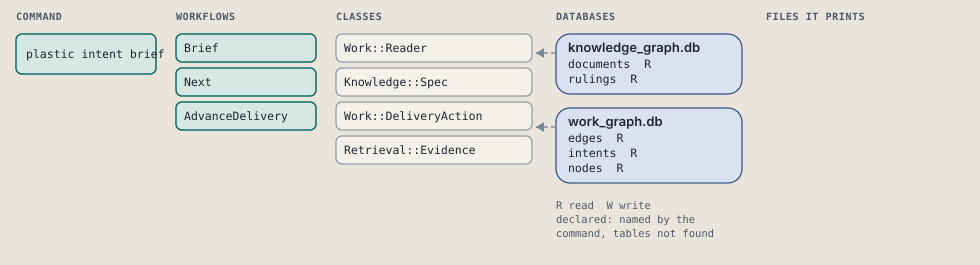
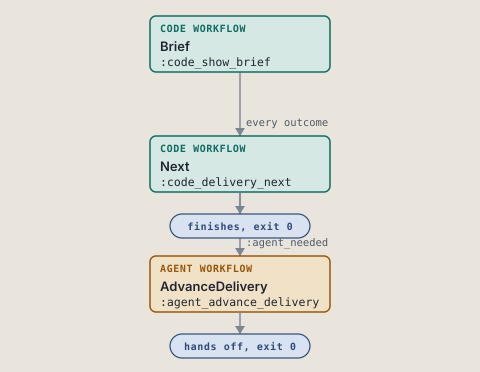
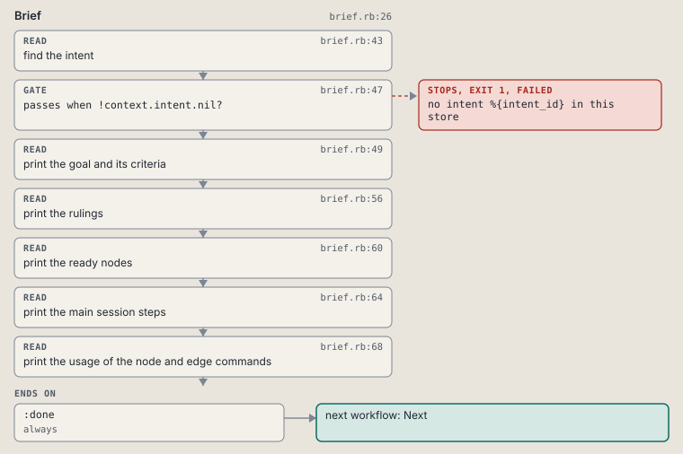
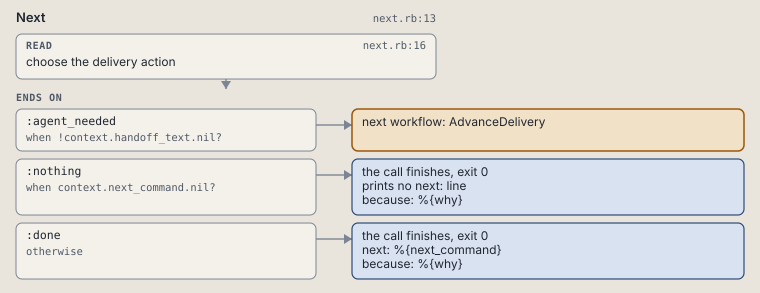
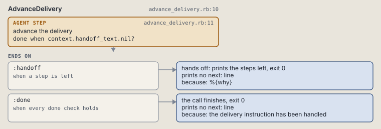
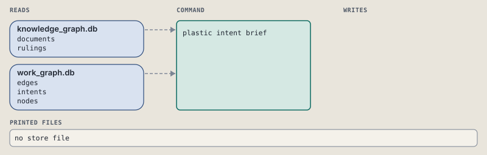

# plastic intent brief

Print an intent's goal, criteria, rulings, ready nodes and command usage.

```sh
plastic intent brief ID
```

The command is `Intent::Brief`, in [`brief.rb:11`](../../../../lib/plastic/commands/intent/brief.rb#L11). The words on this page, such as gate, step and outcome, are explained in [the command DSL](../../dsl/README.md).

| Argument or option | What it gives | Default |
| --- | --- | --- |
| `ID` | the intent | |

## Components



The figure shows the command, the workflows it runs, the classes behind them, and the databases and files they reach.

## The events of one call



| Workflow | Kind | Code |
| --- | --- | --- |
| [Code::Intent::Brief](#codeintentbrief) | code | [`brief.rb:26`](../../../../lib/plastic/workflows/code/intent/brief.rb#L26) |
| [Code::Intent::Brief::Next](#codeintentbriefnext) | code | [`next.rb:13`](../../../../lib/plastic/workflows/code/intent/brief/next.rb#L13) |
| [Agent::Shared::AdvanceDelivery](#agentsharedadvancedelivery) | agent | [`advance_delivery.rb:10`](../../../../lib/plastic/workflows/agent/shared/advance_delivery.rb#L10) |

### Code::Intent::Brief

The code workflow `:code_show_brief`, in [`brief.rb:26`](../../../../lib/plastic/workflows/code/intent/brief.rb#L26).

Prints the goal, the done criteria, the rulings with superseded ones marked, the ready nodes, the main session steps and the usage of the node and edge commands.



Its rows run in this order:

1. Read: find the intent. [`brief.rb:43`](../../../../lib/plastic/workflows/code/intent/brief.rb#L43)
2. Gate: passes when `!context.intent.nil?`; otherwise the call stops with exit 1 and prints no intent INTENT_ID in this store. [`brief.rb:47`](../../../../lib/plastic/workflows/code/intent/brief.rb#L47)
3. Read: print the goal and its criteria. [`brief.rb:49`](../../../../lib/plastic/workflows/code/intent/brief.rb#L49)
4. Read: print the rulings. [`brief.rb:56`](../../../../lib/plastic/workflows/code/intent/brief.rb#L56)
5. Read: print the ready nodes. [`brief.rb:60`](../../../../lib/plastic/workflows/code/intent/brief.rb#L60)
6. Read: print the main session steps. [`brief.rb:64`](../../../../lib/plastic/workflows/code/intent/brief.rb#L64)
7. Read: print the usage of the node and edge commands. [`brief.rb:68`](../../../../lib/plastic/workflows/code/intent/brief.rb#L68)
8. Outcome `:done`, always: starts the workflow [Code::Intent::Brief::Next](#codeintentbriefnext). [`brief.rb:72`](../../../../lib/plastic/workflows/code/intent/brief.rb#L72)

It sets `intent`.

### Code::Intent::Brief::Next

The code workflow `:code_delivery_next`, in [`next.rb:13`](../../../../lib/plastic/workflows/code/intent/brief/next.rb#L13).

Resolves a graph read into an action or a checked harness handoff.



Its rows run in this order:

1. Read: choose the delivery action. [`next.rb:16`](../../../../lib/plastic/workflows/code/intent/brief/next.rb#L16)
2. Outcome `:agent_needed`, when `!context.handoff_text.nil?`: starts the workflow [Agent::Shared::AdvanceDelivery](#agentsharedadvancedelivery). [`next.rb:20`](../../../../lib/plastic/workflows/code/intent/brief/next.rb#L20)
3. Outcome `:nothing`, when `context.next_command.nil?`: finishes with exit 0; prints no next: line. [`next.rb:21`](../../../../lib/plastic/workflows/code/intent/brief/next.rb#L21)
4. Outcome `:done`, otherwise: finishes with exit 0; next: NEXT_COMMAND. [`next.rb:22`](../../../../lib/plastic/workflows/code/intent/brief/next.rb#L22)

It sets `next_command`, `why`, `handoff_text`.

### Agent::Shared::AdvanceDelivery

The agent workflow `:agent_advance_delivery`, in [`advance_delivery.rb:10`](../../../../lib/plastic/workflows/agent/shared/advance_delivery.rb#L10).

The harness performs judgment and records the result through commands.



Its rows run in this order:

1. Agent step: advance the delivery. Done when `context.handoff_text.nil?`; while it fails, the call prints its `say:` text. [`advance_delivery.rb:11`](../../../../lib/plastic/workflows/agent/shared/advance_delivery.rb#L11)
2. Outcome `:handoff`, when a step is left: hands off with exit 0; prints no next: line. [`advance_delivery.rb:12`](../../../../lib/plastic/workflows/agent/shared/advance_delivery.rb#L12)
3. Outcome `:done`, when every done check holds: finishes with exit 0; prints no next: line. [`advance_delivery.rb:13`](../../../../lib/plastic/workflows/agent/shared/advance_delivery.rb#L13)

The agent step "advance the delivery" prints:

> HANDOFF_TEXT

While a step is left, the call hands off with exit 0 from `:handoff`: it prints the `say:` text of each failing step and prints no next: line. The command writes nothing, so the call keeps no routine run row. The next call starts fresh and checks the steps again.

In the words of workflow engines, the rows are these four parts:

- **Trigger**: the call starts the workflow `Code::Intent::Brief`; each later workflow starts from an outcome of the one before it.
- **Activities**: 7 reads and 1 agent step.
- **Transitions**: 1 gate stops the call when its check fails; a step runs only while its done check fails; Brief goes to Next on every outcome; Next goes to AdvanceDelivery on `:agent_needed`.
- **Outcomes**: `:nothing` of Next, `:done` of Next, `:handoff` of AdvanceDelivery, `:done` of AdvanceDelivery end the call.

## What one call reads, writes and prints



| Place | Database or file | Tables | Reads or writes | Code |
| --- | --- | --- | --- | --- |
| the store folder | knowledge_graph.db | `documents`, `rulings` | reads | [`brief.rb:13`](../../../../lib/plastic/commands/intent/brief.rb#L13) |
| the store folder | work_graph.db | `edges`, `intents`, `nodes` | reads | [`brief.rb:13`](../../../../lib/plastic/commands/intent/brief.rb#L13) |

A second call runs the same rows again. A step runs again only when its done check fails.

| Step | Done when | The second call | Code |
| --- | --- | --- | --- |
| advance the delivery | `context.handoff_text.nil?` | skips it | [`advance_delivery.rb:11`](../../../../lib/plastic/workflows/agent/shared/advance_delivery.rb#L11) |

## How a call ends

Every call can also end in [the ways any call can end](../../dsl/README.md#how-any-call-can-end).

| Ending | Exit | next: | Code |
| --- | --- | --- | --- |
| no intent INTENT_ID in this store | 1 | prints no next: line | [`brief.rb:47`](../../../../lib/plastic/workflows/code/intent/brief.rb#L47) |
| WHY | 0 | prints no next: line | [`next.rb:21`](../../../../lib/plastic/workflows/code/intent/brief/next.rb#L21) |
| WHY | 0 | NEXT_COMMAND | [`next.rb:22`](../../../../lib/plastic/workflows/code/intent/brief/next.rb#L22) |
| WHY | 0 | prints no next: line | [`advance_delivery.rb:12`](../../../../lib/plastic/workflows/agent/shared/advance_delivery.rb#L12) |
| the delivery instruction has been handled | 0 | prints no next: line | [`advance_delivery.rb:13`](../../../../lib/plastic/workflows/agent/shared/advance_delivery.rb#L13) |
| a step raises | 1 | prints no next: line | [`code_workflow.rb:102`](../../../../lib/plastic/code_workflow.rb#L102) |

## What the page leaves out

Every call shares a few things that this page does not repeat; [the command DSL](../../dsl/README.md#what-every-call-shares) names them.

- No gate of this command refuses, so exit 3 never happens.
