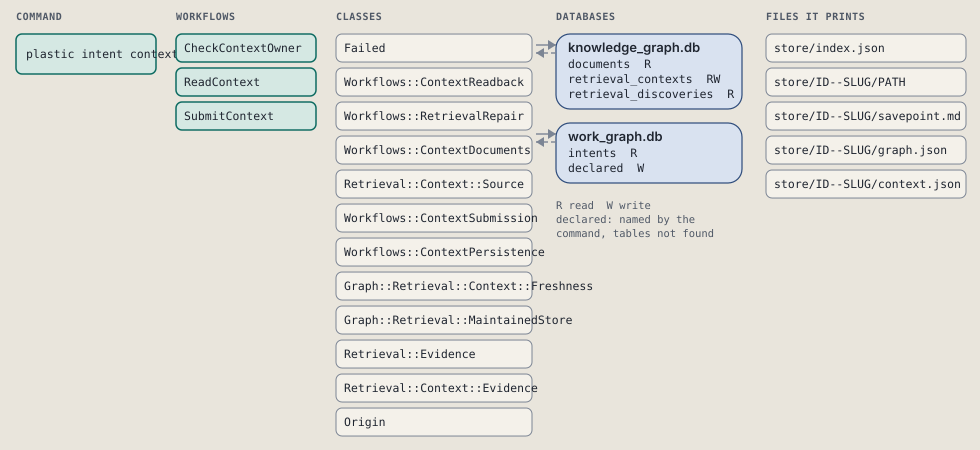
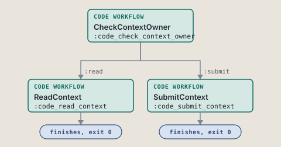
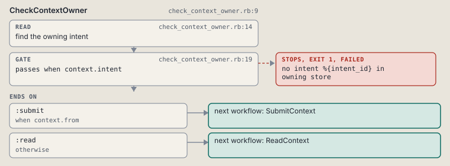
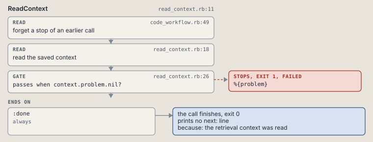
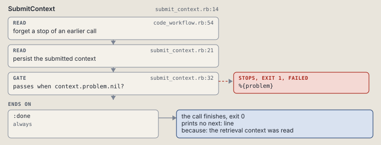

# plastic intent context

Read or submit selected retrieval context for an intent.

Persists the agent's selected evidence without judging its relevance.

```sh
plastic intent context ID [--from FILE]
```

The command is `IntentContext`, in [`intent_context.rb:8`](../../../../scripts/lib/plastic/commands/intent_context.rb#L8). The words on this page, such as gate, step and outcome, are explained in [the command DSL](../../dsl/README.md).

| Argument or option | What it gives | Default |
| --- | --- | --- |
| `ID` | the owning intent | |
| `--from FILE` | JSON file holding the arrays evidence, facts, interpretations, gaps and rulings |  |

## What it touches



## How the call flows



| Workflow | Kind | Code |
| --- | --- | --- |
| [CheckContextOwner](#checkcontextowner) | code | [`check_context_owner.rb:9`](../../../../scripts/lib/plastic/workflows/check_context_owner.rb#L9) |
| [ReadContext](#readcontext) | code | [`read_context.rb:10`](../../../../scripts/lib/plastic/workflows/read_context.rb#L10) |
| [SubmitContext](#submitcontext) | code | [`submit_context.rb:14`](../../../../scripts/lib/plastic/workflows/submit_context.rb#L14) |

### CheckContextOwner

The code workflow `:code_check_context_owner`, in [`check_context_owner.rb:9`](../../../../scripts/lib/plastic/workflows/check_context_owner.rb#L9).

Confirms that a context request names an existing intent in its owning store.



| Step | Kind | Check | Code |
| --- | --- | --- | --- |
| find the owning intent | read |  | [`check_context_owner.rb:14`](../../../../scripts/lib/plastic/workflows/check_context_owner.rb#L14) |
| no intent %{intent_id} in owning store | gate, stops with exit 1 | `context.intent` | [`check_context_owner.rb:19`](../../../../scripts/lib/plastic/workflows/check_context_owner.rb#L19) |

| Outcome | When | Then | Code |
| --- | --- | --- | --- |
| `:submit` | when `context.from` | runs [SubmitContext](#submitcontext) | [`check_context_owner.rb:21`](../../../../scripts/lib/plastic/workflows/check_context_owner.rb#L21) |
| `:read` | otherwise | runs [ReadContext](#readcontext) | [`check_context_owner.rb:22`](../../../../scripts/lib/plastic/workflows/check_context_owner.rb#L22) |

It sets `intent`.

### ReadContext

The code workflow `:code_read_context`, in [`read_context.rb:10`](../../../../scripts/lib/plastic/workflows/read_context.rb#L10).

Reads the saved retrieval context of one intent with its evidence freshness.



| Step | Kind | Check | Code |
| --- | --- | --- | --- |
| forget a stop of an earlier call | read |  | [`code_workflow.rb:49`](../../../../scripts/lib/plastic/code_workflow.rb#L49) |
| read the saved context | read |  | [`read_context.rb:17`](../../../../scripts/lib/plastic/workflows/read_context.rb#L17) |
| %{problem} | gate, stops with exit 1 | `context.problem.nil?` | [`read_context.rb:25`](../../../../scripts/lib/plastic/workflows/read_context.rb#L25) |

| Outcome | When | Then | Code |
| --- | --- | --- | --- |
| `:done` | always | finishes, exit 0; prints no next: line | [`read_context.rb:27`](../../../../scripts/lib/plastic/workflows/read_context.rb#L27) |

It sets `problem`.

### SubmitContext

The code workflow `:code_submit_context`, in [`submit_context.rb:14`](../../../../scripts/lib/plastic/workflows/submit_context.rb#L14).

Validates a submitted evidence selection and persists it in the owning store.



| Step | Kind | Check | Code |
| --- | --- | --- | --- |
| forget a stop of an earlier call | read |  | [`code_workflow.rb:49`](../../../../scripts/lib/plastic/code_workflow.rb#L49) |
| persist the submitted context | read |  | [`submit_context.rb:21`](../../../../scripts/lib/plastic/workflows/submit_context.rb#L21) |
| %{problem} | gate, stops with exit 1 | `context.problem.nil?` | [`submit_context.rb:32`](../../../../scripts/lib/plastic/workflows/submit_context.rb#L32) |

| Outcome | When | Then | Code |
| --- | --- | --- | --- |
| `:done` | always | finishes, exit 0; prints no next: line | [`submit_context.rb:34`](../../../../scripts/lib/plastic/workflows/submit_context.rb#L34) |

It sets `problem`.

## Outcomes

Every call can also end in [the ways any call can end](../../dsl/README.md#how-any-call-can-end).

| Ending | Exit | next: | Code |
| --- | --- | --- | --- |
| no intent %{intent_id} in owning store | 1 | prints no next: line | [`check_context_owner.rb:19`](../../../../scripts/lib/plastic/workflows/check_context_owner.rb#L19) |
| %{problem} | 1 | prints no next: line | [`read_context.rb:25`](../../../../scripts/lib/plastic/workflows/read_context.rb#L25) |
| the retrieval context was read | 0 | prints no next: line | [`read_context.rb:27`](../../../../scripts/lib/plastic/workflows/read_context.rb#L27) |
| %{problem} | 1 | prints no next: line | [`submit_context.rb:32`](../../../../scripts/lib/plastic/workflows/submit_context.rb#L32) |
| the retrieval context was read | 0 | prints no next: line | [`submit_context.rb:34`](../../../../scripts/lib/plastic/workflows/submit_context.rb#L34) |
| a step raises | 1 | prints no next: line | [`code_workflow.rb:97`](../../../../scripts/lib/plastic/code_workflow.rb#L97) |
