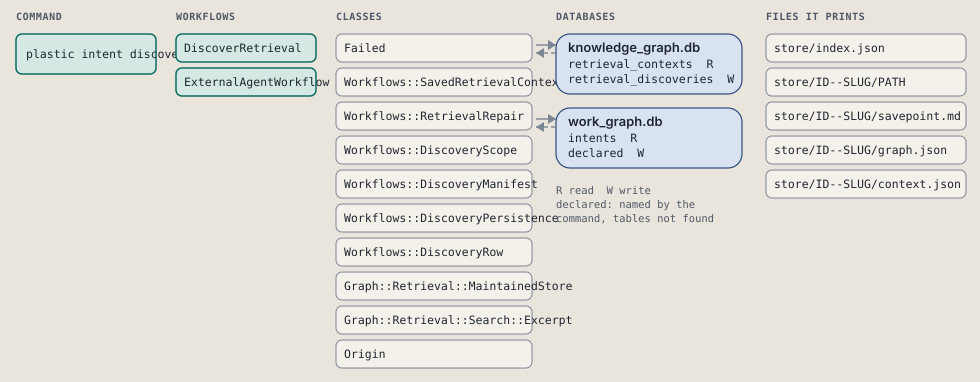
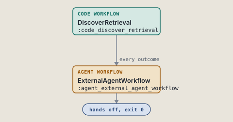
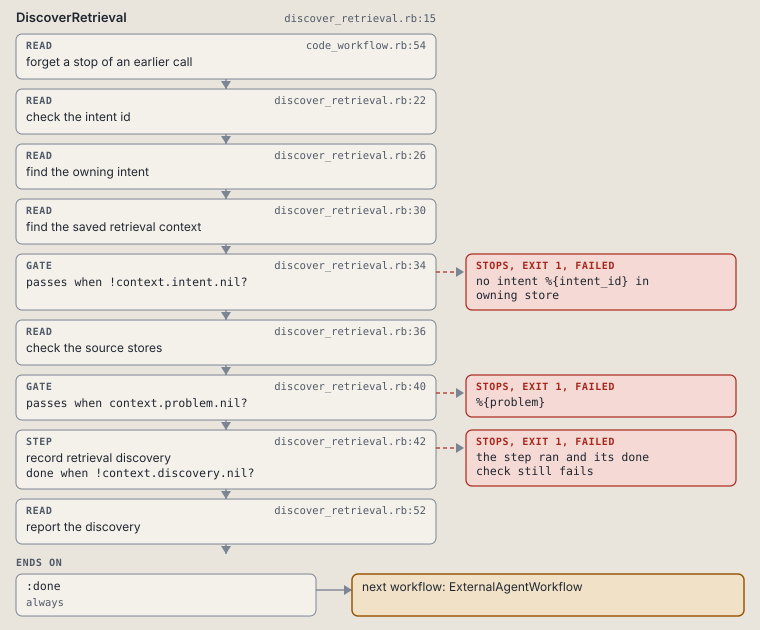
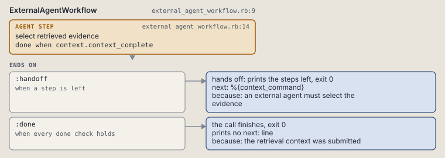

# plastic intent discover

Record deterministic retrieval candidates for an intent.

Builds the retrieval handoff manifest; the harness chooses its evidence.

```sh
plastic intent discover ID TERMS... [--source-project SLUG]
```

The command is `IntentDiscover`, in [`intent_discover.rb:8`](../../../../scripts/lib/plastic/commands/intent_discover.rb#L8). The words on this page, such as gate, step and outcome, are explained in [the command DSL](../../dsl/README.md).

| Argument or option | What it gives | Default |
| --- | --- | --- |
| `ID` | the owning intent | |
| `TERMS` | literal search terms | |
| `--source-project SLUG` | a source store | `[]` |

## What it touches



## How the call flows



| Workflow | Kind | Code |
| --- | --- | --- |
| [DiscoverRetrieval](#discoverretrieval) | code | [`discover_retrieval.rb:15`](../../../../scripts/lib/plastic/workflows/discover_retrieval.rb#L15) |
| [ExternalAgentWorkflow](#externalagentworkflow) | agent | [`external_agent_workflow.rb:9`](../../../../scripts/lib/plastic/workflows/external_agent_workflow.rb#L9) |

### DiscoverRetrieval

The code workflow `:code_discover_retrieval`, in [`discover_retrieval.rb:15`](../../../../scripts/lib/plastic/workflows/discover_retrieval.rb#L15).

Records lexical retrieval candidates before an external agent selects them.



| Step | Kind | Check | Code |
| --- | --- | --- | --- |
| check the intent id | read |  | [`discover_retrieval.rb:20`](../../../../scripts/lib/plastic/workflows/discover_retrieval.rb#L20) |
| find the owning intent | read |  | [`discover_retrieval.rb:24`](../../../../scripts/lib/plastic/workflows/discover_retrieval.rb#L24) |
| find the saved retrieval context | read |  | [`discover_retrieval.rb:28`](../../../../scripts/lib/plastic/workflows/discover_retrieval.rb#L28) |
| no intent %{intent_id} in owning store | gate, stops with exit 1 | `!context.intent.nil?` | [`discover_retrieval.rb:34`](../../../../scripts/lib/plastic/workflows/discover_retrieval.rb#L34) |
| record retrieval discovery | step | `!context.discovery.nil?` | [`discover_retrieval.rb:36`](../../../../scripts/lib/plastic/workflows/discover_retrieval.rb#L36) |
| report the discovery | read |  | [`discover_retrieval.rb:46`](../../../../scripts/lib/plastic/workflows/discover_retrieval.rb#L46) |

| Outcome | When | Then | Code |
| --- | --- | --- | --- |
| `:done` | always | runs [ExternalAgentWorkflow](#externalagentworkflow) | [`discover_retrieval.rb:50`](../../../../scripts/lib/plastic/workflows/discover_retrieval.rb#L50) |

It sets `intent`, `source_scope`, `discovery`, `handoff_text`, `context_command`, `context_complete`.

### ExternalAgentWorkflow

The agent workflow `:agent_external_agent_workflow`, in [`external_agent_workflow.rb:9`](../../../../scripts/lib/plastic/workflows/external_agent_workflow.rb#L9).

Gives an external agent deterministic retrieval commands without selecting evidence.



| Step | Kind | Check | Code |
| --- | --- | --- | --- |
| select retrieved evidence | agent step | `context.context_complete` | [`external_agent_workflow.rb:14`](../../../../scripts/lib/plastic/workflows/external_agent_workflow.rb#L14) |

| Outcome | When | Then | Code |
| --- | --- | --- | --- |
| `:handoff` | when a step is left | hands off, exit 0; next: %{context_command} | [`external_agent_workflow.rb:15`](../../../../scripts/lib/plastic/workflows/external_agent_workflow.rb#L15) |
| `:done` | when every done check holds | finishes, exit 0; prints no next: line | [`external_agent_workflow.rb:16`](../../../../scripts/lib/plastic/workflows/external_agent_workflow.rb#L16) |

The agent step "select retrieved evidence" prints:

> %{handoff_text}

It sets `handoff_text`, `context_command`, `context_complete`.

## Outcomes

Every call can also end in [the ways any call can end](../../dsl/README.md#how-any-call-can-end).

| Ending | Exit | next: | Code |
| --- | --- | --- | --- |
| no intent %{intent_id} in owning store | 1 | prints no next: line | [`discover_retrieval.rb:34`](../../../../scripts/lib/plastic/workflows/discover_retrieval.rb#L34) |
| an external agent must select the evidence | 0 | %{context_command} | [`external_agent_workflow.rb:15`](../../../../scripts/lib/plastic/workflows/external_agent_workflow.rb#L15) |
| the retrieval context was submitted | 0 | prints no next: line | [`external_agent_workflow.rb:16`](../../../../scripts/lib/plastic/workflows/external_agent_workflow.rb#L16) |
| a step raises | 1 | prints no next: line | [`code_workflow.rb:102`](../../../../scripts/lib/plastic/code_workflow.rb#L102) |
