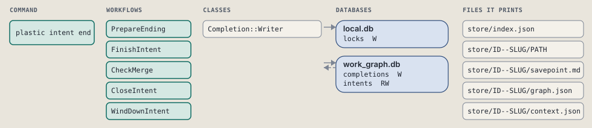
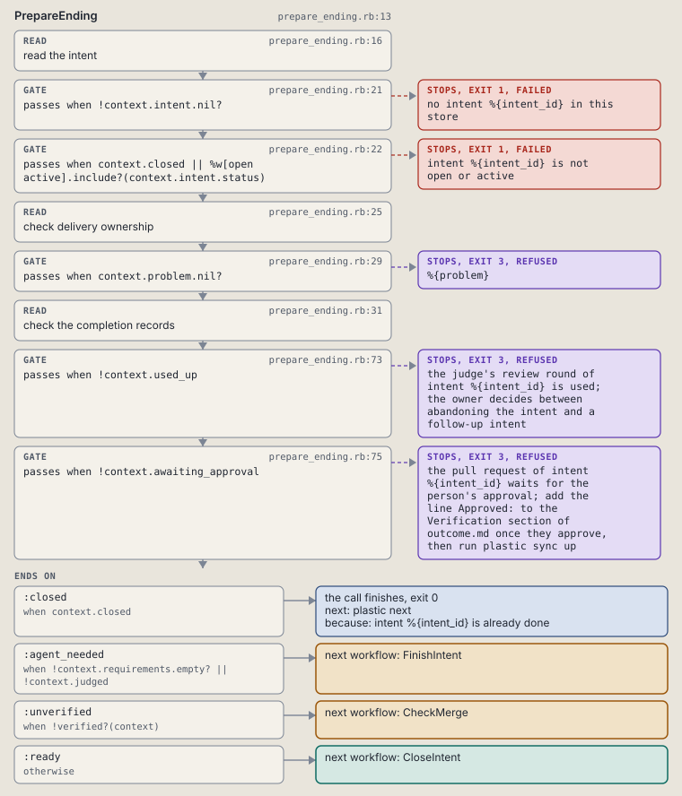
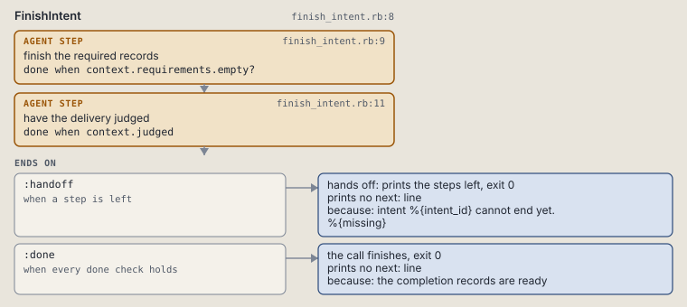
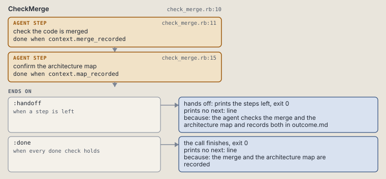
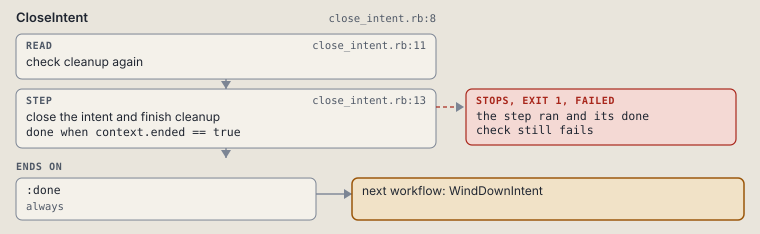
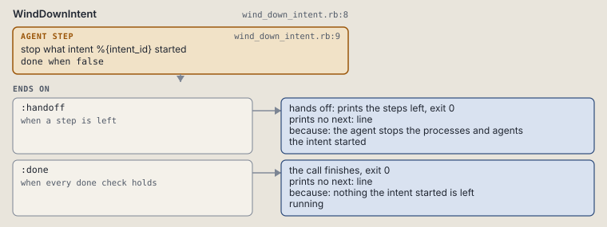

# plastic intent end

Close a delivered intent once its verdict, nodes and outcome allow it, or print what is missing.

Closes a delivered intent once the rows, the verdict and outcome.md allow it, and hands over what is missing.

```sh
plastic intent end ID
```

The command is `IntentEnd`, in [`intent_end.rb:8`](../../../../scripts/lib/plastic/commands/intent_end.rb#L8). The words on this page, such as gate, step and outcome, are explained in [the command DSL](../../dsl/README.md).

| Argument or option | What it gives | Default |
| --- | --- | --- |
| `ID` | the intent | |

## What it touches



## How the call flows


| Workflow | Kind | Code |
| --- | --- | --- |
| [PrepareEnding](#prepareending) | code | [`prepare_ending.rb:13`](../../../../scripts/lib/plastic/workflows/prepare_ending.rb#L13) |
| [FinishIntent](#finishintent) | agent | [`finish_intent.rb:8`](../../../../scripts/lib/plastic/workflows/finish_intent.rb#L8) |
| [CheckMerge](#checkmerge) | agent | [`check_merge.rb:10`](../../../../scripts/lib/plastic/workflows/check_merge.rb#L10) |
| [CloseIntent](#closeintent) | code | [`close_intent.rb:8`](../../../../scripts/lib/plastic/workflows/close_intent.rb#L8) |
| [WindDownIntent](#winddownintent) | agent | [`wind_down_intent.rb:8`](../../../../scripts/lib/plastic/workflows/wind_down_intent.rb#L8) |

### PrepareEnding

The code workflow `:code_prepare_ending`, in [`prepare_ending.rb:13`](../../../../scripts/lib/plastic/workflows/prepare_ending.rb#L13).

Reads what closing an intent needs: the rows, the judge's verdict, outcome.md and, by the review setting, the pull request.



| Step | Kind | Check | Code |
| --- | --- | --- | --- |
| read the intent | read |  | [`prepare_ending.rb:16`](../../../../scripts/lib/plastic/workflows/prepare_ending.rb#L16) |
| no intent %{intent_id} in this store | gate, stops with exit 1 | `!context.intent.nil?` | [`prepare_ending.rb:21`](../../../../scripts/lib/plastic/workflows/prepare_ending.rb#L21) |
| intent %{intent_id} is not open or active | gate, stops with exit 1 | `context.closed \|\| %w[open active].include?(context.intent.status)` | [`prepare_ending.rb:22`](../../../../scripts/lib/plastic/workflows/prepare_ending.rb#L22) |
| check delivery ownership | read |  | [`prepare_ending.rb:25`](../../../../scripts/lib/plastic/workflows/prepare_ending.rb#L25) |
| %{problem} | gate, stops with exit 3 | `context.problem.nil?` | [`prepare_ending.rb:29`](../../../../scripts/lib/plastic/workflows/prepare_ending.rb#L29) |
| check the completion records | read |  | [`prepare_ending.rb:31`](../../../../scripts/lib/plastic/workflows/prepare_ending.rb#L31) |
| the judge's review round of intent %{intent_id} is used; the owner decides between abandoning the intent and a follow-up intent | gate, stops with exit 3 | `!context.used_up` | [`prepare_ending.rb:73`](../../../../scripts/lib/plastic/workflows/prepare_ending.rb#L73) |
| the pull request of intent %{intent_id} waits for the person's approval; add the line Approved: to the Verification section of outcome.md once they approve, then run plastic sync up | gate, stops with exit 3 | `!context.awaiting_approval` | [`prepare_ending.rb:75`](../../../../scripts/lib/plastic/workflows/prepare_ending.rb#L75) |

| Outcome | When | Then | Code |
| --- | --- | --- | --- |
| `:closed` | when `context.closed` | finishes, exit 0; next: plastic next | [`prepare_ending.rb:80`](../../../../scripts/lib/plastic/workflows/prepare_ending.rb#L80) |
| `:agent_needed` | when `!context.requirements.empty? \|\| !context.judged` | runs [FinishIntent](#finishintent) | [`prepare_ending.rb:82`](../../../../scripts/lib/plastic/workflows/prepare_ending.rb#L82) |
| `:unverified` | when `!verified?(context)` | runs [CheckMerge](#checkmerge) | [`prepare_ending.rb:83`](../../../../scripts/lib/plastic/workflows/prepare_ending.rb#L83) |
| `:ready` | otherwise | runs [CloseIntent](#closeintent) | [`prepare_ending.rb:84`](../../../../scripts/lib/plastic/workflows/prepare_ending.rb#L84) |

It sets `intent`, `closed`, `problem`, `requirements`, `judged`, `used_up`, `awaiting_approval`, `intent_folder`, `merge_recorded`, `map_recorded`, `missing`.

### FinishIntent

The agent workflow `:agent_finish_intent`, in [`finish_intent.rb:8`](../../../../scripts/lib/plastic/workflows/finish_intent.rb#L8).

The harness writes the records the close needs and has the work judged.



| Step | Kind | Check | Code |
| --- | --- | --- | --- |
| finish the required records | agent step | `context.requirements.empty?` | [`finish_intent.rb:9`](../../../../scripts/lib/plastic/workflows/finish_intent.rb#L9) |
| have the delivery judged | agent step | `context.judged` | [`finish_intent.rb:11`](../../../../scripts/lib/plastic/workflows/finish_intent.rb#L11) |

| Outcome | When | Then | Code |
| --- | --- | --- | --- |
| `:handoff` | when a step is left | hands off, exit 0; prints no next: line | [`finish_intent.rb:15`](../../../../scripts/lib/plastic/workflows/finish_intent.rb#L15) |
| `:done` | when every done check holds | finishes, exit 0; prints no next: line | [`finish_intent.rb:16`](../../../../scripts/lib/plastic/workflows/finish_intent.rb#L16) |

The agent step "finish the required records" prints:

> Complete these recorded prerequisites: %{requirements}

The agent step "have the delivery judged" prints:

> No accepted review counts yet. Run plastic intent judge %{intent_id}; the judge records the verdict of the next review round with plastic intent verdict. Then run plastic intent end %{intent_id} again.

### CheckMerge

The agent workflow `:agent_check_merge`, in [`check_merge.rb:10`](../../../../scripts/lib/plastic/workflows/check_merge.rb#L10).

The agent checks that the code is merged and confirms the architecture map, then records both under Verification in outcome.md. Plastic runs no version control command and records what the agent writes.



| Step | Kind | Check | Code |
| --- | --- | --- | --- |
| check the code is merged | agent step | `context.merge_recorded` | [`check_merge.rb:11`](../../../../scripts/lib/plastic/workflows/check_merge.rb#L11) |
| confirm the architecture map | agent step | `context.map_recorded` | [`check_merge.rb:15`](../../../../scripts/lib/plastic/workflows/check_merge.rb#L15) |

| Outcome | When | Then | Code |
| --- | --- | --- | --- |
| `:handoff` | when a step is left | hands off, exit 0; prints no next: line | [`check_merge.rb:21`](../../../../scripts/lib/plastic/workflows/check_merge.rb#L21) |
| `:done` | when every done check holds | finishes, exit 0; prints no next: line | [`check_merge.rb:22`](../../../../scripts/lib/plastic/workflows/check_merge.rb#L22) |

The agent step "check the code is merged" prints:

> Check with your own version control tool that the intent's branch is merged into its base. Then add the line '- Merged: <branch> into <base> at <commit or pull request>' under ## Verification in %{intent_folder}/outcome.md. Plastic runs no version control command; it records what you write.

The agent step "confirm the architecture map" prints:

> Now that the work is delivered, fetch the architecture map once more, with the tool you used before planning or by mapping the code yourself, and confirm that it describes the delivered code. Then add the line '- Architecture map: <tool> at <source revision>' under ## Verification in %{intent_folder}/outcome.md. Run plastic sync up and then plastic intent end %{intent_id} again.

### CloseIntent

The code workflow `:code_close_intent`, in [`close_intent.rb:8`](../../../../scripts/lib/plastic/workflows/close_intent.rb#L8).

Closure can be retried after the work commit but before lock cleanup. The files of the intent print after the close.



| Step | Kind | Check | Code |
| --- | --- | --- | --- |
| check cleanup again | read |  | [`close_intent.rb:11`](../../../../scripts/lib/plastic/workflows/close_intent.rb#L11) |
| close the intent and finish cleanup | step | `context.ended == true` | [`close_intent.rb:13`](../../../../scripts/lib/plastic/workflows/close_intent.rb#L13) |

| Outcome | When | Then | Code |
| --- | --- | --- | --- |
| `:done` | always | runs [WindDownIntent](#winddownintent) | [`close_intent.rb:19`](../../../../scripts/lib/plastic/workflows/close_intent.rb#L19) |

It sets `ended`.

### WindDownIntent

The agent workflow `:agent_wind_down_intent`, in [`wind_down_intent.rb:8`](../../../../scripts/lib/plastic/workflows/wind_down_intent.rb#L8).

The agent stops what the intent started. Plastic runs and stops nothing.



| Step | Kind | Check | Code |
| --- | --- | --- | --- |
| stop what intent %{intent_id} started | agent step | `false` | [`wind_down_intent.rb:9`](../../../../scripts/lib/plastic/workflows/wind_down_intent.rb#L9) |

| Outcome | When | Then | Code |
| --- | --- | --- | --- |
| `:handoff` | when a step is left | hands off, exit 0; prints no next: line | [`wind_down_intent.rb:13`](../../../../scripts/lib/plastic/workflows/wind_down_intent.rb#L13) |
| `:done` | when every done check holds | finishes, exit 0; prints no next: line | [`wind_down_intent.rb:14`](../../../../scripts/lib/plastic/workflows/wind_down_intent.rb#L14) |

The agent step "stop what intent %{intent_id} started" prints:

> Stop the processes and the agents that intent %{intent_id} started: servers, watchers, background jobs and subagents. Plastic runs none of them and stops none of them.

## Outcomes

Every call can also end in [the ways any call can end](../../dsl/README.md#how-any-call-can-end).

| Ending | Exit | next: | Code |
| --- | --- | --- | --- |
| no intent %{intent_id} in this store | 1 | prints no next: line | [`prepare_ending.rb:21`](../../../../scripts/lib/plastic/workflows/prepare_ending.rb#L21) |
| intent %{intent_id} is not open or active | 1 | prints no next: line | [`prepare_ending.rb:22`](../../../../scripts/lib/plastic/workflows/prepare_ending.rb#L22) |
| %{problem} | 3 | prints no next: line | [`prepare_ending.rb:29`](../../../../scripts/lib/plastic/workflows/prepare_ending.rb#L29) |
| the judge's review round of intent %{intent_id} is used; the owner decides between abandoning the intent and a follow-up intent | 3 | prints no next: line | [`prepare_ending.rb:73`](../../../../scripts/lib/plastic/workflows/prepare_ending.rb#L73) |
| the pull request of intent %{intent_id} waits for the person's approval; add the line Approved: to the Verification section of outcome.md once they approve, then run plastic sync up | 3 | prints no next: line | [`prepare_ending.rb:75`](../../../../scripts/lib/plastic/workflows/prepare_ending.rb#L75) |
| intent %{intent_id} is already done | 0 | plastic next | [`prepare_ending.rb:80`](../../../../scripts/lib/plastic/workflows/prepare_ending.rb#L80) |
| intent %{intent_id} cannot end yet. %{missing} | 0 | prints no next: line | [`finish_intent.rb:15`](../../../../scripts/lib/plastic/workflows/finish_intent.rb#L15) |
| the completion records are ready | 0 | prints no next: line | [`finish_intent.rb:16`](../../../../scripts/lib/plastic/workflows/finish_intent.rb#L16) |
| the agent checks the merge and the architecture map and records both in outcome.md | 0 | prints no next: line | [`check_merge.rb:21`](../../../../scripts/lib/plastic/workflows/check_merge.rb#L21) |
| the merge and the architecture map are recorded | 0 | prints no next: line | [`check_merge.rb:22`](../../../../scripts/lib/plastic/workflows/check_merge.rb#L22) |
| the agent stops the processes and agents the intent started | 0 | prints no next: line | [`wind_down_intent.rb:13`](../../../../scripts/lib/plastic/workflows/wind_down_intent.rb#L13) |
| nothing the intent started is left running | 0 | prints no next: line | [`wind_down_intent.rb:14`](../../../../scripts/lib/plastic/workflows/wind_down_intent.rb#L14) |
| a step raises | 1 | prints no next: line | [`code_workflow.rb:97`](../../../../scripts/lib/plastic/code_workflow.rb#L97) |
