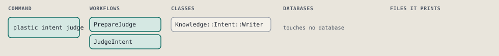
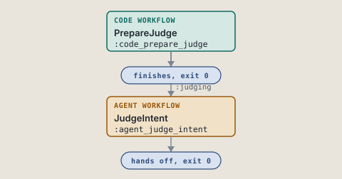
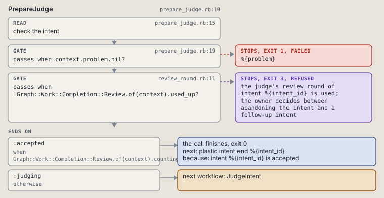
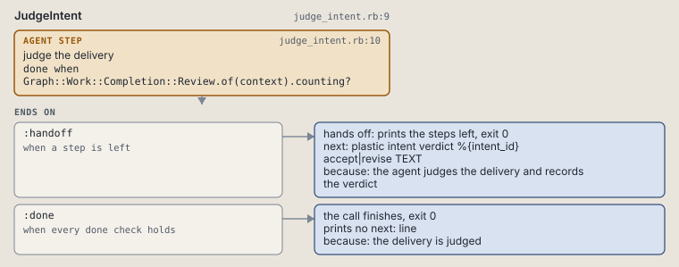

# plastic intent judge

Print the steps that start the judge of an intent.

```sh
plastic intent judge ID
```

The command is `IntentJudge`, in [`intent_judge.rb:8`](../../../../scripts/lib/plastic/commands/intent_judge.rb#L8). The words on this page, such as gate, step and outcome, are explained in [the command DSL](../../dsl/README.md).

| Argument or option | What it gives | Default |
| --- | --- | --- |
| `ID` | the intent | |

## What it touches



## How the call flows



| Workflow | Kind | Code |
| --- | --- | --- |
| [PrepareJudge](#preparejudge) | code | [`prepare_judge.rb:10`](../../../../scripts/lib/plastic/workflows/prepare_judge.rb#L10) |
| [JudgeIntent](#judgeintent) | agent | [`judge_intent.rb:9`](../../../../scripts/lib/plastic/workflows/judge_intent.rb#L9) |

### PrepareJudge

The code workflow `:code_prepare_judge`, in [`prepare_judge.rb:10`](../../../../scripts/lib/plastic/workflows/prepare_judge.rb#L10).

Reads the intent and its judge rounds: a missing or closed intent fails, both rounds used is the owner's step.



| Step | Kind | Check | Code |
| --- | --- | --- | --- |
| check the intent | read |  | [`prepare_judge.rb:15`](../../../../scripts/lib/plastic/workflows/prepare_judge.rb#L15) |
| %{problem} | gate, stops with exit 1 | `context.problem.nil?` | [`prepare_judge.rb:19`](../../../../scripts/lib/plastic/workflows/prepare_judge.rb#L19) |
| the judge's review round of intent %{intent_id} is used; the owner decides between abandoning the intent and a follow-up intent | gate, stops with exit 3 | `!Graph::Work::Completion::Review.of(context).used_up?` | [`review_round.rb:11`](../../../../scripts/lib/plastic/workflows/review_round.rb#L11) |

| Outcome | When | Then | Code |
| --- | --- | --- | --- |
| `:accepted` | when `Graph::Work::Completion::Review.of(context).counting?` | finishes, exit 0; next: plastic intent end %{intent_id} | [`prepare_judge.rb:22`](../../../../scripts/lib/plastic/workflows/prepare_judge.rb#L22) |
| `:judging` | otherwise | runs [JudgeIntent](#judgeintent) | [`prepare_judge.rb:24`](../../../../scripts/lib/plastic/workflows/prepare_judge.rb#L24) |

It sets `problem`.

### JudgeIntent

The agent workflow `:agent_judge_intent`, in [`judge_intent.rb:9`](../../../../scripts/lib/plastic/workflows/judge_intent.rb#L9).

The agent reads the spec and the findings of every node, decides, and records the verdict.



| Step | Kind | Check | Code |
| --- | --- | --- | --- |
| judge the delivery | agent step | `Graph::Work::Completion::Review.of(context).counting?` | [`judge_intent.rb:10`](../../../../scripts/lib/plastic/workflows/judge_intent.rb#L10) |

| Outcome | When | Then | Code |
| --- | --- | --- | --- |
| `:handoff` | when a step is left | hands off, exit 0; next: plastic intent verdict %{intent_id} accept\|revise TEXT | [`judge_intent.rb:17`](../../../../scripts/lib/plastic/workflows/judge_intent.rb#L17) |
| `:done` | when every done check holds | finishes, exit 0; prints no next: line | [`judge_intent.rb:19`](../../../../scripts/lib/plastic/workflows/judge_intent.rb#L19) |

The agent step "judge the delivery" prints:

> Start a reasoning judge agent; the harness picks which kind. Tell it to read spec.md and the findings of every node, check each done criterion against the delivered work and decide: accept when every criterion holds, revise when something falls short. It records the verdict with plastic intent verdict %{intent_id} accept|revise TEXT. A revise starts a second review round, and a second revise stops the intent for the owner.

## Outcomes

Every call can also end in [the ways any call can end](../../dsl/README.md#how-any-call-can-end).

| Ending | Exit | next: | Code |
| --- | --- | --- | --- |
| %{problem} | 1 | prints no next: line | [`prepare_judge.rb:19`](../../../../scripts/lib/plastic/workflows/prepare_judge.rb#L19) |
| the judge's review round of intent %{intent_id} is used; the owner decides between abandoning the intent and a follow-up intent | 3 | prints no next: line | [`review_round.rb:11`](../../../../scripts/lib/plastic/workflows/review_round.rb#L11) |
| intent %{intent_id} is accepted | 0 | plastic intent end %{intent_id} | [`prepare_judge.rb:22`](../../../../scripts/lib/plastic/workflows/prepare_judge.rb#L22) |
| the agent judges the delivery and records the verdict | 0 | plastic intent verdict %{intent_id} accept\|revise TEXT | [`judge_intent.rb:17`](../../../../scripts/lib/plastic/workflows/judge_intent.rb#L17) |
| the delivery is judged | 0 | prints no next: line | [`judge_intent.rb:19`](../../../../scripts/lib/plastic/workflows/judge_intent.rb#L19) |
| a step raises | 1 | prints no next: line | [`code_workflow.rb:97`](../../../../scripts/lib/plastic/code_workflow.rb#L97) |
