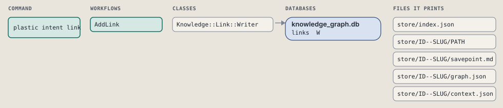
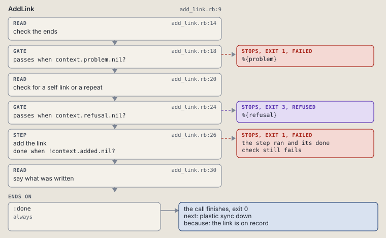

# plastic intent link

Write a typed link from an intent to a ref.

Writes one `links` row from ID to TARGET: an intent id, a ruling ref such as `1/D1`, or a ref with a store prefix such as `global:25`.

```sh
plastic intent link ID KIND TARGET
```

The command is `IntentLink`, in [`intent_link.rb:10`](../../../../scripts/lib/plastic/commands/intent_link.rb#L10). The words on this page, such as gate, step and outcome, are explained in [the command DSL](../../dsl/README.md).

| Argument or option | What it gives | Default |
| --- | --- | --- |
| `ID` | the intent this link starts from | |
| `KIND` | cites, supersedes, answers, source or chain | |
| `TARGET` | an intent, a ruling, or a ref with a store prefix | |

## What it touches



## Before the chain

The command's own `call`, at [`intent_link.rb:19`](../../../../scripts/lib/plastic/commands/intent_link.rb#L19), runs first:

```ruby
def call
  raise CLI::Command::Usage, "KIND takes #{Graph::Knowledge::Link::KINDS.join(", ")}" unless Graph::Knowledge::Link::KINDS.include?(parsed[:kind])

  super
end
```

## How the call flows


| Workflow | Kind | Code |
| --- | --- | --- |
| [AddLink](#addlink) | code | [`add_link.rb:9`](../../../../scripts/lib/plastic/workflows/add_link.rb#L9) |

### AddLink

The code workflow `:code_add_link`, in [`add_link.rb:9`](../../../../scripts/lib/plastic/workflows/add_link.rb#L9).

Writes one guarded link: failed on a missing id or target, refused on a self link or a link already there.



| Step | Kind | Check | Code |
| --- | --- | --- | --- |
| check the ends | read |  | [`add_link.rb:14`](../../../../scripts/lib/plastic/workflows/add_link.rb#L14) |
| %{problem} | gate, stops with exit 1 | `context.problem.nil?` | [`add_link.rb:18`](../../../../scripts/lib/plastic/workflows/add_link.rb#L18) |
| check for a self link or a repeat | read |  | [`add_link.rb:20`](../../../../scripts/lib/plastic/workflows/add_link.rb#L20) |
| %{refusal} | gate, stops with exit 3 | `context.refusal.nil?` | [`add_link.rb:24`](../../../../scripts/lib/plastic/workflows/add_link.rb#L24) |
| add the link | step | `!context.added.nil?` | [`add_link.rb:26`](../../../../scripts/lib/plastic/workflows/add_link.rb#L26) |
| say what was written | read |  | [`add_link.rb:30`](../../../../scripts/lib/plastic/workflows/add_link.rb#L30) |

| Outcome | When | Then | Code |
| --- | --- | --- | --- |
| `:done` | always | finishes, exit 0; next: plastic sync down | [`add_link.rb:34`](../../../../scripts/lib/plastic/workflows/add_link.rb#L34) |

It sets `problem`, `refusal`, `added`.

## Outcomes

Every call can also end in [the ways any call can end](../../dsl/README.md#how-any-call-can-end).

| Ending | Exit | next: | Code |
| --- | --- | --- | --- |
| %{problem} | 1 | prints no next: line | [`add_link.rb:18`](../../../../scripts/lib/plastic/workflows/add_link.rb#L18) |
| %{refusal} | 3 | prints no next: line | [`add_link.rb:24`](../../../../scripts/lib/plastic/workflows/add_link.rb#L24) |
| the link is on record | 0 | plastic sync down | [`add_link.rb:34`](../../../../scripts/lib/plastic/workflows/add_link.rb#L34) |
| a step raises | 1 | prints no next: line | [`code_workflow.rb:102`](../../../../scripts/lib/plastic/code_workflow.rb#L102) |
| Usage error: KIND takes %{raph} | 2 | prints no next: line | [`intent_link.rb:20`](../../../../scripts/lib/plastic/commands/intent_link.rb#L20) |
