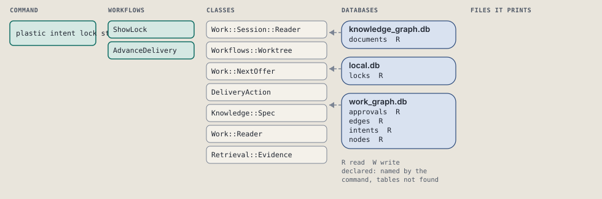
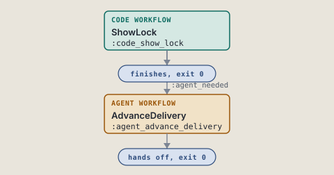
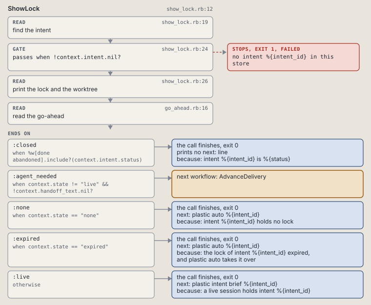
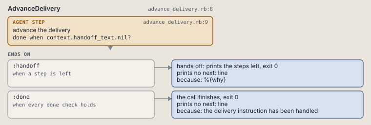

# plastic intent lock status

Print the session that holds an intent's lock, and its worktree.

```sh
plastic intent lock status ID
```

The command is `IntentLockStatus`, in [`intent_lock_status.rb:8`](../../../../scripts/lib/plastic/commands/intent_lock_status.rb#L8). The words on this page, such as gate, step and outcome, are explained in [the command DSL](../../dsl/README.md).

| Argument or option | What it gives | Default |
| --- | --- | --- |
| `ID` | the intent | |

## What it touches



## How the call flows



| Workflow | Kind | Code |
| --- | --- | --- |
| [ShowLock](#showlock) | code | [`show_lock.rb:12`](../../../../scripts/lib/plastic/workflows/show_lock.rb#L12) |
| [AdvanceDelivery](#advancedelivery) | agent | [`advance_delivery.rb:8`](../../../../scripts/lib/plastic/workflows/advance_delivery.rb#L8) |

### ShowLock

The code workflow `:code_show_lock`, in [`show_lock.rb:12`](../../../../scripts/lib/plastic/workflows/show_lock.rb#L12).

Prints an intent's lock row: the session, the mode, when it was taken and renewed, and whether it is still live; then the code worktree when the store's project names a repository. Refuses an unknown id.



| Step | Kind | Check | Code |
| --- | --- | --- | --- |
| find the intent | read |  | [`show_lock.rb:19`](../../../../scripts/lib/plastic/workflows/show_lock.rb#L19) |
| no intent %{intent_id} in this store | gate, stops with exit 1 | `!context.intent.nil?` | [`show_lock.rb:24`](../../../../scripts/lib/plastic/workflows/show_lock.rb#L24) |
| print the lock and the worktree | read |  | [`show_lock.rb:26`](../../../../scripts/lib/plastic/workflows/show_lock.rb#L26) |
| read the go-ahead | read |  | [`go_ahead.rb:16`](../../../../scripts/lib/plastic/workflows/go_ahead.rb#L16) |

| Outcome | When | Then | Code |
| --- | --- | --- | --- |
| `:closed` | when `%w[done abandoned].include?(context.intent.status)` | finishes, exit 0; prints no next: line | [`show_lock.rb:46`](../../../../scripts/lib/plastic/workflows/show_lock.rb#L46) |
| `:agent_needed` | when `context.state != "live" && !context.handoff_text.nil?` | runs [AdvanceDelivery](#advancedelivery) | [`show_lock.rb:48`](../../../../scripts/lib/plastic/workflows/show_lock.rb#L48) |
| `:none` | when `context.state == "none"` | finishes, exit 0; next: plastic auto %{intent_id} | [`show_lock.rb:49`](../../../../scripts/lib/plastic/workflows/show_lock.rb#L49) |
| `:expired` | when `context.state == "expired"` | finishes, exit 0; next: plastic auto %{intent_id} | [`show_lock.rb:51`](../../../../scripts/lib/plastic/workflows/show_lock.rb#L51) |
| `:live` | otherwise | finishes, exit 0; next: plastic intent brief %{intent_id} | [`show_lock.rb:53`](../../../../scripts/lib/plastic/workflows/show_lock.rb#L53) |

It sets `intent`, `state`, `status`, `why`, `handoff_text`.

### AdvanceDelivery

The agent workflow `:agent_advance_delivery`, in [`advance_delivery.rb:8`](../../../../scripts/lib/plastic/workflows/advance_delivery.rb#L8).

The harness performs judgment and records the result through commands.



| Step | Kind | Check | Code |
| --- | --- | --- | --- |
| advance the delivery | agent step | `context.handoff_text.nil?` | [`advance_delivery.rb:9`](../../../../scripts/lib/plastic/workflows/advance_delivery.rb#L9) |

| Outcome | When | Then | Code |
| --- | --- | --- | --- |
| `:handoff` | when a step is left | hands off, exit 0; prints no next: line | [`advance_delivery.rb:10`](../../../../scripts/lib/plastic/workflows/advance_delivery.rb#L10) |
| `:done` | when every done check holds | finishes, exit 0; prints no next: line | [`advance_delivery.rb:11`](../../../../scripts/lib/plastic/workflows/advance_delivery.rb#L11) |

The agent step "advance the delivery" prints:

> %{handoff_text}

## Outcomes

Every call can also end in [the ways any call can end](../../dsl/README.md#how-any-call-can-end).

| Ending | Exit | next: | Code |
| --- | --- | --- | --- |
| no intent %{intent_id} in this store | 1 | prints no next: line | [`show_lock.rb:24`](../../../../scripts/lib/plastic/workflows/show_lock.rb#L24) |
| intent %{intent_id} is %{status} | 0 | prints no next: line | [`show_lock.rb:46`](../../../../scripts/lib/plastic/workflows/show_lock.rb#L46) |
| intent %{intent_id} holds no lock | 0 | plastic auto %{intent_id} | [`show_lock.rb:49`](../../../../scripts/lib/plastic/workflows/show_lock.rb#L49) |
| the lock of intent %{intent_id} expired, and plastic auto takes it over | 0 | plastic auto %{intent_id} | [`show_lock.rb:51`](../../../../scripts/lib/plastic/workflows/show_lock.rb#L51) |
| a live session holds intent %{intent_id} | 0 | plastic intent brief %{intent_id} | [`show_lock.rb:53`](../../../../scripts/lib/plastic/workflows/show_lock.rb#L53) |
| %{why} | 0 | prints no next: line | [`advance_delivery.rb:10`](../../../../scripts/lib/plastic/workflows/advance_delivery.rb#L10) |
| the delivery instruction has been handled | 0 | prints no next: line | [`advance_delivery.rb:11`](../../../../scripts/lib/plastic/workflows/advance_delivery.rb#L11) |
| a step raises | 1 | prints no next: line | [`code_workflow.rb:97`](../../../../scripts/lib/plastic/code_workflow.rb#L97) |
