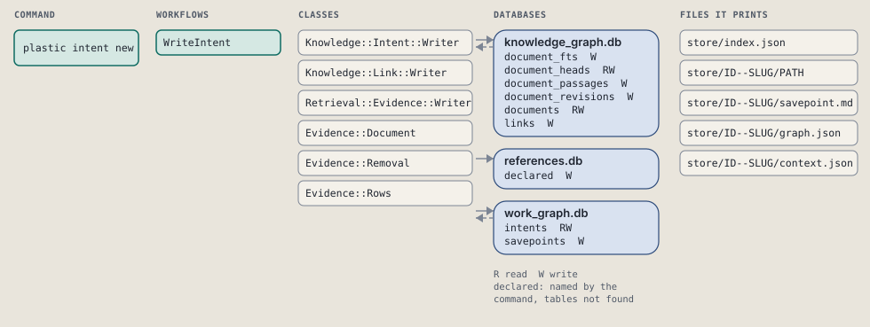
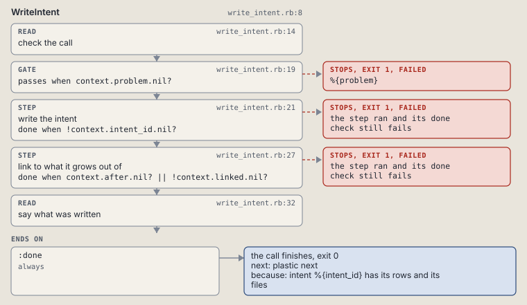

# plastic intent new

Open an intent: write its rows and its folder.

Opens an intent: writes its row and its first rows, and prints its folder and store/index.json in the same call.

```sh
plastic intent new TITLE... [--parent ID] [--ref REF] [--after ID] [--kind KIND] [--status STATUS]
```

The command is `IntentNew`, in [`intent_new.rb:9`](../../../../scripts/lib/plastic/commands/intent_new.rb#L9). The words on this page, such as gate, step and outcome, are explained in [the command DSL](../../dsl/README.md).

| Argument or option | What it gives | Default |
| --- | --- | --- |
| `TITLE` | what the intent is for, in words | |
| `--parent ID` | the intent this one is a child of |  |
| `--ref REF` | a ticket, a link, or another intent as ID-ORIGIN |  |
| `--after ID` | an intent this one grows out of, linked as source |  |
| `--kind KIND` | the kind of work | `"work"` |
| `--status STATUS` | open, active, parked or future | `"open"` |

## What it touches



## How the call flows


| Workflow | Kind | Code |
| --- | --- | --- |
| [WriteIntent](#writeintent) | code | [`write_intent.rb:8`](../../../../scripts/lib/plastic/workflows/write_intent.rb#L8) |

### WriteIntent

The code workflow `:code_write_intent`, in [`write_intent.rb:8`](../../../../scripts/lib/plastic/workflows/write_intent.rb#L8).

Writes a new intent's rows; the command prints its folder and store/index.json.



| Step | Kind | Check | Code |
| --- | --- | --- | --- |
| check the call | read |  | [`write_intent.rb:14`](../../../../scripts/lib/plastic/workflows/write_intent.rb#L14) |
| %{problem} | gate, stops with exit 1 | `context.problem.nil?` | [`write_intent.rb:19`](../../../../scripts/lib/plastic/workflows/write_intent.rb#L19) |
| write the intent | step | `!context.intent_id.nil?` | [`write_intent.rb:21`](../../../../scripts/lib/plastic/workflows/write_intent.rb#L21) |
| link to what it grows out of | step | `context.after.nil? \|\| !context.linked.nil?` | [`write_intent.rb:27`](../../../../scripts/lib/plastic/workflows/write_intent.rb#L27) |
| say what was written | read |  | [`write_intent.rb:32`](../../../../scripts/lib/plastic/workflows/write_intent.rb#L32) |

| Outcome | When | Then | Code |
| --- | --- | --- | --- |
| `:done` | always | finishes, exit 0; next: plastic next | [`write_intent.rb:37`](../../../../scripts/lib/plastic/workflows/write_intent.rb#L37) |

It sets `problem`, `intent_id`, `linked`.

## Outcomes

Every call can also end in [the ways any call can end](../../dsl/README.md#how-any-call-can-end).

| Ending | Exit | next: | Code |
| --- | --- | --- | --- |
| %{problem} | 1 | prints no next: line | [`write_intent.rb:19`](../../../../scripts/lib/plastic/workflows/write_intent.rb#L19) |
| intent %{intent_id} has its rows and its files | 0 | plastic next | [`write_intent.rb:37`](../../../../scripts/lib/plastic/workflows/write_intent.rb#L37) |
| a step raises | 1 | prints no next: line | [`code_workflow.rb:97`](../../../../scripts/lib/plastic/code_workflow.rb#L97) |
