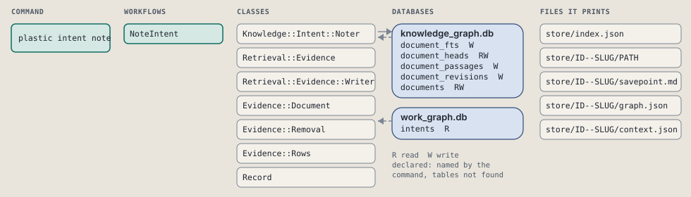
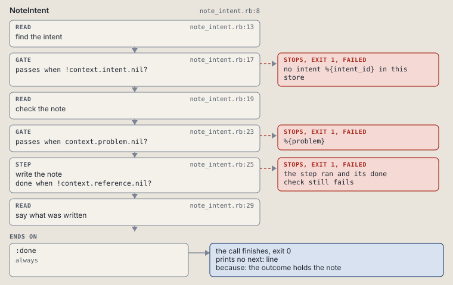

# plastic intent note

Add one line under Notes in the outcome of an intent, keeping the earlier text as a revision.

Adds one line under `## Notes` in the intent's outcome.md. The earlier text stays as an earlier revision of the file.

```sh
plastic intent note ID TEXT [--kind KIND]
```

The command is `IntentNote`, in [`intent_note.rb:10`](../../../../scripts/lib/plastic/commands/intent_note.rb#L10). The words on this page, such as gate, step and outcome, are explained in [the command DSL](../../dsl/README.md).

| Argument or option | What it gives | Default |
| --- | --- | --- |
| `ID` | the intent | |
| `TEXT` | the note, one line | |
| `--kind KIND` | Review, Commit or Report | `"Report"` |

## What it touches



## Before the chain

The command's own `call`, at [`intent_note.rb:17`](../../../../scripts/lib/plastic/commands/intent_note.rb#L17), runs first:

```ruby
def call
  kinds = Graph::Knowledge::Intent::Notes::KINDS
  raise CLI::Command::Usage, "KIND takes #{kinds.join(", ")}" unless kinds.include?(parsed[:kind])

  super
end
```

## How the call flows


| Workflow | Kind | Code |
| --- | --- | --- |
| [NoteIntent](#noteintent) | code | [`note_intent.rb:8`](../../../../scripts/lib/plastic/workflows/note_intent.rb#L8) |

### NoteIntent

The code workflow `:code_note_intent`, in [`note_intent.rb:8`](../../../../scripts/lib/plastic/workflows/note_intent.rb#L8).

Adds a note line to the outcome of an intent.



| Step | Kind | Check | Code |
| --- | --- | --- | --- |
| find the intent | read |  | [`note_intent.rb:13`](../../../../scripts/lib/plastic/workflows/note_intent.rb#L13) |
| no intent %{intent_id} in this store | gate, stops with exit 1 | `!context.intent.nil?` | [`note_intent.rb:17`](../../../../scripts/lib/plastic/workflows/note_intent.rb#L17) |
| check the note | read |  | [`note_intent.rb:19`](../../../../scripts/lib/plastic/workflows/note_intent.rb#L19) |
| %{problem} | gate, stops with exit 1 | `context.problem.nil?` | [`note_intent.rb:23`](../../../../scripts/lib/plastic/workflows/note_intent.rb#L23) |
| write the note | step | `!context.reference.nil?` | [`note_intent.rb:25`](../../../../scripts/lib/plastic/workflows/note_intent.rb#L25) |
| say what was written | read |  | [`note_intent.rb:29`](../../../../scripts/lib/plastic/workflows/note_intent.rb#L29) |

| Outcome | When | Then | Code |
| --- | --- | --- | --- |
| `:done` | always | finishes, exit 0; prints no next: line | [`note_intent.rb:33`](../../../../scripts/lib/plastic/workflows/note_intent.rb#L33) |

It sets `intent`, `problem`, `reference`.

## Outcomes

Every call can also end in [the ways any call can end](../../dsl/README.md#how-any-call-can-end).

| Ending | Exit | next: | Code |
| --- | --- | --- | --- |
| no intent %{intent_id} in this store | 1 | prints no next: line | [`note_intent.rb:17`](../../../../scripts/lib/plastic/workflows/note_intent.rb#L17) |
| %{problem} | 1 | prints no next: line | [`note_intent.rb:23`](../../../../scripts/lib/plastic/workflows/note_intent.rb#L23) |
| the outcome holds the note | 0 | prints no next: line | [`note_intent.rb:33`](../../../../scripts/lib/plastic/workflows/note_intent.rb#L33) |
| a step raises | 1 | prints no next: line | [`code_workflow.rb:97`](../../../../scripts/lib/plastic/code_workflow.rb#L97) |
| raise CLI::Command::Usage, "KIND takes #{kinds.join(", ")}" unless kinds.include?(parsed[:kind]) | 2 | prints no next: line | [`intent_note.rb:19`](../../../../scripts/lib/plastic/commands/intent_note.rb#L19) |
