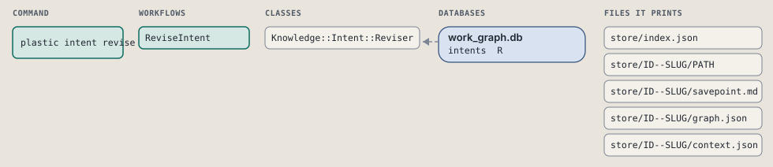
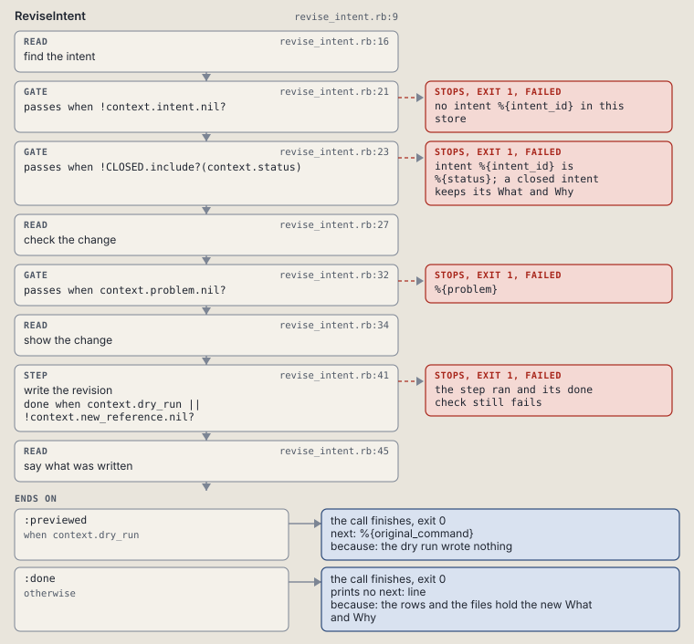

# plastic intent revise

Rewrite an intent's What and Why after grilling, keeping the old text as a revision.

Rewrites the What and the Why of an intent after grilling. The old text stays as an earlier revision of the intent's file.

```sh
plastic intent revise ID LINE [--why TEXT] [--dry-run]
```

The command is `IntentRevise`, in [`intent_revise.rb:9`](../../../../scripts/lib/plastic/commands/intent_revise.rb#L9). The words on this page, such as gate, step and outcome, are explained in [the command DSL](../../dsl/README.md).

| Argument or option | What it gives | Default |
| --- | --- | --- |
| `ID` | the intent | |
| `LINE` | the new What, the intent line | |
| `--why TEXT` | the new Why, the lead text of ## Context |  |
| `--dry-run` | print the change and write nothing | `false` |

## What it touches



## How the call flows


| Workflow | Kind | Code |
| --- | --- | --- |
| [ReviseIntent](#reviseintent) | code | [`revise_intent.rb:9`](../../../../scripts/lib/plastic/workflows/revise_intent.rb#L9) |

### ReviseIntent

The code workflow `:code_revise_intent`, in [`revise_intent.rb:9`](../../../../scripts/lib/plastic/workflows/revise_intent.rb#L9).

Rewrites an intent's What and Why; a done or abandoned intent refuses, and a dry run prints the change and writes nothing.



| Step | Kind | Check | Code |
| --- | --- | --- | --- |
| find the intent | read |  | [`revise_intent.rb:16`](../../../../scripts/lib/plastic/workflows/revise_intent.rb#L16) |
| no intent %{intent_id} in this store | gate, stops with exit 1 | `!context.intent.nil?` | [`revise_intent.rb:21`](../../../../scripts/lib/plastic/workflows/revise_intent.rb#L21) |
| intent %{intent_id} is %{status}; a closed intent keeps its What and Why | gate, stops with exit 1 | `!CLOSED.include?(context.status)` | [`revise_intent.rb:23`](../../../../scripts/lib/plastic/workflows/revise_intent.rb#L23) |
| check the change | read |  | [`revise_intent.rb:27`](../../../../scripts/lib/plastic/workflows/revise_intent.rb#L27) |
| %{problem} | gate, stops with exit 1 | `context.problem.nil?` | [`revise_intent.rb:32`](../../../../scripts/lib/plastic/workflows/revise_intent.rb#L32) |
| show the change | read |  | [`revise_intent.rb:34`](../../../../scripts/lib/plastic/workflows/revise_intent.rb#L34) |
| write the revision | step | `context.dry_run \|\| !context.new_reference.nil?` | [`revise_intent.rb:41`](../../../../scripts/lib/plastic/workflows/revise_intent.rb#L41) |
| say what was written | read |  | [`revise_intent.rb:45`](../../../../scripts/lib/plastic/workflows/revise_intent.rb#L45) |

| Outcome | When | Then | Code |
| --- | --- | --- | --- |
| `:previewed` | when `context.dry_run` | finishes, exit 0; next: %{original_command} | [`revise_intent.rb:50`](../../../../scripts/lib/plastic/workflows/revise_intent.rb#L50) |
| `:done` | otherwise | finishes, exit 0; prints no next: line | [`revise_intent.rb:52`](../../../../scripts/lib/plastic/workflows/revise_intent.rb#L52) |

It sets `intent`, `status`, `change`, `problem`, `old_reference`, `new_reference`.

## Outcomes

Every call can also end in [the ways any call can end](../../dsl/README.md#how-any-call-can-end).

| Ending | Exit | next: | Code |
| --- | --- | --- | --- |
| no intent %{intent_id} in this store | 1 | prints no next: line | [`revise_intent.rb:21`](../../../../scripts/lib/plastic/workflows/revise_intent.rb#L21) |
| intent %{intent_id} is %{status}; a closed intent keeps its What and Why | 1 | plastic next | [`revise_intent.rb:23`](../../../../scripts/lib/plastic/workflows/revise_intent.rb#L23) |
| %{problem} | 1 | prints no next: line | [`revise_intent.rb:32`](../../../../scripts/lib/plastic/workflows/revise_intent.rb#L32) |
| the dry run wrote nothing | 0 | %{original_command} | [`revise_intent.rb:50`](../../../../scripts/lib/plastic/workflows/revise_intent.rb#L50) |
| the rows and the files hold the new What and Why | 0 | prints no next: line | [`revise_intent.rb:52`](../../../../scripts/lib/plastic/workflows/revise_intent.rb#L52) |
| a step raises | 1 | prints no next: line | [`code_workflow.rb:97`](../../../../scripts/lib/plastic/code_workflow.rb#L97) |
