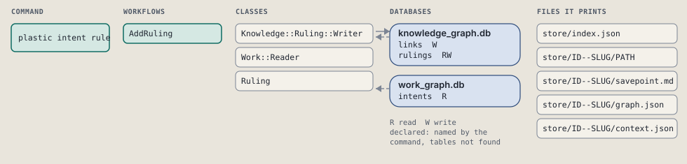
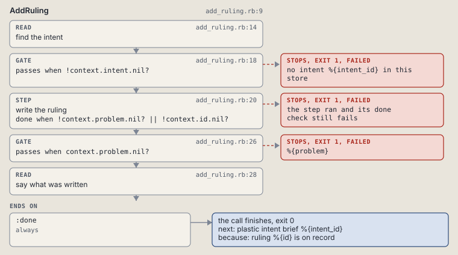

# plastic intent rule

Write an owner ruling, with --supersedes to replace an older one.

Writes one owner ruling against an intent, numbered in order, one after the last. --supersedes names an older ruling and links the two.

```sh
plastic intent rule ID TEXT [--supersedes RULING_ID]
```

The command is `IntentRule`, in [`intent_rule.rb:9`](../../../../scripts/lib/plastic/commands/intent_rule.rb#L9). The words on this page, such as gate, step and outcome, are explained in [the command DSL](../../dsl/README.md).

| Argument or option | What it gives | Default |
| --- | --- | --- |
| `ID` | the intent | |
| `TEXT` | the ruling, in the owner's words | |
| `--supersedes RULING_ID` | an older ruling this one replaces |  |

## What it touches



## How the call flows


| Workflow | Kind | Code |
| --- | --- | --- |
| [AddRuling](#addruling) | code | [`add_ruling.rb:9`](../../../../scripts/lib/plastic/workflows/add_ruling.rb#L9) |

### AddRuling

The code workflow `:code_add_ruling`, in [`add_ruling.rb:9`](../../../../scripts/lib/plastic/workflows/add_ruling.rb#L9).

Writes one ruling; fails on an unknown intent, or when --supersedes names no such ruling.



| Step | Kind | Check | Code |
| --- | --- | --- | --- |
| find the intent | read |  | [`add_ruling.rb:14`](../../../../scripts/lib/plastic/workflows/add_ruling.rb#L14) |
| no intent %{intent_id} in this store | gate, stops with exit 1 | `!context.intent.nil?` | [`add_ruling.rb:18`](../../../../scripts/lib/plastic/workflows/add_ruling.rb#L18) |
| write the ruling | step | `!context.problem.nil? \|\| !context.id.nil?` | [`add_ruling.rb:20`](../../../../scripts/lib/plastic/workflows/add_ruling.rb#L20) |
| %{problem} | gate, stops with exit 1 | `context.problem.nil?` | [`add_ruling.rb:26`](../../../../scripts/lib/plastic/workflows/add_ruling.rb#L26) |
| say what was written | read |  | [`add_ruling.rb:28`](../../../../scripts/lib/plastic/workflows/add_ruling.rb#L28) |

| Outcome | When | Then | Code |
| --- | --- | --- | --- |
| `:done` | always | finishes, exit 0; next: plastic intent brief %{intent_id} | [`add_ruling.rb:32`](../../../../scripts/lib/plastic/workflows/add_ruling.rb#L32) |

It sets `intent`, `problem`, `id`.

## Outcomes

Every call can also end in [the ways any call can end](../../dsl/README.md#how-any-call-can-end).

| Ending | Exit | next: | Code |
| --- | --- | --- | --- |
| no intent %{intent_id} in this store | 1 | prints no next: line | [`add_ruling.rb:18`](../../../../scripts/lib/plastic/workflows/add_ruling.rb#L18) |
| %{problem} | 1 | prints no next: line | [`add_ruling.rb:26`](../../../../scripts/lib/plastic/workflows/add_ruling.rb#L26) |
| ruling %{id} is on record | 0 | plastic intent brief %{intent_id} | [`add_ruling.rb:32`](../../../../scripts/lib/plastic/workflows/add_ruling.rb#L32) |
| a step raises | 1 | prints no next: line | [`code_workflow.rb:97`](../../../../scripts/lib/plastic/code_workflow.rb#L97) |
